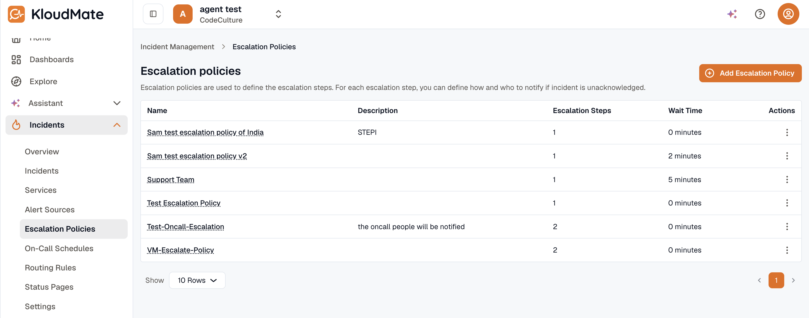

Escalation policies control how incident notifications progress when an incident remains unacknowledged.

They let you define:

- Who should be notified
- Which notification channel should be used
- How long each escalation step should wait before moving to the next step

The escalation policies list shows each policy’s name, description, wait time, and number of escalation steps.

:::note
  A single escalation step can notify multiple targets through multiple channels.
:::

## Policy Details

Open any escalation policy to review:

- Initial wait time
- Notification targets for each step
- Escalation timeout for each step

Use the settings menu to edit or archive the policy.
