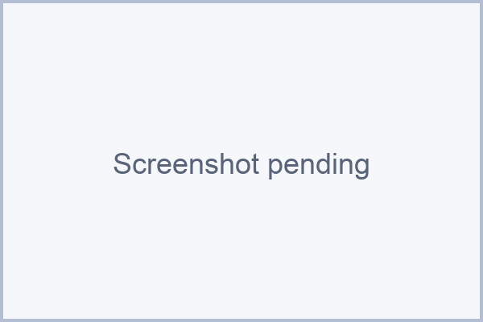

An incident's life begins when an alert triggers it and ends when someone resolves it. In between, KloudMate moves it through a coordinated flow that pulls in alert sources, routing rules, services, escalation policies, and on-call schedules.

:::note[Placeholder image]
Screenshot pending — the updated incident pipeline diagram: alert source → routing rule → incident / service → escalation policy → on-call → resolution.
:::

## Alert

An alert fires when a monitored condition or threshold is met. It's the starting signal for an incident.

## Alert source

An [alert source](../integrations/) receives alerts from an external system — KloudMate alerts, CloudWatch, or a generic webhook — and maps each payload into incident fields. Every alert source belongs to a **service** and can set a default **escalation policy**.

## Routing rule

Before an incident opens, the alert runs through your [routing rules](../routing-rules/). A matching rule decides:

- which **service** the incident opens against,
- which **escalation policy** pages,
- the **severity**,
- whether to **suppress** the alert entirely, and
- whether to **add responders** or **notify on-call schedules**.

This is where raw alert traffic becomes the right incident — or gets dropped before it pages anyone.

### Where routing rules fit

Routing rules sit between the alert source and the incident. If no rule matches, the incident inherits its service and escalation policy from the alert source and service defaults, so routing rules are an optional layer of control rather than a requirement.

## Incident

Unless a rule suppresses it, an incident is created and needs operational attention. It records its service, source, severity, and a full activity timeline. See [Incidents](../incidents/).

## Service

[Services](../services/) group related incidents by microservice, application area, or ownership. Each service has a default escalation policy and can own multiple alert sources.

## Escalation policy

An [escalation policy](../escalation-policy/) defines who is notified and how the response progresses if no one acknowledges in time. A policy waits an initial delay, then works through its steps; if nobody acknowledges, it can repeat from the top.

## Escalation steps

Each step notifies one or more recipients — users, on-call schedules, or Slack channels:

- If the incident is acknowledged or resolved before the step's timer elapses, the policy stops there.
- If not, the next step fires.

## On-call resolution

When a step targets an [on-call schedule](../oncall/) instead of a named person, KloudMate resolves the schedule at that exact moment — applying any override, otherwise taking the union of its active rotations — and notifies whoever is on call right then, which may be several people.

### Where on-call fits

On-call schedules don't notify anyone on their own. They're a target an escalation step (or a routing rule) points at, resolved to whoever is on call only when the notification needs to go out. That late resolution is why a last-minute override or rotation change still takes effect.

## Resolution

The incident is resolved when a responder marks it resolved — directly, or through Slack ChatOps. While you respond, you can [publish the incident to a status page](../status-pages/posting-incidents/) to keep customers informed.

## Related Resources

- [What Is Incident Management?](../what-is-incident-management/)
- [Routing Rules](../routing-rules/)
- [Escalation Policies](../escalation-policy/)
- [On-Call Schedules](../oncall/)
