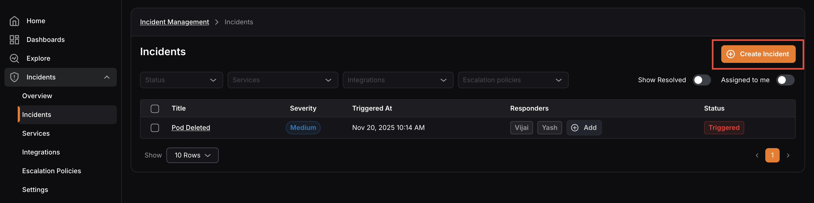
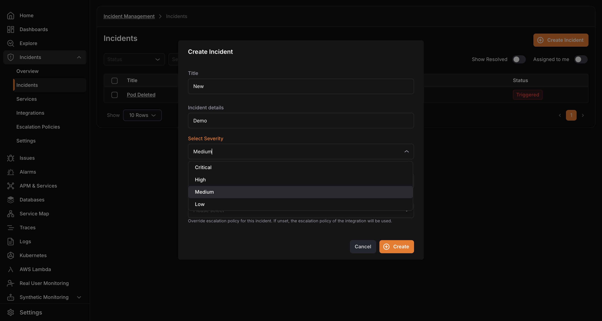
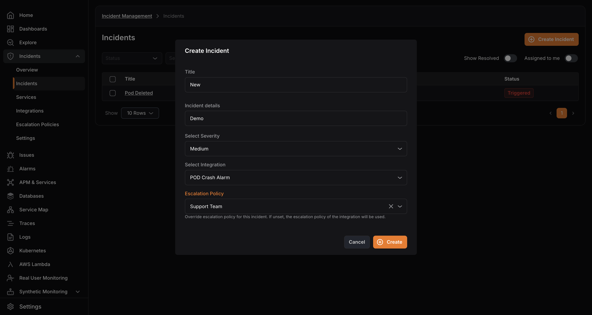

Use the steps below to create an incident manually.

1. Click **Create Incident** in the top-right corner of the Incidents screen.

2. Enter the incident **Title** and **Incident Details**.
3. Select a severity level: **Critical**, **High**, **Medium**, or **Low**.

4. Select the integration the incident belongs to.
5. Optionally choose an escalation policy to override the integration default.
6. Click **Create**.

<hint type="info">
  Selecting an integration is required. If you do not have an integration yet, create one first in [Adding Integrations](../../integrations/adding-integrations/).

  If no escalation policy is selected, the policy assigned to the selected integration is applied automatically.
</hint>
