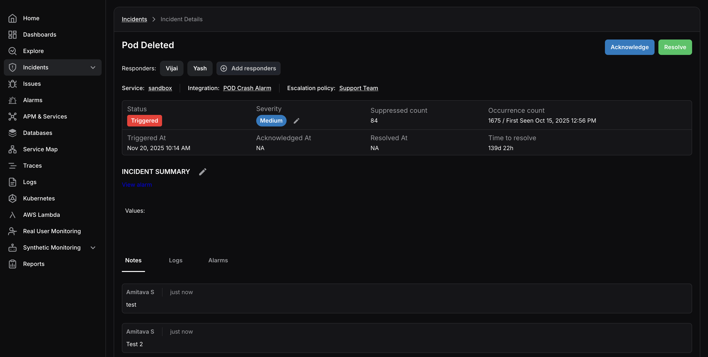
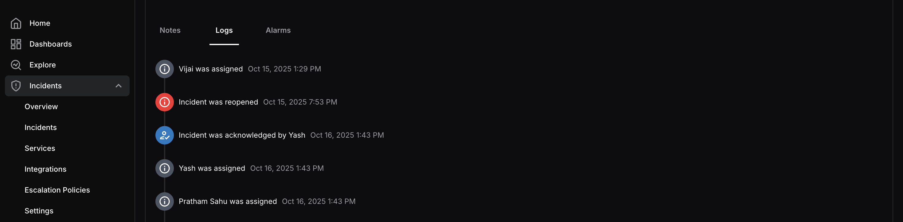

Click on any incident from the Incidents list to open its detail view. This screen provides a comprehensive view of everything related to the selected incident.

At the top, you can see the incident’s assigned responders, the service it belongs to, the integration it came through, and the escalation policy applied to it. You can add or remove responders directly from this screen using the Add Responders button.

The detail view also displays key incident metrics:

- **Status —** The current status of the incident.
- **Severity —** The severity level of the incident, which can be edited if needed.
- **Suppressed Count —** The number of times the incident was auto-resolved.
- **Occurrence Count —** The total number of times the incident has occurred, along with when it was first seen.
- **Triggered At —** The date and time when the incident was first triggered.
- **Acknowledged At —** The date and time when the incident was first acknowledged.
- **Resolved At —** The date and time when the incident was resolved.
- **Time to Resolve —** The total time taken from trigger to resolution.

The Incident Summary section provides a description of the incident along with a link to the associated alarm for deeper investigation.

At the bottom of the screen, three tabs give you additional context:

- **Notes —** Add and view notes on the incident to keep your team informed and document findings throughout the investigation.
- **Logs —** A chronological activity trail showing every action taken on the incident, such as assignments, acknowledgements, and status changes. This helps you track who has interacted with the incident and when throughout its lifecycle.
- **Alarms —** View the alarms attached to the incident.

To update the status of the incident, use the Acknowledge or Resolve buttons at the top right corner of the screen.

