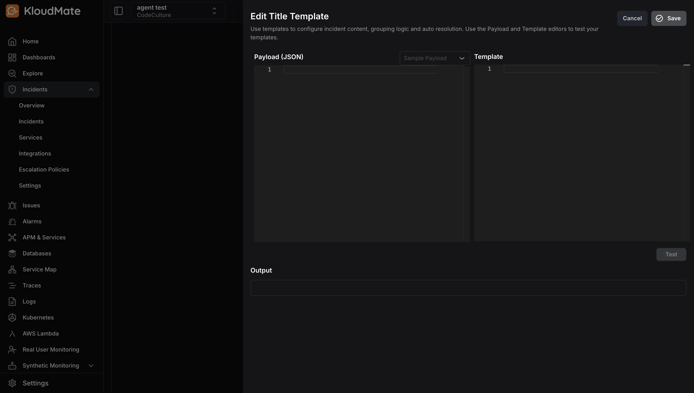
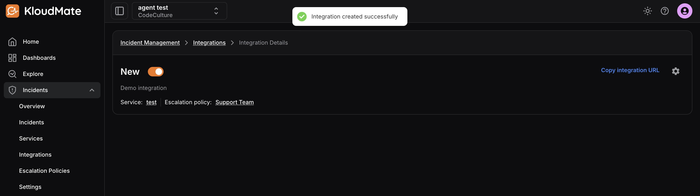

import { Aside } from '@astrojs/starlight/components';

Use the steps below to create a new incident integration.

1. Click **Add Integration** from the Integrations page.

2. Select an **Integration Type**.

Available types:

- **KloudMate Alarm**
- **CloudWatch Alarm**
- **Webhook**

<Aside type="note">
  KloudMate Alarm and CloudWatch Alarm integrations use predefined templates. Webhook integrations let you configure title, grouping, and auto-resolution logic manually.
</Aside>

## Create a KloudMate Alarm or CloudWatch Alarm Integration

1. Select the service.
2. Enter the integration name and description.
3. Optionally choose an escalation policy override.
4. Click **Save**.

<Aside type="note">
  If no escalation policy is selected, the service default is applied automatically.
</Aside>

## Create a Webhook Integration

1. Select the service.
2. Enter the integration name and description.
3. Configure the **Title Template**.
4. Configure the **Grouping Template**.
5. Configure the **Auto Resolve Template**.
6. Select an escalation policy if needed.
7. Click **Save**.

After the integration is created, you will be taken to the integration details screen where you can copy the integration URL or edit/archive the integration.

## Related Resources

- [Integrating with KloudMate Alarms](./integrating-with-kloudmate-alarms/)
