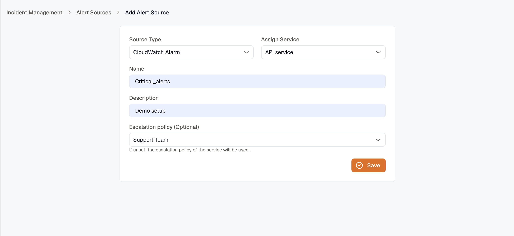
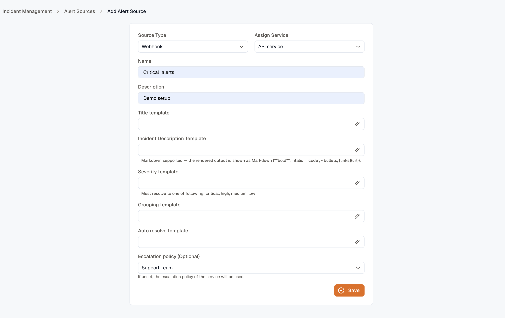
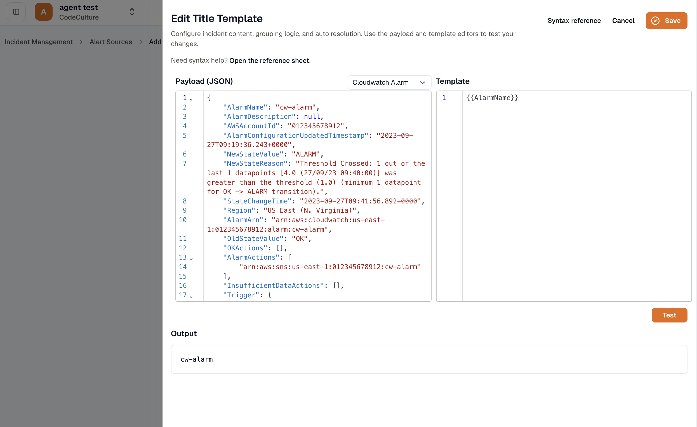
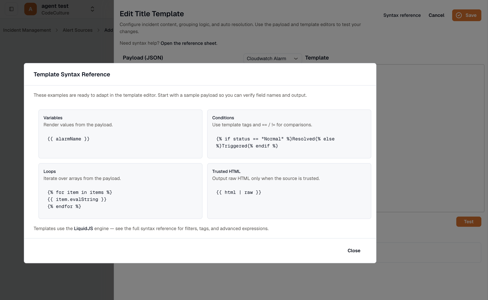

import { Steps } from '@astrojs/starlight/components';

An alert source receives alerts and turns them into incidents on a service. This page covers creating each type, mapping a webhook's payload to incident fields with templates, and sending alerts to its inbound URL.

## Create an alert source

<Steps>
1. Click **Add** from the Alert Sources page.

2. Choose a **type**: KloudMate Alert group, CloudWatch Alarm, or Webhook.

3. Pick the **service** the source opens incidents on. This is required.

4. Enter a **name** and **description**.

5. *(Optional)* Choose an **escalation policy** override. Leave it unset to use the service's default.

6. For a **Webhook**, configure the templates (below). KloudMate Alert group and CloudWatch Alarm sources use built-in templates, so there's nothing more to configure.

7. Click **Save**.
</Steps>



After saving, you land on the source's details page, where you can copy its inbound URL.

## The inbound URL

Every alert source gets its own hashed endpoint:

```
https://<your-api-host>/im/hooks/<hash>
```

Copy it from the source's details page with **Copy source URL**, then point your sender at it. The hash is what ties an incoming payload to this source.

**CloudWatch** sources receive alarms through **Amazon SNS**: point an SNS topic at the URL, and KloudMate confirms the subscription automatically the first time it's hit. CloudWatch wraps the alarm JSON inside the SNS message, and KloudMate unwraps it for you.

## Send an alert

For a **Webhook** source, send your alert as a JSON `POST` to the inbound URL. The body can be any shape — your [templates](#map-a-webhook-payload-with-templates) decide how each field maps to the incident.

```bash
curl -X POST https://<your-api-host>/im/hooks/<hash> \
  -H "Content-Type: application/json" \
  -d '{
    "alert": "High error rate on checkout-api",
    "state": "firing",
    "priority": "high",
    "fingerprint": "checkout-api-error-rate",
    "summary": "Error rate is 12% over the last 5 minutes",
    "runbook": "https://runbooks.example.com/checkout-errors"
  }'
```

KloudMate responds with the incident it opened or updated. Sending another alert that maps to the same [grouping key](#how-grouping-and-auto-resolve-behave) folds onto that incident instead of opening a duplicate; send one your [auto-resolve template](#map-a-webhook-payload-with-templates) reads as resolved to close it.

## Map a webhook payload with templates

A webhook can come from anywhere, so you tell KloudMate how to read it. Five fields take [Liquid](https://liquidjs.com/) templates that render against the incoming JSON:

| Field | Sets | Notes |
|---|---|---|
| **Title template** | The incident title | |
| **Incident description template** | The incident description | Markdown — `**bold**`, `_italic_`, `` `code` ``, bullets, and `[links](url)` render in the incident. |
| **Severity template** | The severity | Must resolve to `critical`, `high`, `medium`, or `low`. |
| **Grouping template** | The grouping key | Alerts that render the same key fold into one incident. Leave it empty to group by title. |
| **Auto resolve template** | Whether to auto-resolve | Resolve it to `true`, `ok`, or `1` to close the matching incident automatically. |

### A worked example

For the payload from [Send an alert](#send-an-alert), these templates open an incident titled *High error rate on checkout-api* at **high** severity:

| Field | Template | Renders to |
|---|---|---|
| Title template | `{{ alert }}` | High error rate on checkout-api |
| Incident description template | `{{ summary }} — [Runbook]({{ runbook }})` | Error rate is 12% over the last 5 minutes — Runbook |
| Severity template | `{{ priority }}` | high |
| Grouping template | `{{ fingerprint }}` | checkout-api-error-rate |
| Auto resolve template | ` true  false ` | false |

Send the same payload with `"state": "resolved"` and the auto-resolve template renders `true`, closing the matching incident.

### Liquid syntax

The template tester's **Syntax reference** covers the constructs you'll use:

- **Variables** — `{{ alarmName }}` renders a value from the payload.
- **Conditions** — `ResolvedTriggered`, using `==` and `!=`.
- **Loops** — `{{ item.evalString }}` iterates an array.
- **Trusted HTML** — `{{ html | raw }}` outputs unescaped HTML, only when you trust the source.

An unknown variable renders as empty rather than erroring, so a template won't break if a field is missing from the payload.

### Test before you save

The **template tester** checks a template against a real payload without waiting for an alert:

<Steps>
1. Pick a **sample payload** — a CloudWatch alarm or a KloudMate alarm — or paste your own JSON.

2. Edit the **template**.

3. Click **Test** to see the rendered output. For the auto-resolve template, the tester also tells you whether the incident would auto-resolve.
</Steps>







### How grouping and auto-resolve behave

**Grouping** keeps repeat alerts together. While an incident is open, every alert that renders the same grouping key folds onto it instead of opening a duplicate. Leave the grouping template empty and KloudMate groups by the rendered title instead.

**Auto resolve** closes the matching open incident when the auto-resolve template renders `true`, `ok`, or `1`. A resolving alert that matches no open incident is ignored — KloudMate never opens an incident from a recovery. Once an incident is resolved, the next firing alert with the same grouping key opens a *new* incident, linked as a recurrence of the one before it.

## Related

- [Alert Sources overview](../) — types and details.
- [Integrate with KloudMate Alerts](../integrating-with-kloudmate-alerts/) — wire KloudMate alerts into IM through a channel and routing rule.
- [Integrate with AWS CloudWatch Alarms](../integrating-with-aws-cloudwatch/) — route AWS CloudWatch alarms to KloudMate via SNS.
- [Routing Rules](../../routing-rules/) — decide which service, escalation policy, and severity an incident gets.
