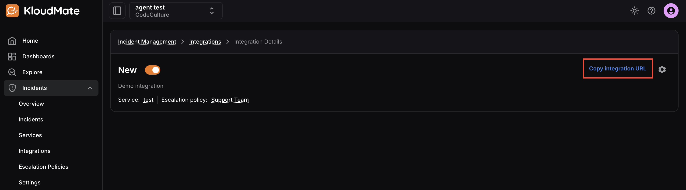
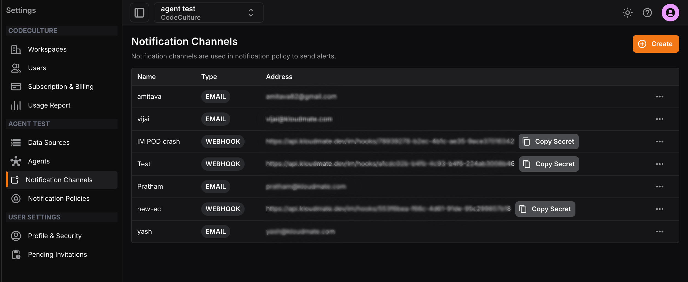
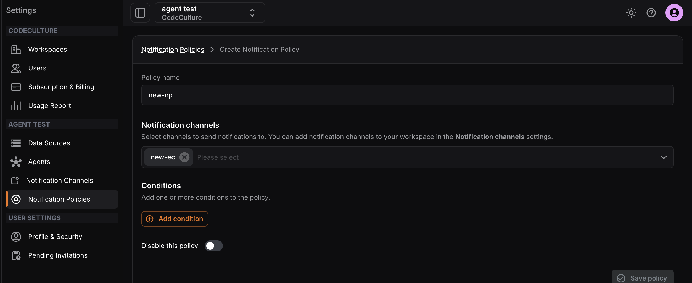
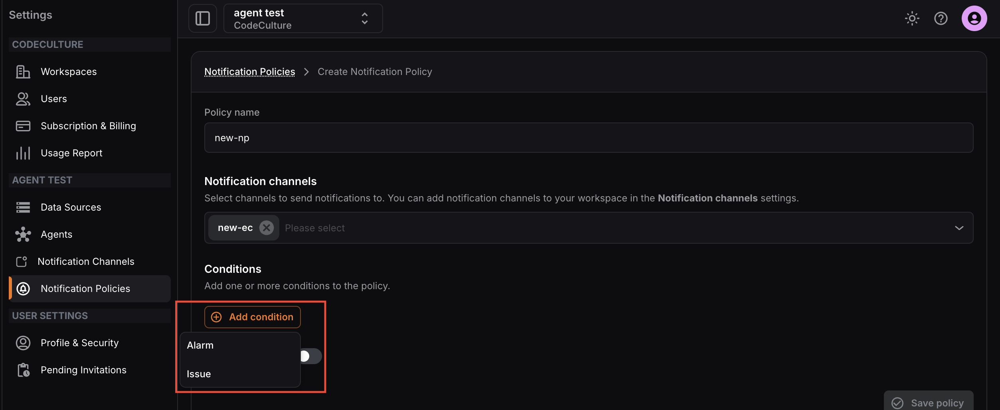

To send alarm-triggered notifications into Incident Management, connect a webhook integration to a notification channel and notification policy.

## Step 1: Copy the Integration URL

1. Open **Incidents -> Integrations**.
2. Select an integration of type **KloudMate Alarm**.
3. Copy the integration URL from the integration details page.

If you have not created the integration yet, start with [Add an Integration](../adding-integrations/).

## Step 2: Create a Notification Channel

1. Open **Settings -> Notification Channels**.
2. Click **Create**.
3. Select **Webhook**.
4. Enter a name and paste the integration URL.
5. Submit the channel.

## Step 3: Create a Notification Policy

1. Open **Settings -> Notification Policies**.
2. Click **Create**.
3. Enter a policy name.
4. Select the webhook notification channel.
5. Add conditions for **Alarm** or **Issue**.
6. Save the policy.

:::note
  Alerts matching this notification policy will be sent into the selected Incident Management integration and follow its escalation policy.
:::
