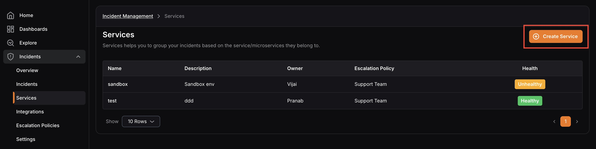
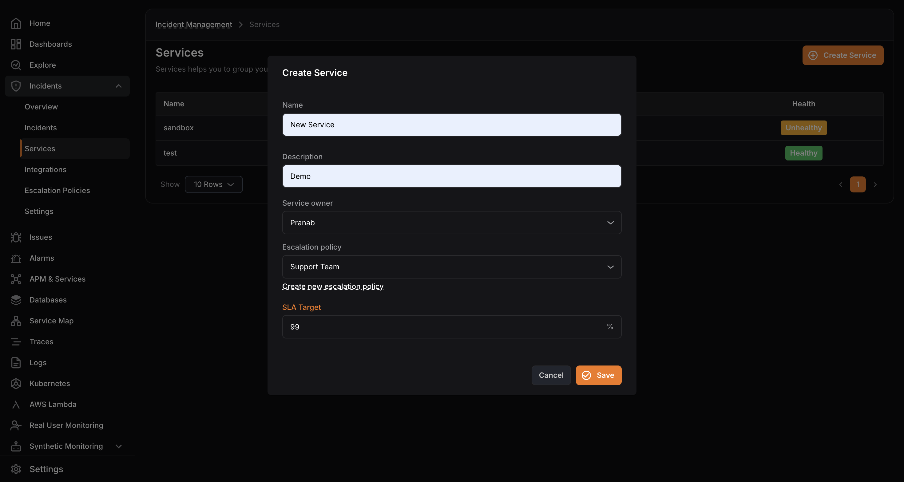

import { Aside } from '@astrojs/starlight/components';

Use the steps below to create a new service.

1. Click **Create Service** from the Services page.

2. Enter the **Service Name ** and ** Description**.
3. Select the **Service Owner**.
4. Select the default **Escalation Policy** for the service.

<Aside type="note">
  Every service requires an escalation policy. If one does not already exist, create it first before saving the service.
</Aside>

5. Set the **SLA Target** percentage.

6. Click **Save**.
