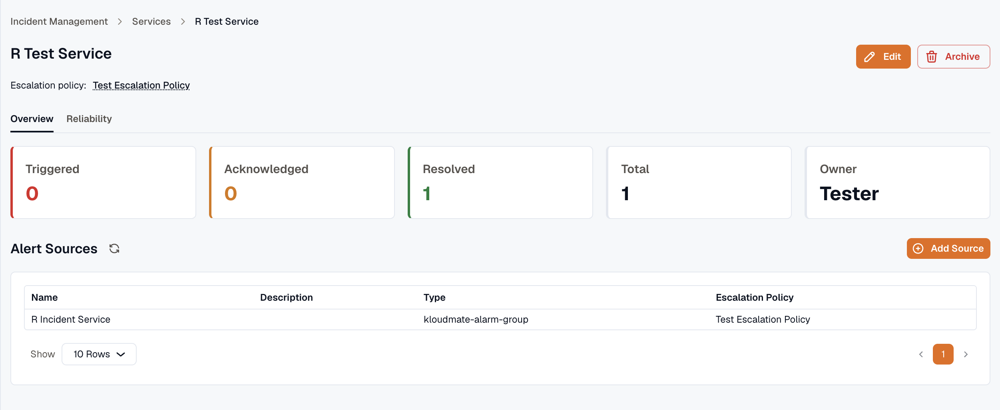

Services group incidents by application area, microservice, or operational ownership, so your team manages related incidents together. Each service has an **owner** and a default **escalation policy**.

To track a service against a reliability target, define a [Service Level Objective (SLO)](../../reliability/) for it.

The Services page lists each service with its name, description, owner, default escalation policy, and current health.

:::note
A service can own several alert sources. The escalation policy on the service is the default — an alert source uses it unless it sets its own override, and a [routing rule](../routing-rules/) can override it per incident.
:::

## Service details

Open a service to review:

- Triggered, acknowledged, and resolved incident counts
- The service owner
- The default escalation policy (linked)
- The service's **alert sources**, listed with their name, description, type, and escalation policy

You can add an alert source directly from the service page, and use the settings menu to edit or archive the service.

## Next

- [Create a service](./creating-services/) — set its owner and escalation policy.
- [Alert Sources](../integrations/) — what feeds incidents into a service.
- [SLOs](../../reliability/) — track a service against a reliability target.
