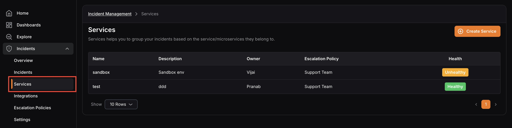
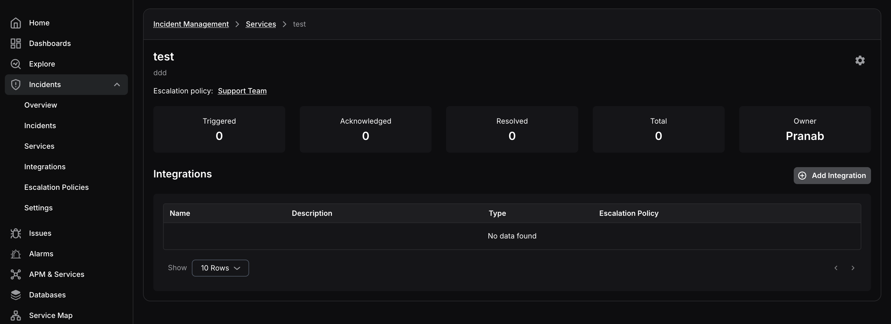

Services group incidents by application area, microservice, or operational ownership so your team can manage related incidents together.

The Services page lists each service with its:

- Name
- Description
- Owner
- Default escalation policy
- Current health state

<hint type="info">
  A service can have multiple integrations. The escalation policy shown on the service is the default policy used when an integration does not define its own override.
</hint>

## Service Details

Open any service to view:

- Triggered, acknowledged, and resolved incident counts
- Service owner details
- Related integrations

You can also add an integration directly from the service page.

Use the settings menu to edit or archive the service.

