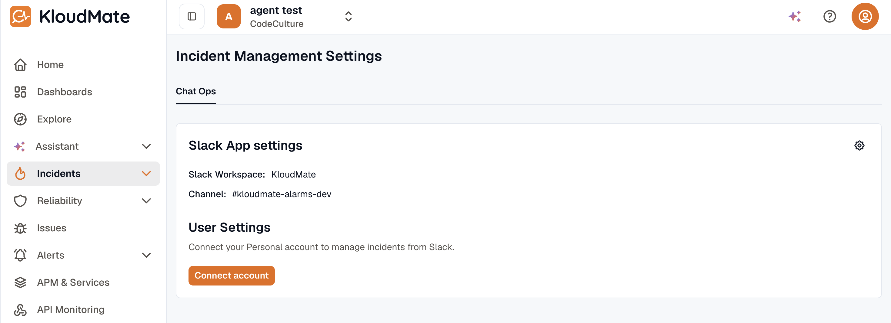

Use the Slack integration to send incident notifications into Slack and let responders interact with incidents from their workspace.

## Connect Slack

1. Open **Incidents -> Settings** from the left navigation.

2. In the **Chat Ops** tab, click **Connect** for Slack.
3. Complete the Slack authorization flow.
4. Select the Slack channel you want to use.
5. Add a message for your app manager if required.
6. Submit the connection.

:::note
  After the workspace connection is complete, each team member must connect their own Slack account before they can manage incidents from Slack.
:::
