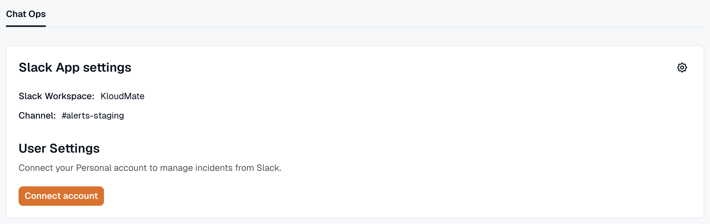

KloudMate uses a single unified Slack app for both notification delivery and IM ChatOps. Installing it once gives you:

- Threaded notifications on alert groups and incidents (replies stay attached to the parent message).
- Per-user ChatOps actions: acknowledge, resolve, or comment on incidents without leaving Slack.
- Cross-surface visibility: the same install shows up under both **Settings → Notification Channels** and **Incidents → Chat Ops**.

You can start the install from either place, and it shows up in both.

## Connect Slack from Incident Management

1. Open **Incidents → Chat Ops** and click **Connect** on the Slack card. You need the **Developer** role for this step.

2. Complete the Slack OAuth flow: pick the Slack workspace and channel KloudMate should post into.
3. KloudMate returns you to the Chat Ops tab and shows the linked workspace and channel.

The new Slack row appears under both **Settings → Notification Channels** and **Incidents → Chat Ops**. You can use it as a notification destination on a [Routing Rule](../../alerts/routing-rules/) immediately.

## Per-user account linking

After the org-level install is complete, each responder needs to link their own Slack account before they can acknowledge or resolve incidents from Slack. From the Chat Ops tab, scroll to **User Settings** and click **Connect account**. A one-time OAuth flow links your KloudMate account to your Slack account.

Once linked, the same tab shows your Slack username with a **Disconnect** action.

## Related

- [Connections](/platform/settings/connections/): the Slack install is a connection, so one credential serves notifications, ChatOps, and workflows. Manage or rotate it there. Before a workflow step or trigger can use it, add the **Workflows** capability to it.
- [Workflows](../../workflows/): post to Slack from a [workflow step](../../workflows/actions/#slack), or start a workflow from a [Slack event](../../workflows/triggers/#app-event), using the same install.
