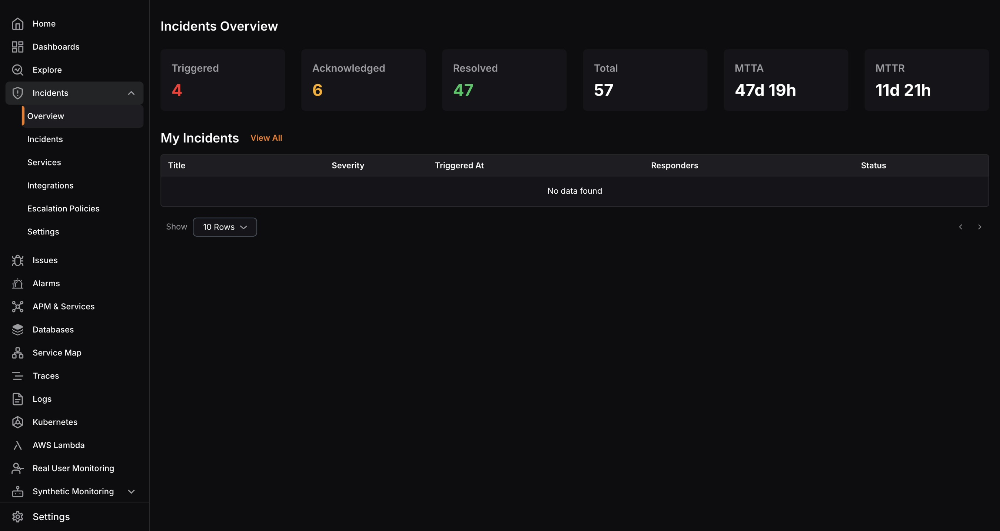

An incident is any event or issue that negatively affects services, application workflows, end users, or customers.

KloudMate Incident Management helps teams detect, assign, escalate, and resolve incidents within a unified workflow.

## What the Module Covers

Incident Management in KloudMate helps your team:

- Detect and track active incidents
- Assign incidents to the right service and responders
- Route alerts through integrations
- Apply escalation rules automatically
- Collaborate on investigation and resolution

## Key Components

### Overview

The overview page gives you a real-time snapshot of incident counts, statuses, MTTA, and MTTR.

### Incidents

Incidents are the core records your team acknowledges, investigates, and resolves.

### Services

Services group incidents by application area, microservice, or functional ownership.

### Integrations

Integrations receive alerts from KloudMate alarms, CloudWatch, webhooks, and other sources.

### Escalation Policies

Escalation policies define who gets notified, how they are notified, and when incidents move to the next response step.

## Related Resources

- [Incident Lifecycle](./incident-lifecycle/)
- [Incidents](./incidents/)
- [Services](./services/)
- [Integrations](./integrations/)
- [Escalation Policies](./escalation-policy/)
