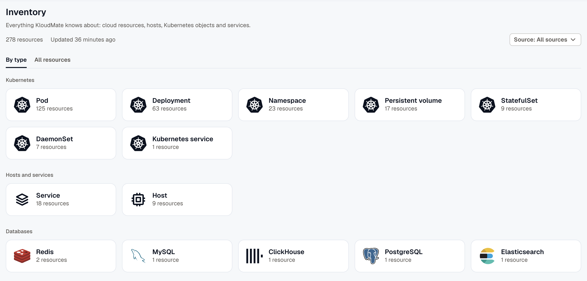
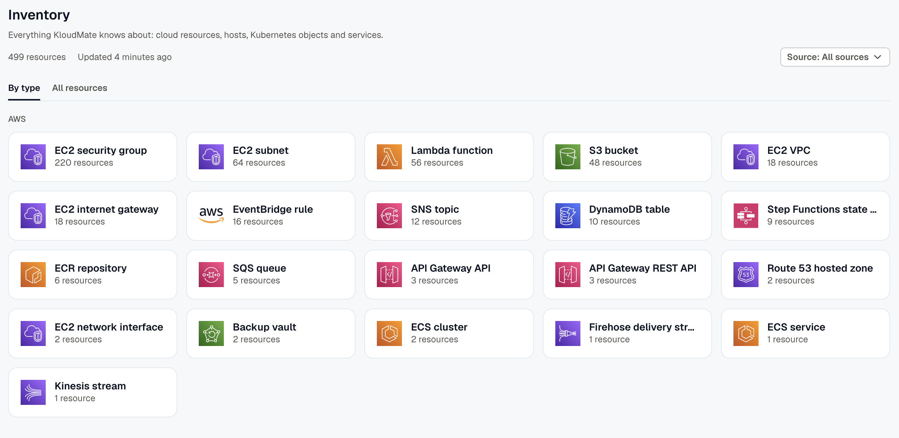

**Inventory** lists everything KloudMate knows about in your workspace: cloud resources, hosts, Kubernetes objects, services, and databases. Use it to find a resource, see where it runs, and check what it connects to. To see how a resource performs, open it in Kubernetes, Hosts, APM, or Databases.

You don't need an AWS account to use Inventory. The [KloudMate agent](../../kloudmate-agent/) adds your hosts, Kubernetes objects, services, and databases. [Connect an AWS account](../../aws-integration/account-setup/) to add its resources too.

## Browse by type

Open **Inventory**. The **By type** tab shows a card for each resource type with its count, grouped into **AWS**, **Kubernetes**, **Hosts and services**, **Databases**, and **Other**. Click a card to list the resources of that type on the **All resources** tab.

AWS resources get their own group after you connect an AWS account.

## Filter by source

When the workspace has a cloud account, use the **Source** filter to choose where the resources come from:

- **All sources:** every resource.
- **A cloud account:** the resources of one connected account.
- **Telemetry:** the resources the KloudMate agent reports, such as hosts, Kubernetes objects, and services.

The filter applies to both tabs. Without a cloud account, every resource comes from telemetry, so the filter doesn't show.

If you pick an AWS account that has regions turned off, some of its resources may be missing. Click **Review** on the warning to turn those regions back on. See [Region sync status](../../platform/settings/data-sources/#region-sync-status).

## Find a resource

The **All resources** tab lists each resource with its **Name**, **Type**, **Where**, **Tags**, and **Last seen**. Search by name or key to find one.

**Where** shows where the resource lives:

- A cloud resource shows its region and account.
- A Kubernetes object shows its cluster and namespace.
- A database shows the address and port that clients connect to.
- Hosts and services leave it empty.

Resources that the agent reports leave the list when they haven't been seen for 2 hours. Cloud resources stay until a sync finds they're gone. Inventory doesn't list containers, network endpoints, or storage mounts.

## Open a resource

Click a resource to open its details. Every resource has these tabs:

- **Overview:** the resource's type, where it runs, its key (the ARN for an AWS resource), and when KloudMate first and last saw it.
- **Related:** what the resource connects to, grouped by relation, such as **Runs on**, **Talks with**, or **Contains**. Each group shows how many of its resources are alerting, and a group with alerting resources opens by default. Click a resource to open it.
- **Tags:** the resource's tags.

AWS resources also have **Alerts**, **Metrics**, and **Config** tabs, with the resource's active alerts, its CloudWatch metrics, and its AWS configuration.

When a resource has its own page elsewhere in KloudMate, a button takes you there: **Open in Kubernetes**, **Open in Hosts**, **Open in APM**, or **Open in Databases**.

## When Inventory is empty

If Inventory shows **No resources yet**, nothing has reported to the workspace. [Install the KloudMate agent](../../kloudmate-agent/) to list your hosts, Kubernetes objects, and services, or [connect an AWS account](../../aws-integration/account-setup/) to list its resources. An organization **Owner** can start either one from the empty page with **Install the agent** or **Connect AWS account**.

## Related

- [Kubernetes Monitoring](../kubernetes/): how clusters, nodes, and workloads perform, and a map of the traffic between workloads.
- [Hosts & Containers](../hosts/): host metrics and logs, and what each host connects to.
- [Alert Groups](../../alerts/alert-groups/): the resources an alert group affects, and what else is alerting around them.
