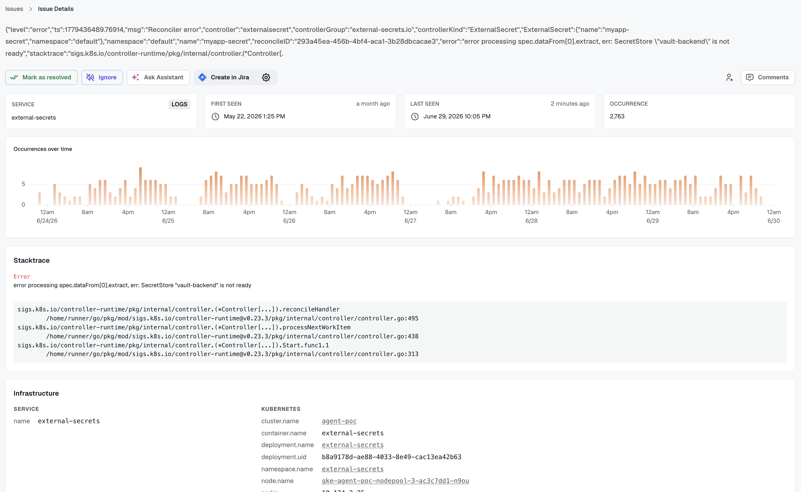
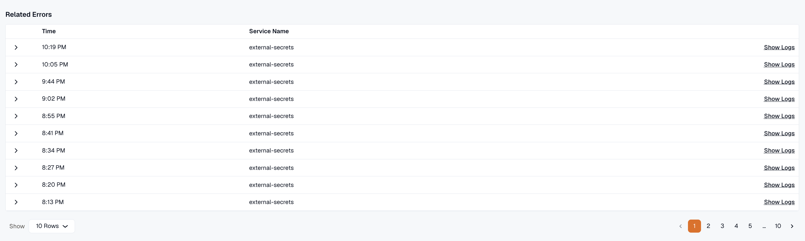
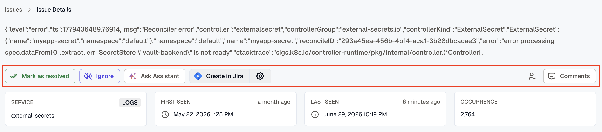

KloudMate automatically discovers errors from your application logs and traces and aggregates them in the Issues section. This gives you a centralised view of all errors and warnings detected across your services, so you can track, investigate, and resolve them efficiently.

To navigate to the Issues screen, click **Issues** in the left navigation menu.

## Issues Dashboard

The **Issues** screen displays all detected issues in a list.

Each issue shows the source, last seen time, occurrence count, and assigned user.

Use the **Assignee**, **Service**, **Source**, and **Error type** filters to narrow down the list.

Issues are organised across three tabs — **All Unresolved**, **Ignored**, and **Resolved** — so you can focus on what's active or review previously handled issues.

Click **Notification settings** at the top right to configure when you receive notifications for new or recurring issues.

Click **Explore Error Patterns** at the top right to identify recurring error patterns across your services.

## Issue Details

Click on any issue to open its detail view.

The detail page shows:

- The full **error message** at the top
- **Service**, **source** (Logs or Traces), **first seen**, **last seen**, and total **occurrence count**
- An **Occurrences over time** chart showing how frequently the issue has occurred across the selected time range
- A **Stacktrace** section with the error type and the full call stack for pinpointing the origin of the error
- An **Infrastructure** section showing the service name and Kubernetes context — cluster, container, deployment, namespace, node, pod, and replicaset details

### Related Errors

The **Related Errors** section at the bottom lists individual occurrences of the issue with timestamps, service names, and direct **Show Logs** links for deeper investigation into each occurrence.

### Actions

From the issue detail page you can take the following actions using the action bar:

- **Mark as resolved** — removes the issue from the Unresolved list.
- **Ignore** — mutes future notifications for this issue if it reoccurs.
- **Ask Assistant** — automatically analyses the issue and provides a concise summary, probable root cause, and recommended actions for faster resolution.
- **Create in Jira** — creates a Jira ticket directly from the issue for tracking in your existing workflow.
- **Assign** — assign the issue to one or more team members using the assign icon on the right. Assigned users are notified when an issue is assigned to them.
- **Comments** — add comments using the comment icon on the right. You can mention other users in comments, and all participating users receive notifications for any updates on the issue.

You can also mark issues as resolved or ignored in bulk by selecting multiple issues from the main list and applying the action collectively.

## Issue Statuses

- **Unresolved** — an issue that has been detected and is yet to be reviewed or addressed.
- **Resolved** — an issue that has been reviewed and marked as resolved. It will no longer appear in the Unresolved list.
- **Ignored** — an issue that has been intentionally muted. No notifications will be sent if the same issue reoccurs in the future.

## Notification Preferences

Click **Notification settings** on the Issues dashboard to configure when you receive alerts. You can choose to be notified for:

- **New Issues** — issues detected for the first time.
- **New and Regression Issues** — issues detected for the first time, as well as issues that had previously occurred and have reappeared.

## User Permissions

Access to issue actions is determined by the user's assigned role:

- **Owner and Developer** — can mark issues as resolved or ignored, assign issues to team members, create Jira tickets, and leave comments.
- **Viewer** — can assign issues to team members and leave comments, but cannot mark issues as resolved or ignored.

## Related Resources

- [Notification routing](./notification-routing/)
- [Routing Rules](../alerts/routing-rules/)
- [Notification Channels](../platform/settings/notification-channels/)
