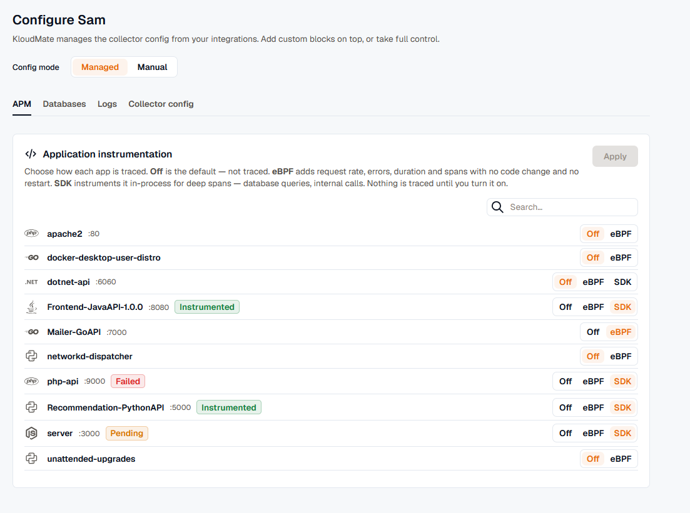

import { LinkCard, CardGrid } from '@astrojs/starlight/components';

Application performance monitoring (APM) is opt-in and per service. For each service the agent discovers, you choose how it is traced:

- **Off:** not traced. This is the default, so nothing is traced (and nothing costs) until you turn it on.
- **eBPF:** Rate, Errors, and Duration (RED) metrics and trace spans, captured out of process with no code change and no restart.
- **SDK:** OpenTelemetry (OTel) auto-instrumentation attached in-process for full distributed traces, with spans for your frameworks, database calls, and outbound requests. It needs a one-time process restart, so you turn it on one service at a time.

## The per-service flow

The flow is the same across every deployment mode:

1. **Discover.** The agent finds your services and lists them under **Discovered Services**. See [Discovery](../../concepts/discovery/).
2. **Choose a mode.** For each service, pick Off, eBPF, or SDK, then apply. eBPF takes effect on the next agent check-in with no restart.
3. **Confirm the restart (SDK only).** SDK instrumentation takes effect when the process restarts, so the agent asks before applying. After you confirm, the service shows **Pending** while the agent applies the change and restarts the app.
4. **Traces flow.** The service's chip flips to **Instrumented** and it sends application traces to the agent's local collector, correlated with its eBPF spans.

## Status chips

Each service selected for SDK instrumentation shows a status chip so you always know where it stands:

- **Pending:** the service is selected for SDK and the agent is wiring it up, applying the change and restarting the app. It clears to **Instrumented** once the agent confirms, usually within a minute.
- **Instrumented:** the SDK is applied and the service is sending application traces.
- **Failed:** the restart failed, so the agent rolled back the change (see rollback below) and the service reverts to its previous mode.
- **Unsupported:** the runtime version has no bundled instrumentation, for example a Python minor release with no bundled cell. The service stays covered by eBPF; move to a supported version to add SDK traces.

Services covered by eBPF (Go, Ruby, or anything without an SDK injector) don't restart and carry no chip. eBPF traces them as soon as you turn them on. A separate **Restart pending** marker on the *agents list* is unrelated: it means the agent's own collector configuration is queued for a restart, not a per-service instrumentation change.

## Restart consent and health gating

The agent never restarts your services silently.

- Turning SDK instrumentation on or off needs a restart, so the agent asks for **explicit confirmation** first, and the prompt lists exactly which apps restart. eBPF and Off changes apply with no restart and no prompt.
- The agent restarts **one service at a time**.
- It can apply an optional **health gate**. After the restart, the agent waits for the service to become active. Where the listen port is known, it also waits for the service to accept connections before reporting success.

## Automatic rollback

If an instrumented service fails to restart or falls into a crash loop, the agent **rolls back automatically**. It removes the change, reloads, and restarts the service, so the service returns to its previous mode, and its chip shows **Failed**. Because you instrument one service at a time, a problem with one never affects the others.

## Supported runtimes

| Runtime | How the agent instruments it |
|---|---|
| Java | OpenTelemetry Java agent, attached per service |
| Node.js | OpenTelemetry Node.js instrumentation, attached per service |
| Python | OpenTelemetry Python instrumentation, attached per service |
| .NET | OpenTelemetry .NET auto-instrumentation (CLR profiler) |
| PHP | Attached per service, covering both PHP 7 and PHP 8 |
| Go | Covered by eBPF monitoring, not injected |
| Ruby | Covered by eBPF monitoring; deep tracing with the OpenTelemetry Ruby gems |

The language agents ship inside the KloudMate agent package and are versioned with it, so there is no separate download to manage.

## Clean traces without duplicates

When you instrument a service, the agent tells eBPF monitoring to stop tracing that service's own requests. You get the richer application spans from the language agent, while eBPF keeps tracing the services around it, all on one connected trace.

## Instrument everything (advanced)

Instrumenting per service is the default and the recommended approach. For automated rollouts, the agent also has an autonomous mode that instruments every eligible service without per-service toggles. This is an advanced option. See [Advanced configuration](../../advanced-configuration/).

## Instrument by language

Pick your language for the full setup, on every environment it runs on: Linux, Kubernetes, Amazon ECS, Docker, and Windows.

<CardGrid>
  <LinkCard title="Java" href="../java/" description="systemd, runtime attach, Kubernetes, ECS, and Windows." />
  <LinkCard title="Node.js" href="../nodejs/" description="systemd, PM2, Kubernetes, ECS, and Windows." />
  <LinkCard title="Python" href="../python/" description="systemd, PM2, Kubernetes, ECS, and Windows; versions 3.10 to 3.13." />
  <LinkCard title=".NET" href="../dotnet/" description="The CLR profiler on Windows and Linux, plus Kubernetes and ECS." />
  <LinkCard title="PHP" href="../php/" description="PHP 7 and 8 on Linux and Docker; eBPF on Kubernetes." />
  <LinkCard title="Go" href="../go/" description="Covered by eBPF, no injection." />
  <LinkCard title="Ruby" href="../ruby/" description="eBPF out of the box, plus deep tracing with the OTel gems." />
</CardGrid>

## Environment specifics

Shared setup that applies to every language on that platform:

<CardGrid>
  <LinkCard title="Kubernetes setup" href="../kubernetes/" description="The OpenTelemetry Operator, Cert Manager, and monitored namespaces." />
  <LinkCard title="Windows platform notes" href="../../platform-notes/windows/" description="ETW, IIS application pools, and service discovery." />
  <LinkCard title="Docker" href="../../platform-notes/docker/" description="eBPF per container, and manual OpenTelemetry for full SDK depth." />
  <LinkCard title="Amazon ECS" href="../../installation/ecs-agent/" description="Language-aware SDK injection on EC2 and Fargate." />
</CardGrid>

## Set the sampling rate

<CardGrid>
  <LinkCard title="Sampling" href="../sampling/" description="Balance trace fidelity against ingestion cost." />
</CardGrid>
