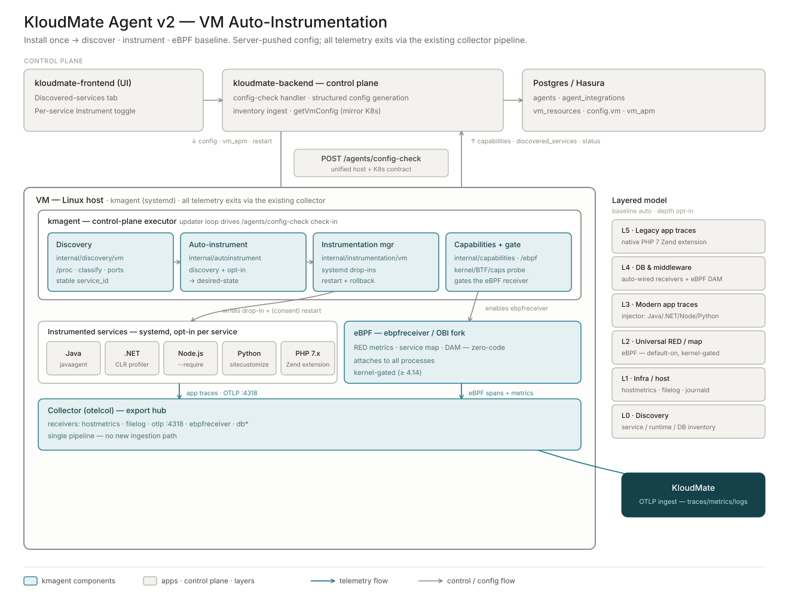

import { LinkCard, CardGrid } from '@astrojs/starlight/components';

The KloudMate agent is built around a clear split: a **control plane** that decides what to collect, and a **data plane** that does the collecting. This page explains the two halves, the check-in protocol that connects them, and how the same model maps onto each deployment mode.

## Design principles

The agent follows five principles that shape everything else in this section:

- **Baseline is automatic; depth is opt-in.** Anything that is safe and zero-risk (host metrics, logs, and the eBPF baseline) turns on automatically. Anything that requires a process restart or touches your application code is opt-in, one service at a time.
- **Configuration is generated, not hand-written.** A structured set of features and integrations compiles into collector configuration. The raw YAML editor stays as an advanced escape hatch, not the primary experience.
- **Reuse the ecosystem.** The agent leans on OpenTelemetry (OTel) language agents, the OpenTelemetry .NET profiler, and an extended Berkeley Packet Filter (eBPF) baseline. KloudMate adds discovery, the control-plane glue, and the user experience.
- **Mirror the Kubernetes contract.** The flow is the same everywhere: discover, choose settings, the agent self-applies, then reports status back.
- **Separate "apply instrumentation" from "restart collector."** Instrumentation actions run on their own path, independent of the collector's configuration-driven restarts.

## Control plane and data plane

```
Control plane (KloudMate)                Data plane (your host or cluster)
┌──────────────────────────┐            ┌──────────────────────────────────┐
│ Web interface            │            │ KloudMate agent                   │
│  • discovered inventory  │            │  • embedded OTel Collector        │
│  • feature/integration   │  check-in  │  • service discovery              │
│    toggles               │◀──────────▶│  • instrumentation manager        │
│ Backend                  │  protocol  │  • updater loop                   │
│  • config generation     │            │                                   │
│  • inventory ingest       │            │  exports telemetry ──▶ KloudMate │
└──────────────────────────┘            └──────────────────────────────────┘
```

### Control plane

The control plane runs inside KloudMate:

- The **web interface** shows the discovered inventory for each host or cluster and lets you toggle features and per-service instrumentation.
- The **backend** stores what each agent should collect, generates the collector configuration from your enabled integrations, and ingests the inventory the agent reports.

### Data plane

The data plane is the agent itself, running on your host or cluster. It bundles several parts:

- The **embedded OpenTelemetry Collector**, which runs the receivers, processors, and exporters that actually collect and ship telemetry.
- The **discovery service**, which inventories the services, runtimes, and databases on the host. See [Discovery](../discovery/).
- The **instrumentation manager**, which applies per-service instrumentation (for example, systemd drop-ins on Linux or registry entries on Windows) when you opt in.
- The **updater loop**, which checks in with the control plane, applies new configuration, and reports status.

Every layer of telemetry exports through the same embedded collector, so there is no separate ingestion path to manage.



## The check-in protocol

The two planes stay in sync through a periodic check-in:

1. The agent reports what it found (discovered services and host capabilities such as kernel version and eBPF support) to the control plane.
2. The control plane generates the collector configuration from your enabled integrations and returns it, along with any per-service instrumentation settings you have chosen.
3. The agent applies the configuration. If the configuration changed, it restarts the embedded collector. If you toggled a service for instrumentation, the instrumentation manager applies it on its own path.

Because configuration flows one way (from the control plane to the agent), a change you make in the web interface reaches every matching agent on its next check-in without any manual steps on the host.

## How the model maps onto each deployment mode

The control-plane and data-plane split is the same in every mode. What changes is how the data plane is packaged and how it applies instrumentation.

| Mode | Data-plane packaging | Instrumentation mechanism |
|---|---|---|
| Linux / VM | A single agent running as a systemd service, with an embedded collector. | systemd drop-in files per service. |
| Windows | A single agent running as a Windows service. | Registry and Internet Information Services (IIS) configuration per service or application pool. |
| Kubernetes | A control-plane pod (fleet manager) plus DaemonSet and Deployment collector pods. One agent represents one cluster. | OpenTelemetry Operator annotations on workloads. |
| Docker | A containerized collector started in Docker mode. | Host metrics, logs, and eBPF today; per-container injection is rolling out. |

On Kubernetes, the agent keeps a two-plane split of its own: a fleet-manager pod acts as the on-cluster control-plane applier, while the DaemonSet and Deployment collector pods form the data plane. Per-node identity is carried on resource attributes, so one cluster appears as one agent rather than many. See [Kubernetes platform notes](../../platform-notes/kubernetes/).

## Next steps

<CardGrid>
  <LinkCard title="Layered instrumentation" href="../layered-instrumentation/" description="What each layer from L0 to L5 emits." />
  <LinkCard title="Discovery" href="../discovery/" description="How the agent inventories your services." />
  <LinkCard title="Configuration model" href="../config-model/" description="How managed configuration is generated." />
</CardGrid>
