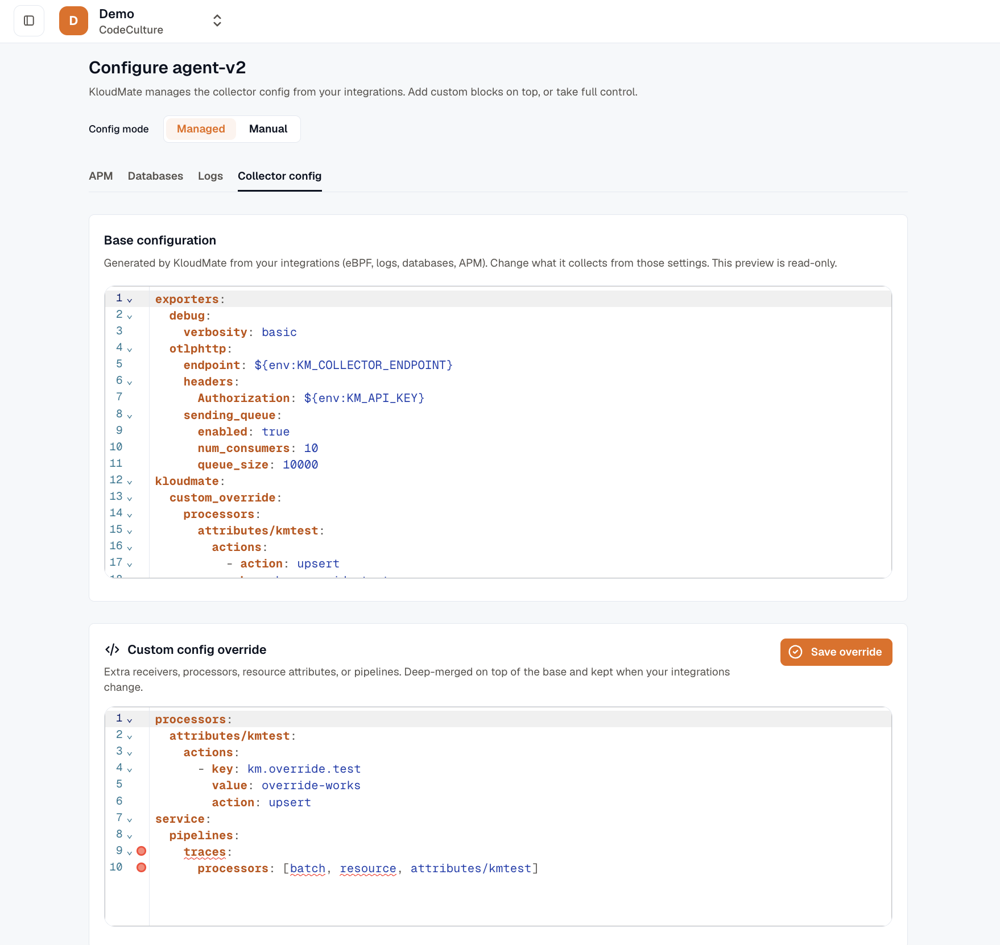
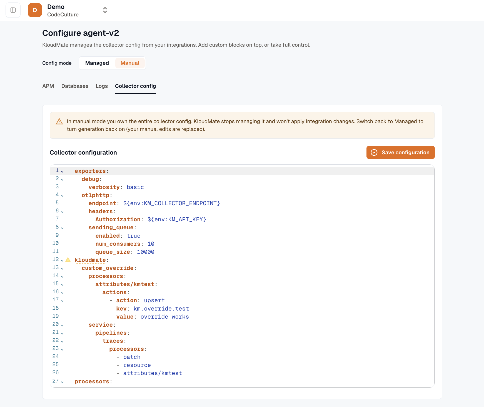

import { LinkCard, CardGrid } from '@astrojs/starlight/components';

In **managed mode**, you turn features on and off from the KloudMate web interface and the agent is configured for you, with no hand-edited YAML. This is how new agents run by default, and it covers host metrics, eBPF monitoring, application performance monitoring (APM), database monitoring, and everything else you toggle in the interface.

A feature only appears where it applies. For example, eBPF monitoring is offered only on hosts with a supported Linux kernel.

## Managed and manual modes

Every agent runs in one of two configuration modes.

| | Managed mode | Manual mode |
|---|---|---|
| Who owns the configuration | KloudMate, from the features you enable | The operator, in the raw YAML |
| YAML editor | Read-only preview | Editable |
| Feature toggles | Available | Disabled |
| Default for | New agents | Existing agents after upgrade |

- In **managed mode**, the configuration is generated from your enabled integrations every time. The YAML editor shows a read-only preview of what was generated. Toggling a feature regenerates the configuration.

- In **manual mode**, you own the YAML blob. The integration toggles are disabled, and the YAML editor is writable. This is for advanced setups that need hand-tuned configuration.

## Undo a change

To undo a managed change, turn the toggle back. There is no separate history or rollback button.

If you switch an agent from manual to managed mode, KloudMate saves a copy of your hand-edited YAML first, so you never lose your manual edits.

## Credentials

Some integrations, such as database receivers, need credentials. You can provide them two ways:

- **Environment reference (default):** the value stays on the host as an environment variable and never reaches KloudMate or the stored configuration. This is recommended, and it makes rotation easier: you update the secret on the host without touching the agent.
- **Plaintext inline (opt-in):** the value is stored in the configuration, and the interface warns you that it is stored unencrypted. Use this only when you accept that trade-off.

See [Database credentials](../../database-monitoring/credentials/).

## Migrating existing agents

When an agent is upgraded, it stays in **manual** mode so nothing changes unexpectedly. To adopt managed mode, switch it in the interface. It starts from a sensible default: host metrics, logs, and eBPF monitoring, plus anything discovery found. New agents already start in managed mode.

:::caution
Switching an agent from manual to managed mode replaces its hand-edited YAML with generated configuration. KloudMate saves the previous manual configuration first, so it is not lost. Still, review the change before you switch a production agent.
:::

## Next steps

<CardGrid>
  <LinkCard title="Architecture" href="../architecture/" description="How the web interface and the agent work together." />
  <LinkCard title="Application APM" href="../../auto-instrumentation/overview/" description="Toggle per-service instrumentation." />
  <LinkCard title="Advanced configuration" href="../../advanced-configuration/" description="Manual YAML editing and custom receivers." />
</CardGrid>
