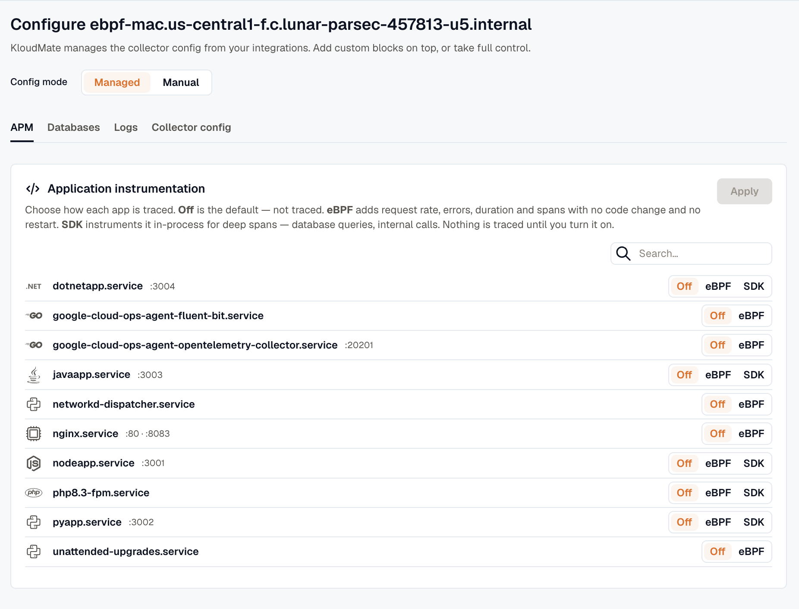

import { LinkCard, CardGrid } from '@astrojs/starlight/components';

Discovery builds a live inventory of what runs on each host or cluster. The web interface uses it to offer to instrument a service or monitor a database, instead of asking you to configure it by hand. It runs on all deployment modes.

## What discovery finds

The agent finds two kinds of things:

- **Application services**, classified by runtime (Java, .NET, Node.js, Python, PHP, Go, and Ruby), with framework and web-server hints (nginx, Apache, and php-fpm) where they apply.
- **Databases and middleware** running locally, such as PostgreSQL, MySQL, Redis, and MongoDB.

For each service, discovery records how it is managed and which ports it listens on.

## Where discovered services appear

To see what discovery found, go to **Settings → Agents**, open the agent's actions menu (⋮), and select **Configure**. Application services are listed in the **Application instrumentation** card on the **APM** tab, and databases on the **Databases** tab. Discovery reports these details for each service:

- **Name** and **runtime** (for example, `checkout` running Java).
- **Runtime version**, where it affects a decision (for example, the PHP major and minor version, or whether a .NET app runs on .NET Framework or .NET Core).
- **Kind**: how the service is managed, such as a systemd unit, a bare process, a container, a Windows service, or an Internet Information Services (IIS) application pool.
- **Listen ports**.
- **State**: `running` or `idle`. Discovery also reports installed-but-not-running services as `idle`, so you can choose to instrument one on its next start.
- **Instrumentable** flag: whether the agent has a way to attach application tracing to that runtime.

:::note
The `instrumentable` flag shows whether the agent can inject tracing into that runtime. Java, .NET, Node.js, and Python are instrumentable. PHP is instrumentable when a tracer is available for the detected version. Go isn't injected. eBPF monitoring covers it instead, so a Go service offers **Off** and **eBPF** but no **SDK** option.
:::

## Stable service identity

Each discovered service gets a **stable identity** that survives restarts and process-ID changes. This is what lets a tracing choice keep applying after a service restarts: you instrument `checkout`, not a process that will be gone after the next deploy.

## Privacy and safety

Discovery keeps sensitive data on the host:

- It **never sends raw environment variables or full command lines** to KloudMate, because these can contain secrets. It extracts only what it needs to classify a service (runtime, version, and listen ports) and discards the rest.
- It skips the agent itself and developer tools, so they are not listed or instrumented.

## How discovery powers the rest of the agent

Discovered services are the entry point for the opt-in features:

- **Application APM:** on the **APM** tab, choose **Off**, **eBPF**, or **SDK** for each service, then click **Apply**. **SDK** is offered only for instrumentable services. See [Application APM](../../auto-instrumentation/overview/).
- **Database monitoring:** on the **Databases** tab, click **Monitor** next to a discovered database to start the monitoring wizard, which prefills the engine and endpoint. See [Database monitoring](../../database-monitoring/overview/).

## Next steps

<CardGrid>
  <LinkCard title="Application APM" href="../../auto-instrumentation/overview/" description="Instrument a discovered service." />
  <LinkCard title="Database monitoring" href="../../database-monitoring/overview/" description="Monitor a discovered database." />
  <LinkCard title="Configuration model" href="../config-model/" description="How managed configuration works." />
</CardGrid>
