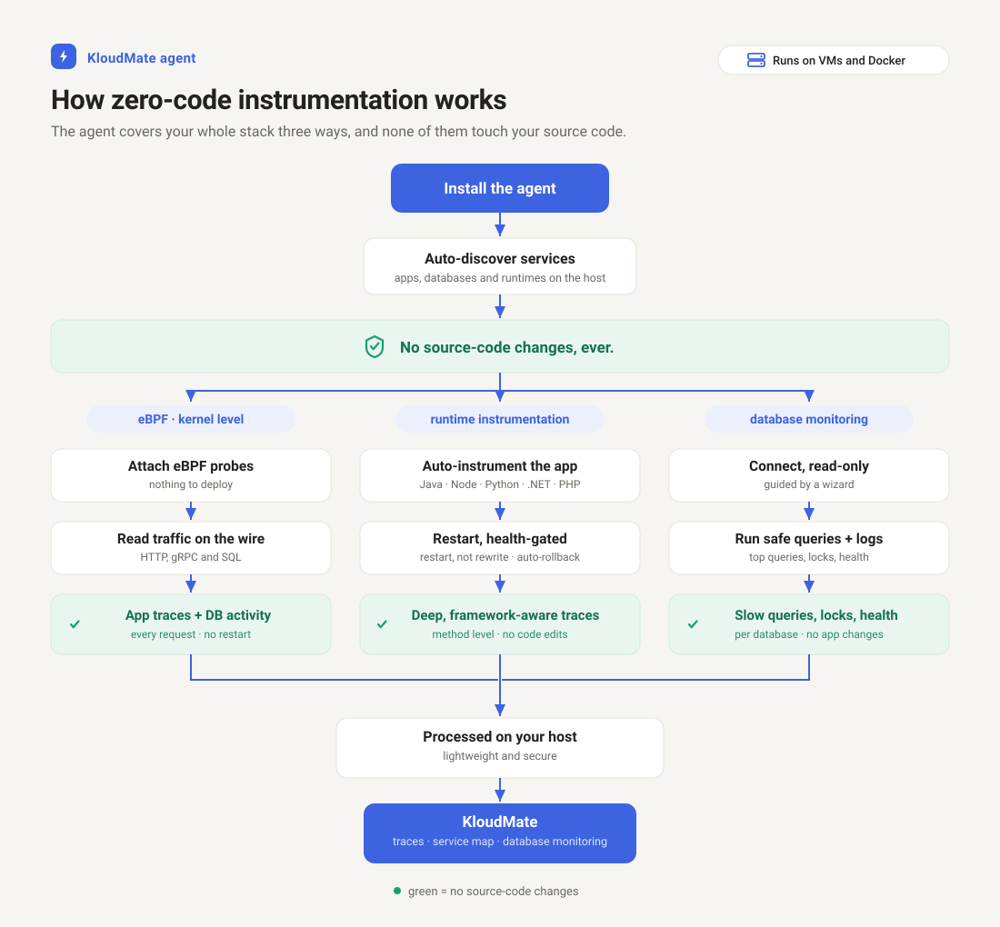

import { LinkCard, CardGrid } from '@astrojs/starlight/components';

The KloudMate agent organizes what it collects into six layers, labeled L0 through L5. The lower layers are automatic and carry no risk to your applications. The upper layers require a process restart, so you turn them on for each service when you are ready. This "zero-config baseline plus opt-in depth" model is what lets you install once and then instrument everything at your own pace.

Every layer exports through the same embedded OpenTelemetry (OTel) Collector, so adding a layer never adds a new pipeline for you to manage.

## The layers at a glance

| Layer | What it provides | How it turns on |
|---|---|---|
| L0: Discovery | Live inventory of services, runtimes, and databases | Automatic |
| L1: Host metrics and logs | CPU, memory, disk, network, and system logs | Automatic |
| L2: eBPF baseline | RED metrics, service map, Database Activity Monitoring, context propagation | Automatic (kernel-gated) |
| L3: Application APM | Distributed traces for Java, Node.js, Python, .NET | Opt-in per service |
| L4: Databases and middleware | Server-side database metrics and logs | Opt-in per database |
| L5: Legacy application traces | Route-level traces for PHP 7 | Opt-in per service |

## The automatic baseline (L0 to L2)

The first three layers turn on without any configuration and without touching your applications.

### L0: Discovery

Discovery inventories the application services, runtimes, and databases running on each host or cluster. It classifies each service by runtime (Java, .NET, Node.js, Python, PHP, Go, and Ruby), notes how it is managed and which ports it listens on, and marks whether the agent has a way to instrument it. This inventory powers the "we found these services, instrument them?" prompts in the web interface. See [Discovery](../discovery/).

### L1: Host metrics and logs

After install, the agent collects host metrics (CPU, memory, disk, and network) and system logs automatically. This is the same infrastructure telemetry the agent has always provided, and it needs no configuration. See [Host metrics and logs](../../baseline/host-metrics-and-logs/).

### L2: eBPF baseline

Where the Linux kernel supports it, the extended Berkeley Packet Filter (eBPF) baseline turns on by default. It observes traffic directly from the kernel to produce:

- **RED metrics** (Rate, Errors, and Duration) for your services.
- A **network service map** with peer-to-peer latency.
- **Database Activity Monitoring (DAM)**, which parses database queries on the wire with no credentials.
- **Trace-context propagation** across services over HTTP, and correlation between logs and traces.

None of this requires code changes or SDKs. See [eBPF observability](../../ebpf-observability/).

## Opt-in depth (L3 to L5)

The upper layers attach to individual services and need a restart of that service, so you enable them one at a time.

### L3: Application APM

Application performance monitoring (APM) attaches OpenTelemetry auto-instrumentation to a modern application to produce full distributed traces. You toggle a service to instrument it, consent to the restart, and traces begin flowing, correlated with the eBPF spans from L2. Supported runtimes include Java, Node.js, Python, and .NET. See [Application APM](../../auto-instrumentation/overview/).

### L4: Databases and middleware

Database monitoring adds server-side receivers that read a database engine's own health metrics and logs (connections, cache hit ratio, replication lag, slow queries, and more). This complements the wire-side view that eBPF DAM provides at L2: eBPF shows the application-to-database traffic, while the receivers show the server's internal state. See [Database monitoring](../../database-monitoring/overview/).

### L5: Legacy application traces

PHP 7 has no native OpenTelemetry path, so the agent brings route-level tracing to PHP 7 applications through a dedicated tracer. The resulting traces share trace identifiers with the eBPF baseline, so they join the same distributed traces as everything else. See [PHP instrumentation](../../auto-instrumentation/php/).

## Why the split matters

Splitting automatic layers from opt-in layers keeps the blast radius of instrumentation small. You get immediate, safe visibility from L0 to L2 the moment the agent is installed. When you want deeper application traces, you enable L3 to L5 for a single service, review the result, and expand from there, rather than instrumenting your whole fleet at once.

## Next steps

<CardGrid>
  <LinkCard title="Discovery" href="../discovery/" description="How the agent inventories your services." />
  <LinkCard title="Configuration model" href="../config-model/" description="How layers compile into collector configuration." />
  <LinkCard title="eBPF observability" href="../../ebpf-observability/" description="Configure the L2 kernel-level baseline." />
</CardGrid>
