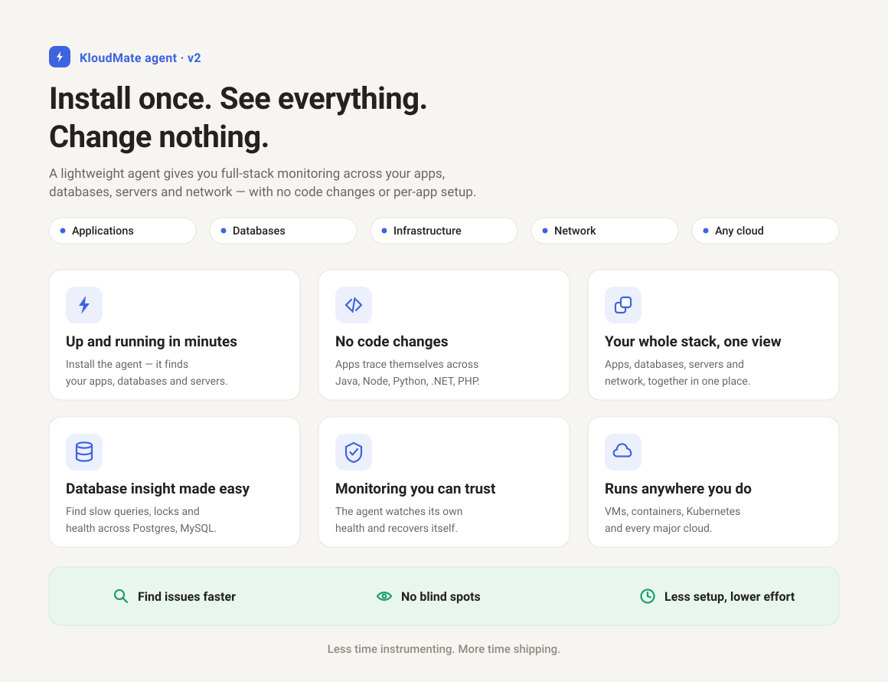

import { LinkCard, CardGrid } from '@astrojs/starlight/components';

The **KloudMate Agent** is a single program that you install on your servers, containers, or clusters. It follows an "install once, instrument everything" model: as soon as it is running, it discovers what you run, starts collecting host metrics and logs, and turns on kernel-level observability. From there, you opt in to deeper application tracing one service at a time, all from the KloudMate web interface.

Under the hood, the agent runs an enhanced build of the industry-standard **OpenTelemetry (OTel) Collector**. We bundle a curated set of components tuned for simple deployment, remote configuration, and **extended Berkeley Packet Filter (eBPF)** kernel-level observability. You never have to hand-write collector configuration to get started.

## How the agent works

The agent has two halves that work together:

- **Control plane** (the KloudMate backend and web interface): stores what each agent should collect, generates the collector configuration, and shows you the discovered inventory and telemetry.
- **Data plane** (the agent on your host): runs the embedded OTel Collector, discovers services, applies instrumentation, and exports telemetry to KloudMate.

The agent periodically checks in with KloudMate to report what it found and to receive its generated configuration. When you change a setting in the web interface, the agent picks up the new configuration on its next check-in and safely restarts the underlying collector for you. You do not need Secure Shell (SSH) access or local file edits to reconfigure an agent.

Each agent is uniquely identifiable, so you can track its health and status from your KloudMate dashboards. To go deeper, read [Architecture](concepts/architecture/) and the [Configuration model](concepts/config-model/).

## The layered instrumentation model

The agent collects telemetry in layers. The lower layers are automatic and carry no risk to your applications. The upper layers require a process restart, so you turn them on per service when you are ready.

- **L0 Discovery:** builds a live inventory of the services, runtimes, and databases running on each host or cluster, and powers the "instrument this?" prompts in the web interface.
- **L1 Host metrics and logs:** collects host metrics and system logs automatically after install.
- **L2 eBPF baseline:** turns on by default (kernel permitting) to produce Rate, Errors, and Duration (RED) metrics, a network service map, Database Activity Monitoring (DAM), and trace-context propagation, with no code changes.
- **L3 Application APM:** opt-in per service. Attaches OpenTelemetry auto-instrumentation to Java, Node.js, Python, and .NET applications for full distributed traces.
- **L4 Databases and middleware:** wires up server-side database receivers (PostgreSQL, MySQL, and more) to complement the wire-side view from eBPF.
- **L5 Legacy application traces:** brings route-level tracing to PHP 7 applications, which have no native OpenTelemetry path.

Read [The layered instrumentation model](concepts/layered-instrumentation/) for what each layer emits and how they fit together.

## What the agent collects

- **Host metrics and logs:** CPU, memory, disk, and network metrics plus system and application logs, with no configuration.
- **eBPF-powered observability:** zero-code visibility into application, network, and database traffic straight from the Linux kernel.
- **Database Activity Monitoring (DAM):** wire-side capture of SQL operations, latency, and throughput for engines such as MySQL, PostgreSQL, Redis, and Kafka.
- **Application performance monitoring (APM):** opt-in distributed tracing for Java, Node.js, Python, .NET, and PHP 7 services.
- **Agent self-health:** out-of-band liveness metrics and error logs so you can see the agent's own status without logging in to the host.

## Supported platforms

The agent runs across four deployment modes. Not every capability applies to every mode: eBPF depends on the Linux kernel, so it does not apply on Windows, where an Event Tracing for Windows (ETW) baseline provides the equivalent view.

| Capability | Linux / VM | Windows | Kubernetes | Docker |
|---|---|---|---|---|
| Service discovery | Yes | Yes | Yes | Yes |
| Host metrics and logs | Yes | Yes | Yes | Yes |
| eBPF baseline (RED, service map, DAM) | Yes | Not applicable | Yes | Yes |
| Application APM (Java, Node.js, Python, .NET) | Yes | Yes | Yes | Rolling out |
| Application APM (PHP 7) | Yes | Not applicable | Not applicable | Rolling out |
| Database monitoring (receivers) | Yes | Yes | Yes | Yes |
| Web server monitoring (nginx, Apache) | Yes | Not applicable | Yes | Yes |
| Agent health and self-logs | Yes | Yes | Yes | Yes |

:::note
On Linux, the eBPF baseline needs kernel 4.14 or newer, and unlocks richer capabilities on 5.8 and above. On Docker, host metrics, logs, and the eBPF baseline work today; per-container application injection is being rolled out. See [Docker platform notes](platform-notes/docker/) for the current coverage.
:::

## Install the agent

<CardGrid>
  <LinkCard title="Linux" href="installation/linux-agent/" description="Install the KloudMate Agent on Debian, Ubuntu, RHEL, or CentOS." />
  <LinkCard title="Docker" href="installation/docker-agent/" description="Deploy the KloudMate Agent as a Docker container." />
  <LinkCard title="Windows" href="installation/windows-agent/" description="Install the KloudMate Agent on Windows Server 2016 and above." />
  <LinkCard title="Kubernetes" href="installation/kubernetes-agent/" description="Deploy the KloudMate Agent via DaemonSet and Deployment." />
</CardGrid>

## Learn the concepts

<CardGrid>
  <LinkCard title="Architecture" href="concepts/architecture/" description="How the control plane and data plane work together across deployment modes." />
  <LinkCard title="Layered instrumentation" href="concepts/layered-instrumentation/" description="The L0 to L5 model: automatic baseline plus opt-in depth." />
  <LinkCard title="Discovery" href="concepts/discovery/" description="How the agent inventories your services and powers instrumentation." />
  <LinkCard title="Configuration model" href="concepts/config-model/" description="Managed and manual modes, integrations, and config history." />
</CardGrid>

## Future support

In future releases, the agent will also support:

- macOS
- Oracle Cloud Infrastructure (OCI)
