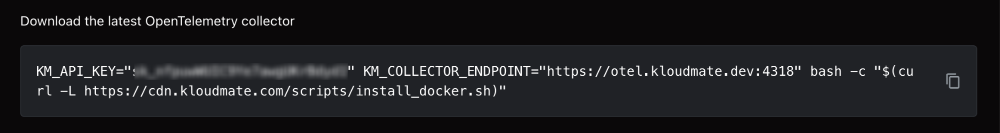
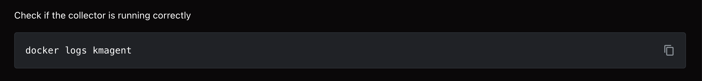
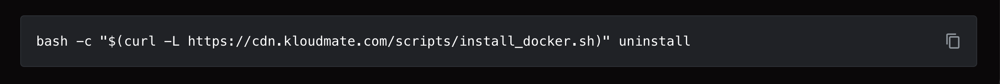

Run the **KloudMate Agent** as a Docker container to collect host and container metrics and logs.

## **What the Docker Agent Monitors**

Once installed, the Docker Agent collects:

- **Container metrics:** CPU, memory, network, and disk usage for each running container
- **Container lifecycle events:** start, stop, restart
- **Host metrics:** CPU, memory, disk, and network usage of the Docker host
- **Container and host logs:** stdout/stderr from containers and system logs from the host
- **Alerts:** Configure thresholds for containers or the host to notify on performance issues
- **Dashboards:** Pre-built views for container-level and host-level performance

This allows you to monitor **containers and host together**, troubleshoot performance issues, and correlate logs with metrics.

## **Accessing Your Data**

View all collected data in these KloudMate sections:

**1. Infrastructure Monitoring**

- Monitor Docker host metrics (CPU, memory, disk, network)
- See all running containers and their resource usage
- Track availability and uptime for containers and host   

[Infrastructure Monitoring](../../../infrastructure/)

**2. Dashboards**

- Build custom dashboards tailored for your containers or host metrics

 [Creating a Dashboard](../../../visualize-data/dashboards/)

**3. Log Explorer**

- Search logs per container or host
- Filter logs by container name, severity, or timestamp
- Correlate container logs with metrics to troubleshoot issues

[Log Explorer](../../../logs/log-explorer/) 

## Pre-requisites

- Docker must be installed on the system.
- Network access to the [required URLs](../../reference/network-requirements/) if your outbound traffic is restricted.

:::note
  The Docker agent requires `docker.sock` to be mounted to the agent container.
:::

:::note
  The commands below are for reference only. Log in to KloudMate and copy your account-specific command to install the Agent.
:::

## Install Agent

**Step 1:** Navigate to the **Settings → Agents** section in your KloudMate account.

**Step 2:** Select **Docker** from the list of available integrations.

**Step 3:** Copy and run the Docker agent install command in your terminal to download and install the agent.

**Step 4:** Run the following command to verify the agent is running correctly.

## **Log Integration**

By default, the KloudMate Agent collects host and container logs.

To collect application log **files** on the Docker host, use log monitoring. In the agent's **Logs** tab, point the agent at a folder and file-name pattern, then choose how to parse each line: plain text, JSON, or a regular expression. Multiline grouping, for stack traces or pretty-printed JSON, works on top of any format. You can preview the parsed records before you save. See [Log monitoring](../../log-monitoring/).

For a hand-written `filelog` receiver in manual mode, see [Collect File Logs with KloudMate Agent](../../../logs/collect-file-logs/).

## Coverage and configuration

In Docker mode, the agent collects host and container metrics, container and host logs, and, where the host kernel supports it, [eBPF monitoring](../../ebpf-observability/) across your containers with no code changes. eBPF monitoring gives you RED metrics, the service map, and Database Activity Monitoring. For span-level application traces, the agent instruments PHP containers without a redeploy. Java, Node.js, Python, and .NET are covered by eBPF monitoring. See [Docker platform notes](../../platform-notes/docker/) for the per-runtime detail.

New agents start in managed mode, so KloudMate generates the collector configuration for you. See the [configuration model](../../concepts/config-model/).

## **Next Steps**

- Open **Infrastructure Monitoring** to see all running containers and host metrics
- Go to **Dashboards** to visualize container and host performance
- Use **Log Explorer** to investigate container logs and host logs
- Configure **alerts** for container or host thresholds

## Uninstall Agent

Run the following command to uninstall the agent.

