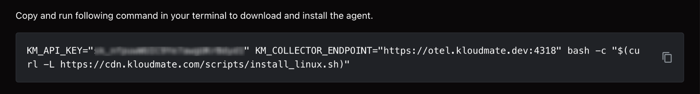
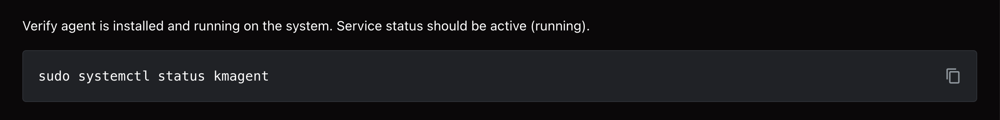
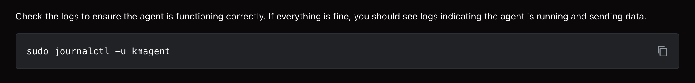
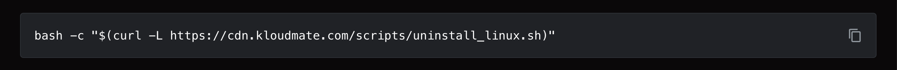

import { Aside } from '@astrojs/starlight/components';

This document provides clear instructions for installing the **KloudMate Agent** on a Linux machine. 

**Supported Platforms:** Debian/Ubuntu, RHEL/CentOS.

<Aside type="note">
  The commands below are for reference only. Log in to KloudMate and copy your account-specific command to install the Agent.
</Aside>

## What the Linux Agent Monitors

After installation, the agent sends telemetry data to KloudMate, enabling unified monitoring of system health and issue investigation.

Key capabilities:

- Monitoring CPU, memory, disk, and network usage
- Tracking performance trends over time
- Detecting resource bottlenecks
- Collecting and analyzing system and application logs
- Visualizing data with dashboards
- Creating alerts for critical conditions

## **Accessing Your Data**

View all data in these KloudMate sections:

**1. Infrastructure Monitoring**

- View connected Linux hosts
- Monitor real-time and historical resource usage
- Track host availability and uptime

[Infrastructure Monitoring](../../../infrastructure-monitoring/)

**2. Dashboards**

- Use the pre-built [Host Metrics – Linux](https://templates.kloudmate.com/host-metrics/index.html) dashboard template to visualize server performance
- Build custom dashboards based on your monitoring needs

[Creating a Dashboard](../../../visualize-data/dashboards/)

**3. Log Explorer**

- Search and filter logs
- Correlate logs with metrics
- Troubleshoot issues

[Log Explorer](../../../logs/log-explorer/)

## Install Agent

**Step 1:** Navigate to the ** Settings → Agents** section in your KloudMate account.

**Step 2:** Select ** Linux** from the list of available integrations.

**Step 3:** Copy and run the Linux agent install command in your terminal to download and install the agent.

**Step 4:** Run the agent status command to check if the agent is active.

**Step 5:** Execute the "Check Logs" command to confirm the agent is functioning correctly.

## **Log Integration**

By default, the KloudMate Agent collects basic system logs.

To configure custom application logs and enable file-based log monitoring, refer to:

[Collect File Logs with KloudMate Agent](../../../logs/server-logs-to-kloudmate/) documentation

This guide explains how to:

- Configure the file log receiver
- Add custom log file paths
- Enable multiline log parsing
- Validate logs in Log Explorer

## Next Steps

- Open **Infrastructure Monitoring** to confirm your Linux hosts are visible
- Go to **Dashboards** to review system performance
- Use **Log Explorer** to start investigating logs
- Set up **alerts & notifications** for critical events

## Uninstall Agent

Run the provided uninstall command to remove the agent.

