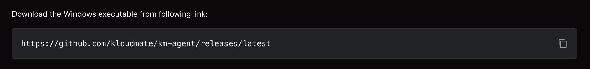
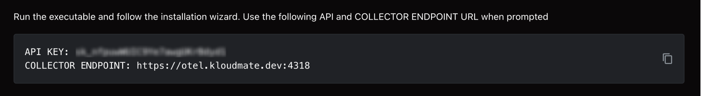
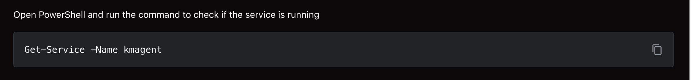
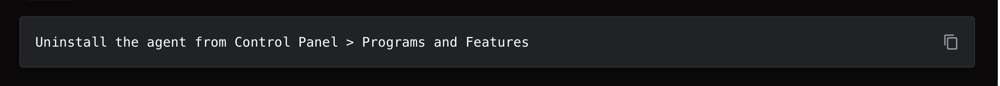

This document will guide you through installing the **KloudMate Agent** on your Windows machine **(Windows Server 2016+)**.

<hint type="info">
  The commands below are for reference only. Log in to KloudMate and copy your account-specific command to install the Agent.
</hint>

## **What the Windows Agent Monitors**

Once installed, the Windows Agent collects:

- **Host metrics:** CPU, memory, disk, and network usage
- **Service monitoring:** Status of critical Windows services (optional, if configured)
- **Windows Event Logs:** System, Application, and Security logs
- **Application logs:** Logs from installed applications (if configured)
- **Alerts:** Configure thresholds for host metrics or service status to notify on critical events
- **Dashboards:** Pre-built and custom dashboards to visualize Windows host metrics and logs

This allows you to monitor Windows hosts, troubleshoot issues, and correlate logs with metrics for performance insights.

## **Accessing Your Data**

View all collected data in these KloudMate sections:

**1. Infrastructure Monitoring**

- Monitor Windows host metrics (CPU, memory, disk, network)
- Track service status and host availability
- Monitor uptime and performance trends

[Infrastructure Monitoring](../../../infrastructure-monitoring/)

**2. Dashboards**

- Use the pre-built [Host Metrics – Windows](https://templates.kloudmate.com/host-metrics-windows/index.html) dashboard template to quickly visualize Windows host metrics and logs
- Build custom dashboards tailored to your host metrics, services, or logs

[Creating a Dashboard](../../../dashboards/)

**3. Log Explorer**

- Access Windows Event Logs (System, Application, Security)
- Search and filter logs by source, severity, or timestamp
- Correlate logs with host metrics to troubleshoot performance issue

[Log Explorer](../../../logs/log-explorer/)

## Install Agent

**Step 1:** Navigate to the **Settings → Agents** section in your KloudMate account.

**Step 2:** Select **Windows** from the list of available integrations.

**Step 3:** Download the Windows executable using the provided link.

**Step 4:** After installation completes, enter the API key and Collector Endpoint when prompted.

**Step 5:** Run the command under **Check service status** in PowerShell to verify the service is running. 

## **Log Integration**

By default, the KloudMate Agent collects basic system logs.

To configure custom application logs and enable file-based log monitoring, refer to:

[Collect File Logs with KloudMate Agent](../../../logs/server-logs-to-kloudmate/) documentation

This guide explains how to:

- Configure the file log receiver
- Add custom log file paths
- Enable multiline log parsing
- Validate logs in Log Explorer

## **Next Steps**

- Open **Infrastructure Monitoring** to see host metrics and service status
- Go to **Dashboards** to visualize host performance and logs
- Use **Log Explorer** to investigate Windows Event Logs and application logs
- Configure **alerts** for host or service thresholds

## Uninstall Agent

Run the following command to uninstall the agent.

