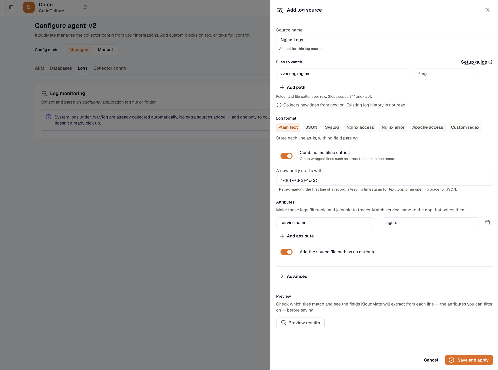
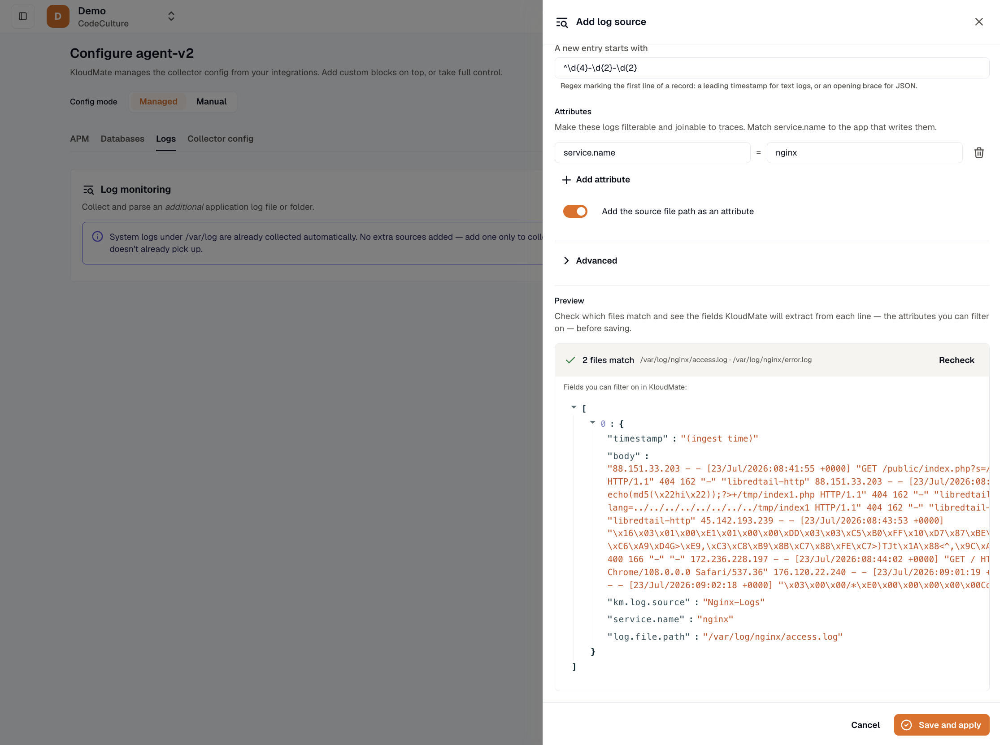

import { Steps, Tabs, TabItem, LinkCard, CardGrid } from '@astrojs/starlight/components';

Log monitoring is a wizard where you point the agent at log files on a host and choose how to parse them, with no hand-written collector configuration. You give the agent a folder and a file-name pattern, pick a parse format, and the agent collects those files. It is the log counterpart of [database monitoring](../database-monitoring/overview/): the same wizard-driven approach, but for log files.

It applies to Linux and Windows virtual machine (VM) hosts and to Docker. It is **not available on Kubernetes**, where pod and container logs are already collected for you. See [Not available on Kubernetes](#not-available-on-kubernetes) below.

## How it fits

Log monitoring is a managed-mode feature. You configure sources from the agent's **Configuration** page, on the **Logs** tab. See the [configuration model](../concepts/config-model/) for how managed mode works.

- **Managed mode only.** The Logs tab is available when the agent is in managed mode. If the agent is in manual mode, the tab prompts you to switch. You can still add a `filelog` receiver by hand in manual mode: see [Manual configuration](#manual-configuration).
- **Independent sources.** Each source is isolated, so one badly configured source cannot affect the others or your host system logs.
- **It adds application log files.** On Windows the agent already collects the Event Log, and on Docker it collects container output; on a Linux host it collects no log files on its own. Log monitoring is how you collect application log **files** on any platform. See [Host metrics and logs](../baseline/host-metrics-and-logs/).

## Add a log source

You add each source through the wizard on the Logs tab.

<Steps>

1. **Open the Logs tab.** Go to the agent's Configuration page and select **Logs**. The agent must be in managed mode.

2. **Name the source.** The name identifies the source and is stamped on every record it collects (as the `km.log.source` attribute), so give it something you will recognize in the Log Explorer.

3. **Point at the files.** Enter the **folder** and a **file-name pattern**. The wizard joins them into a single glob. For example, folder `/var/log/nginx` with pattern `*.log` becomes `/var/log/nginx/*.log`. Patterns support wildcards, including `*`, `**` for nested directories, and `{a,b}` alternatives. There is no auto-discovery of log locations: you type where the files are, and the preset catalog does the rest.

4. **Choose how to parse.** Pick a format or an app preset. See [Choose how to parse](#choose-how-to-parse) and [App presets](#app-presets).

5. **Stamp attributes (optional).** Add attributes such as `service.name` so these logs join the traces of the same application. The wizard suggests service names from what the agent discovered on the host.

6. **Preview results.** Ask the agent to resolve the pattern against the real filesystem and show how your parsing turns sample lines into stored records. See [Preview before you save](#preview-before-you-save).

7. **Save.** The agent applies the change within about a minute and starts reading new lines from the end of each matching file.

</Steps>



## Choose how to parse

A source is parsed one of three ways. The format decides how a line becomes a structured record.

<Tabs>
<TabItem label="Plain text">

Each line is stored as-is, as the record body, with no field parsing. Use this when you only need the raw text searchable in the Log Explorer, or as a starting point before you add parsing.

</TabItem>
<TabItem label="JSON">

Each line is parsed as one JSON object. You then map which fields are the **timestamp**, the **severity**, and the **message**. The timestamp and severity are set on the record, the message becomes the record body, and every other field is kept as a searchable attribute.

</TabItem>
<TabItem label="Custom regex">

You supply a regular expression with **named capture groups**, then map which groups are the timestamp, the severity, and the message. As with JSON, those three are set on the record and the remaining named groups are kept as attributes. This is the most flexible format, and it is what the app presets are built on.

</TabItem>
</Tabs>

## App presets

For common log shapes, the wizard offers presets so you do not have to write the pattern yourself:

- **Syslog** (the classic `/var/log/syslog` format). Plain syslog lines carry no severity, so records have no level unless the message text includes one.
- **Nginx access**
- **Nginx error** (carries a level)
- **Apache access**

Each app preset is a prefilled **Custom regex**: a ready-made regular expression, the timestamp, severity, and message mapping, and the timestamp layout, all filled in for you. You can preview a preset against your own files and edit any part of it before you save. There is also a plain **JSON** preset that prefills the usual `ts`, `level`, and `msg` field names for you to adjust.

## Combine multiline entries

Some log entries span several lines, such as a stack trace or a pretty-printed JSON object. Multiline grouping is a toggle, not a separate format. It works on top of plain text, JSON, or regex.

When you turn it on, you give the agent a line-start pattern that marks where a new entry begins ("a new entry starts with ..."). The agent then joins every following line into that entry until the next start. The wizard fills in a sensible pattern for you (a leading timestamp for text logs, an opening brace for JSON), which you can adjust.

## Timestamps and severity

**Timestamps.** When you map a timestamp field or group, you also tell the agent its layout:

- **ISO 8601** or **RFC 3339**
- **Unix epoch**, in seconds or milliseconds
- A **custom layout**, written with `strptime` directives (for example, `%b %e %H:%M:%S`)

A layout with no year, such as the classic syslog timestamp, is stamped with the current year automatically. If no timestamp is mapped or a value does not match the layout, the record falls back to the time the agent read it.

**Severity.** Standard level names (such as `trace`, `debug`, `info`, `warn`, `error`, and `fatal`) are recognized automatically. The presets also map the syslog and nginx names: `notice` becomes `info`; `crit` and `critical` become `error`; and `alert`, `emerg`, `emergency`, and `panic` become `fatal`. A value that maps to no known level is left unset.

## Preview before you save

Before you save a source, use **Preview results**. The agent does the check against the real files on the host, so you see exactly what will happen, not a guess:

- **Which files match.** The agent resolves your folder-and-pattern glob against the filesystem and lists the files it matched, along with any it matched but cannot read (for example, because of permissions), so a missing match is obvious rather than a silent empty result.
- **A sample of recent lines.** The agent reads a small sample of recent lines from a matching file.
- **The record KloudMate will store.** The agent applies your chosen parsing to each sample line and shows the resulting structured record: the resolved timestamp, the mapped severity, the message body, and the attributes you can filter on.

The preview flags problems while you can still fix them: a regex that does not match a line, or a timestamp layout that a value will not parse against. Secrets that appear in the sample, such as passwords, tokens, and bearer values, are redacted on the host before the sample is sent, so they never leave the machine.



## How the agent reads your files

- **New lines only.** Each source starts reading at the **end** of the file, so you get new lines from the moment it is applied. There is no historical backfill and no checkpoint file. Applying any configuration change restarts the collector and re-opens each source at the end, so a low-traffic file may show nothing until it is next written to.
- **No self-ingestion.** The agent never re-ingests its own logs, even if a broad pattern would otherwise match them.
- **Records carry their source.** Every record is stamped with the source name (`km.log.source`), and any attributes you added. Stamping `service.name` is what lets a file's logs line up with that application's traces. See [Telemetry identity](../reference/telemetry-identity/).

## Not available on Kubernetes

Log monitoring runs on Linux and Windows VM hosts and on Docker. It is **not available on Kubernetes**:

- The Logs tab is hidden for Kubernetes agents, and the backend rejects log sources for them.
- On Kubernetes, the agent's DaemonSet already collects pod and container logs (`stdout` and `stderr`) as part of [host metrics and logs](../baseline/host-metrics-and-logs/), so a file-pointing wizard is not needed. See [Kubernetes platform notes](../platform-notes/kubernetes/).

## Local file sources

Besides the wizard, the agent reads log sources from files on the host. At startup it loads every `*.yaml` or `*.yml` file from a directory on the host:

- **Linux:** `/etc/kmagent/logs.d`
- **Windows:** `%ProgramData%\kmagent\logs.d` (by default `C:\ProgramData\kmagent\logs.d`)

Override the directory with the `KM_LOG_SOURCES_DIR` environment variable. Each file is a YAML list of sources with the same fields the wizard sets. Use this where there is no web interface to configure, such as an autoscaling group or a baked machine image. See [Auto-scaling group deployment](../installation/aws-asg-deployment/#configure-log-collection) for the fields and examples.

These local sources merge with the sources you configure in the web interface. If both define the same source name, the pushed source wins.

## Windows Event Log channels

On Windows, a log source can collect **Windows Event Log channels** instead of files. Set the source `type` to `eventlog` and list the channel names in `include`:

```yaml
# %ProgramData%\kmagent\logs.d\powershell-events.yaml
- name: powershell-events
  type: eventlog
  include: [ "Microsoft-Windows-PowerShell/Operational" ]
```

Only new events are collected, with no historical backfill. The System, Application, and Security logs are already collected by default (see [Host metrics and logs](../baseline/host-metrics-and-logs/)), so use `eventlog` sources for other channels. Event Log sources are Windows-only.

## Manual configuration

The wizard covers the common cases. For anything it cannot express, switch the agent to manual mode and add a `filelog` receiver to the collector configuration by hand. See [Collect file logs](../../logs/collect-file-logs/) for the receiver configuration, and [Advanced configuration](../advanced-configuration/) for when to use manual mode.

## Where to view your logs

Collected logs land in the **Log Explorer**, where you can search and filter them and correlate them with your metrics and traces. See [Log Explorer](../../logs/log-explorer/).

## Next steps

<CardGrid>
  <LinkCard title="Host metrics and logs" href="../baseline/host-metrics-and-logs/" description="What the agent collects automatically, per platform." />
  <LinkCard title="Database monitoring" href="../database-monitoring/overview/" description="The same auto-wired model for databases." />
  <LinkCard title="Configuration model" href="../concepts/config-model/" description="How managed mode generates the collector configuration." />
  <LinkCard title="Collect file logs" href="../../logs/collect-file-logs/" description="Add a filelog receiver by hand in manual mode." />
</CardGrid>
