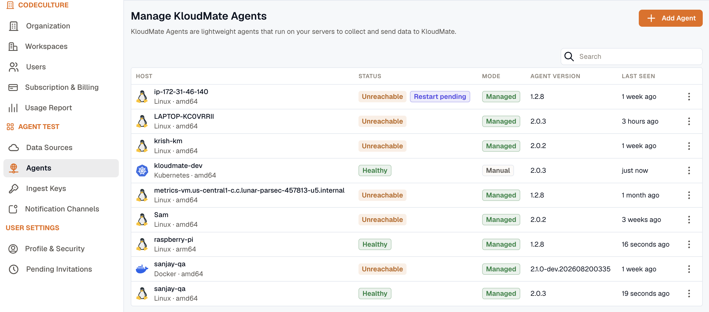
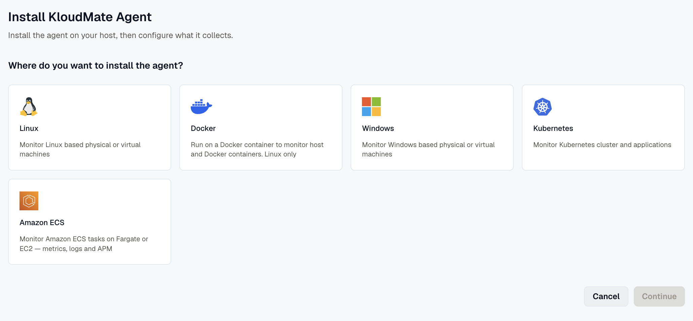

The KloudMate Agent is designed to be managed centrally from the KloudMate web UI. This means you don't need to SSH into your servers or manually edit local YAML files to update settings. Changes made in the dashboard are automatically pushed to your agents across your infrastructure.

## Agents Overview

The KloudMate agent's landing page allows you to view, add, and manage your agents. Once an agent is integrated, you can view its details:



- **Hostname:** The agent's host machine name.
- **Platform:** The operating system or environment of the agent.
- **Status:** Current running status of the agent.
- **Agent Version:** Version of the KloudMate agent used during integration.
- **Updated At:** The last time the collector configuration was updated.

## Adding a New Agent

1. Click the **Add Agent** button located at the top right corner of the page.


2. Select an agent from the available integrations list.



:::note
  After selecting an agent, refer to the corresponding installation guide:

  [Linux](../installation/linux-agent/) | [Docker](../installation/docker-agent/) | [Windows](../installation/windows-agent/) | [Kubernetes](../installation/kubernetes-agent/)
:::

## Remote Configuration Editor

The agent watches for remote configuration changes via a secure connection and updates itself automatically. 

:::danger
  **Do not edit local files manually.**
  Manually updating ConfigMaps or local configuration files is not recommended, as these configurations may be overwritten by the central KloudMate APIs. Always use the **KloudMate Agent Config Editor** in the web UI.
:::

From the KloudMate platform, you can update the collector configuration associated with any agent:


- **Collector Configuration:** Open the web-based YAML editor to make changes to the collector settings and apply updates automatically where the agent is installed.
- **APM Configuration:** Configure the applications running on your Kubernetes cluster (applicable only for Kubernetes agents).
- **Restart Collector:** Restart the collector service when needed.
- **Delete:** Removes the agent from the KloudMate Agent landing page and clears all of its configuration.

:::caution
Deleting an agent decommissions it. Its instrumented applications are restarted to remove their instrumentation, and its database monitoring and log monitoring stop. If the agent is still running on the host, it checks back in and reappears as a new, unconfigured agent, so to remove it for good you must also uninstall it from the host. See the [installation guides](../installation/linux-agent/) for the uninstall command.
:::

### Managed and manual mode

Each agent runs in one of two configuration modes:

- **Managed mode** (the default for new agents): KloudMate generates the collector configuration from the features and integrations you toggle, and the YAML editor shows a read-only preview. This is the recommended way to configure an agent.
- **Manual mode:** you own the raw YAML, and the feature toggles are disabled. This is for advanced, hand-tuned setups.

You can switch an agent between modes. Switching from manual to managed replaces the hand-edited YAML with generated configuration, so review the change first. For the full model, see the [configuration model](../concepts/config-model/).

### Rolling back a change

Managed configuration is generated from your feature and integration toggles, so to undo a change you flip the toggle back and KloudMate regenerates the earlier configuration. There is no separate history list or rollback button, because a managed configuration is always reproducible from your selections. When you switch an agent from manual to managed mode, KloudMate snapshots the hand-edited configuration first, so switching never loses your manual edits. See the [configuration model](../concepts/config-model/).

### Common Configurations

:::note
The snippets below are for manual mode. In managed mode you set these through the feature and integration toggles instead. See [eBPF observability](../ebpf-observability/) and [Database monitoring](../database-monitoring/overview/).
:::

#### Feature Flags

You can control which telemetry signals the agent collects by updating the feature flags in the configuration:

| Flag                    | Default | Description                                |
| ----------------------- | ------- | ------------------------------------------ |
| featuresEnabled.metrics | true    | Enables metrics collection                 |
| featuresEnabled.traces  | true    | Enables trace collection                   |
| featuresEnabled.apm     | false   | Enables application performance monitoring |
| featuresEnabled.logs    | false   | Enables log collection                     |

#### eBPF Configuration

To enable deep kernel-level visibility, you can configure the eBPF Receiver in your `config.yaml`. Below is a standard configuration snippet:

```yaml
metrics:
  features:
    - application          # HTTP, gRPC, SQL operation metrics (RED metrics)
    - application_span     # Trace spans for transactions
    - network              # L3/L4 Network flow metrics

discovery:
  services:
    - name: all-services
      namespace: default
      open_ports: '80, 443, 8080, 8443, 5432, 3306, 6379, 9092, 27017'

network:
  enable: true
  source: tc
  direction: both

attributes:
  kubernetes:
    enable: true
```

#### Database Monitoring Configuration

Enable heuristic SQL detection and tune caches for high-load environments to capture database query performance:

```yaml
ebpf:
  heuristic_sql_detect: true
  mysql_prepared_statements_cache_size: 1024
  postgres_prepared_statements_cache_size: 1024
```

## Agent health and status

Beyond the status shown on the landing page, each agent reports on its own health so you can confirm it is running and see when something goes wrong:

- **Health metrics** tell you whether the agent and its collector are up, and classify why the collector is down if it is. See [Agent health metrics](../self-observability/health-metrics/).
- **Self-logs** bring the agent's own error messages into KloudMate, so you can diagnose a failure without logging in to the host. See [Agent self-logs](../self-observability/self-logs/).

After a configuration change, confirm it applied by checking that telemetry is still flowing and that the agent's health metrics report a clean apply.

## Updating the agent

Update the agent by upgrading its package on the host or the Helm release on Kubernetes, the same way you installed it. The bundled instrumentation agents are versioned with the KloudMate agent, so they update together. See the [installation guides](../installation/linux-agent/).

## Best Practices

- Use filters and search on the Agents landing page to quickly locate agents by **host**, **platform**, or **status**.
- For clusters with multiple agents, consider **bulk restarting** or **updating collectors** where supported.
- Always confirm that agent configurations have applied successfully by checking your dashboards.
