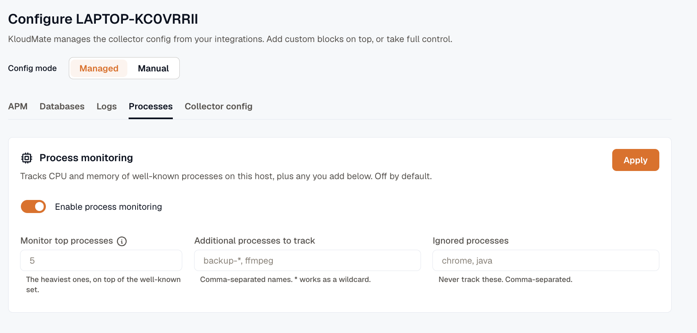

Monitor the processes that matter most on each host — enable it from **Settings** and view them in a new **Processes** tab.

## What it collects

Process monitoring tracks CPU and memory usage for well-known processes on a host, plus any additional processes you add. It is off by default.

## Turn it on

1. Open **Settings → Agents** and select a host.
2. Go to the **Processes** tab.
3. Turn on **Enable process monitoring**.
4. Click **Apply**.

- **Monitor top processes:** The number of heaviest processes to track, on top of the well-known set.
- **Additional processes to track:** Comma-separated process names to always track. `*` works as a wildcard, for example `backup-*, ffmpeg`.
- **Ignored processes:** Comma-separated process names to never track, for example `chrome, java`.
