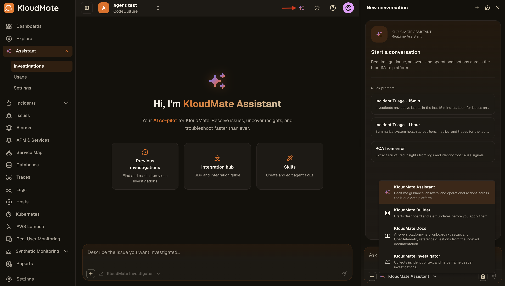
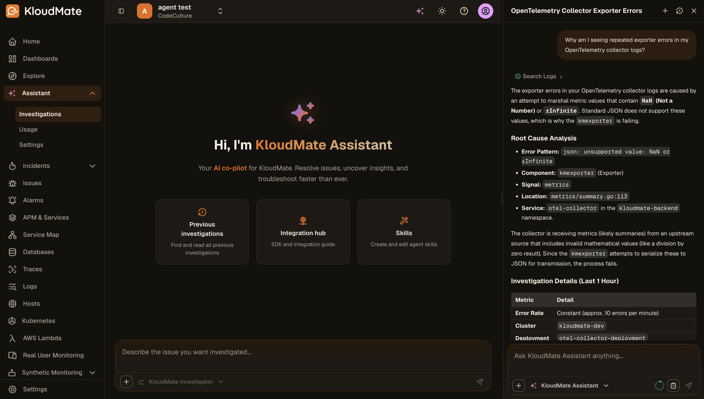
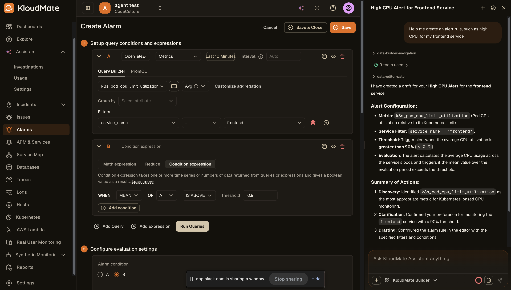
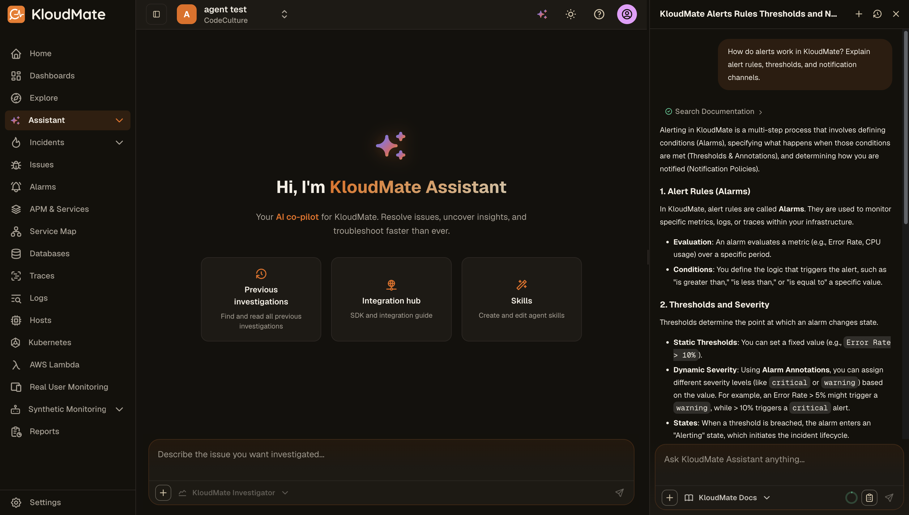
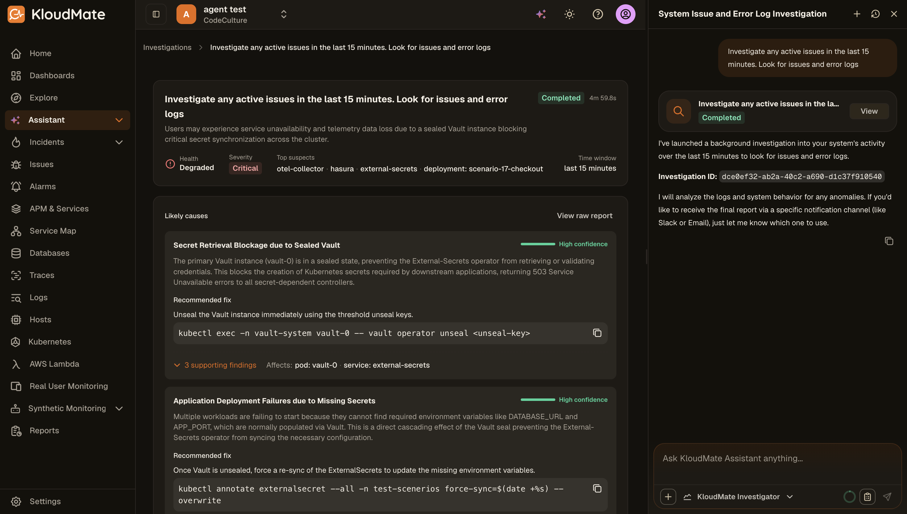

Chat Modes let you choose how KloudMate Assistant should respond before you send a message. Each mode is optimized for a different type of task, whether you want a direct answer, a drafted configuration change, documentation help, or a deeper background investigation.

## Opening the Mode Picker

To choose a chat mode, click the sparkle icon in the top-right corner of the Assistant interface.

Once the Assistant panel opens, use the mode selector in the chat input bar to switch between the available modes.

## KloudMate Assistant

KloudMate Assistant is the default real-time assistant mode. Use it when you want fast answers, platform guidance, or operational help across logs, metrics, traces, alarms, and other KloudMate features.

This mode is best suited for:

- Understanding product behavior or workflows
- Asking questions about recent errors or issues
- Getting quick explanations without launching a background investigation

In this example, the Assistant searches the relevant logs and returns a direct explanation of the exporter failure, including the root cause pattern, affected component, signal type, service context, and a short investigation summary.

## KloudMate Builder

KloudMate Builder is designed for drafting dashboards and alarms before you apply them. Use this mode when you want help creating or modifying alerting and dashboard configurations from natural-language instructions.

In this example, KloudMate Builder interprets the request as an alert creation task for frontend CPU usage and prepares a draft configuration based on that intent.

This helps users move from a natural-language request to a structured alarm draft without manually configuring every field from scratch. The Builder selects an appropriate metric, applies the relevant service filter, and translates the requested threshold into a reviewable alert definition that can be refined and saved.

## KloudMate Docs

KloudMate Docs is optimized for documentation search and platform reference questions. Use this mode when you want answers grounded in the KloudMate documentation rather than a general operational conversation.

This mode is useful for:

- Getting started and onboarding questions
- Finding instrumentation instructions
- Looking up product concepts, alerting behavior, or setup guides

The Docs mode searches the indexed documentation and returns an answer based on the documented product behavior.

## KloudMate Investigator

KloudMate Investigator is used for deeper, background investigations. Instead of replying with only a quick answer, it collects incident context and helps frame a broader RCA workflow.

This mode is appropriate when you need:

- Incident triage over a recent time window
- Correlation across logs, metrics, and traces
- A structured summary of findings for an active issue

In this example, the Investigator launches a background investigation, tracks its progress, and returns a completed report with overall health status, severity, top suspects, likely causes, affected resources, and recommended fixes.

