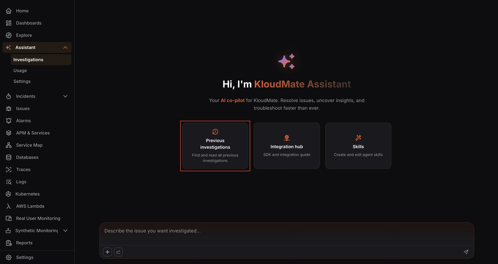
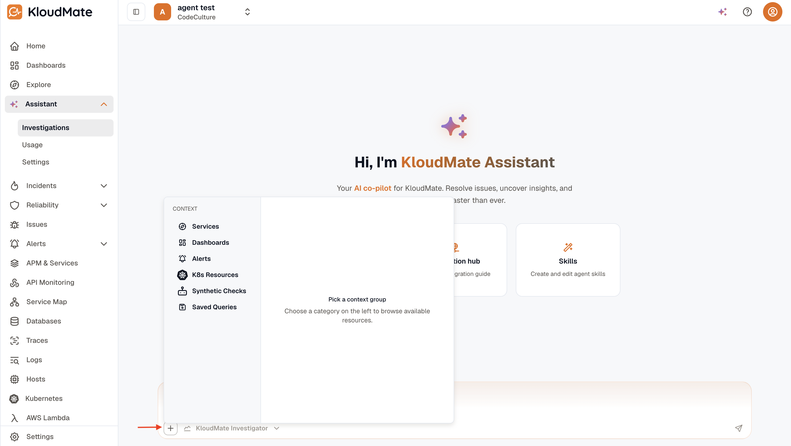
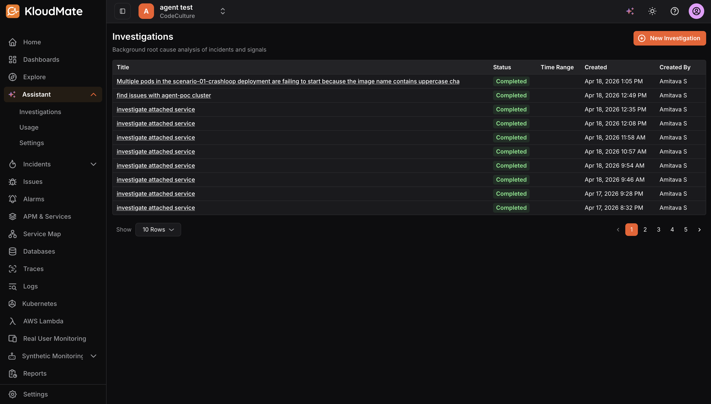
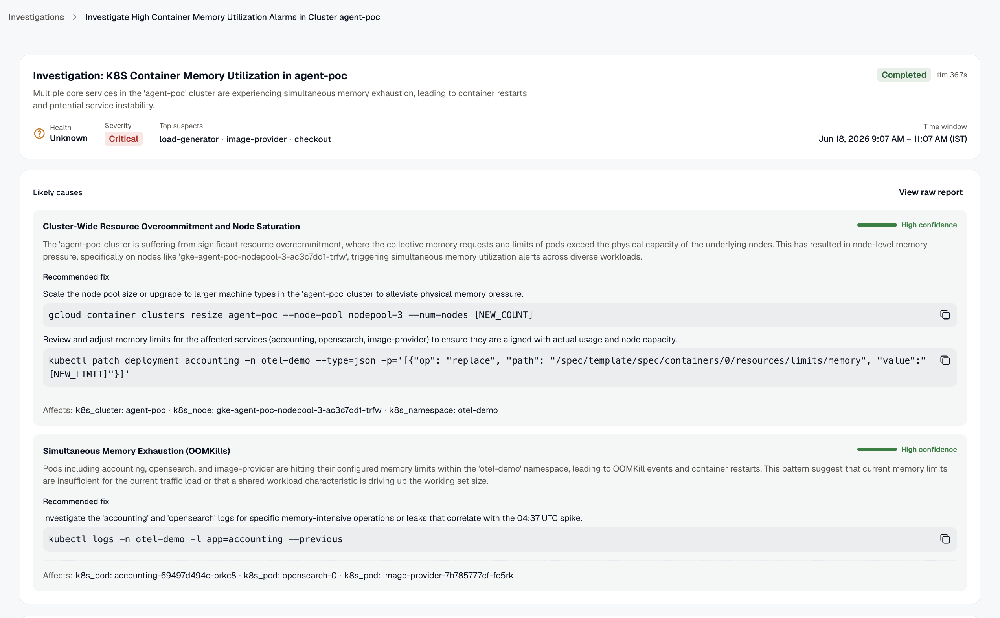

Investigations is your primary workspace for diagnosing issues, exploring anomalies, and uncovering insights. You can ask questions across metrics, logs, and traces, and iteratively troubleshoot problems in a conversational flow.

Opening **Assistant** lands you on the **Investigations** tab, which lists past and active investigations. Click **New investigation** to start one. The new investigation opens with quick-access cards to help you get started:

- **Previous investigations:** Returns you to the **Investigations** tab, where you can find and revisit completed or in-progress RCA reports.
- **Integration hub:** Opens the **MCP Integrations** tab, where you connect external systems to the Assistant.
- **Skills:** Opens the **Skills** tab, where you can create and edit agent skills.

## Adding Context to a Message

The + button in the chat input bar opens a context picker that lets you attach relevant resources to your message before sending it. This helps the Assistant understand the scope of your query without requiring you to describe everything from scratch. Select a category on the left panel, then browse the available resources on the right and attach those relevant to your investigation.

Available context categories include:

- **Services:** Attach APM-instrumented services you want the Assistant to focus on.
- **Dashboards:** Link workspace dashboards to provide visual context.
- **Alerts:** Include alert rules relevant to your query.
- **K8s Resources:** Reference Kubernetes Clusters, Namespaces, Deployments, and Pods.
- **Synthetic Checks:** Attach uptime or browser monitors.
- **Saved Queries:** Include saved log, trace, or metric queries to anchor the investigation.

## Triggering an Investigation

The **KloudMate Assistant** can quickly investigate issues or errors from logs and traces, summarize their causes, and suggest probable root causes to speed up resolution. This reduces **root cause analysis (RCA)** time for engineering teams.

### Decoding Issues

The Issues section in KloudMate aggregates all errors and warnings detected from logs and traces into a unified dashboard view.
Navigate to any issue’s details page and click **Investigate with KloudMate Assistant** for instant analysis.
The Assistant decodes the issue context, explains what went wrong, and provides actionable steps for probable RCA, including potential service impacts.

### Analyzing Error Logs and Traces

The **Logs/Traces** page displays all ingested telemetry data with severity-based filtering to isolate errors quickly.
Select any error log or trace to open its details view, then click **Investigate with KloudMate Assistant**.
The Assistant analyzes the full context, including stack traces, attributes, and timestamps, to deliver an overview of the problem, its service impact, and step-by-step fix recommendations.

### Key Benefits

- **Faster Troubleshooting:** Real-time AI insights reduce MTTR by automating initial diagnostics.
- **Unified Visibility:** Correlates logs, traces, and issues without switching contexts.
- **Actionable Guidance:** Delivers plain-language root cause hypotheses and remediation steps for immediate use.

## Investigations List

Open **Assistant → Investigations** to see the full investigations list.

The list shows all past and active investigations in your workspace. Each row displays the following information:

- **Title:** A brief summary or auto-generated description of the investigation.
- **Status:** The current state of the investigation, typically shown as Completed or In Progress.
- **Time Range:** The observation window that was used when the investigation was run.
- **Created:** The date and time the investigation was initiated.
- **Created By:** The user who triggered the investigation.

## Starting a New Investigation

To start a new investigation, open **Assistant → Investigations** and click **New investigation**. In the chat that opens, describe the issue or symptom you want analyzed. The KloudMate Investigator collects your description and begins a background RCA workflow.

## Viewing an Investigation

Click any investigation title to open the full investigation report. The report is structured to give you a clear picture of what was analyzed, what was found, and what the likely causes are.

At the top of the report, the Investigation Context panel summarizes the scope of the analysis, including the services or resources examined, the time range observed, and the symptom or trigger that was described. It also shows the number of **AI credits** consumed for the investigation and a status badge indicating whether it is **Completed** or still running. If the outcome could not be determined, the badge will show **Unknown**.

Below the context panel, the **Identified User Impact** section provides a plain-language summary of how the issue may be affecting end users or downstream systems. This is designed to give a quick understanding of the situation before diving into the technical detail.

The main body of the report contains the **Active Hypotheses** section, which presents a ranked list of potential root causes uncovered during the investigation. Each hypothesis includes the following:

- **Hypothesis Name:** A concise label for the suspected root cause.
- **Severity:** Indicates the likely impact level: High, Medium, or Low.
- **Description:** A detailed explanation of why this hypothesis was raised, what it implies for the system, and how it relates to the observed symptom.
- **Supporting Evidence:** A list of data points from traces, topology, logs, and metrics that validate the hypothesis.
- **Relevant Resources:** Tags that link to the specific services, pods, or other entities implicated in the hypothesis, making it easy to navigate directly to the affected components.
