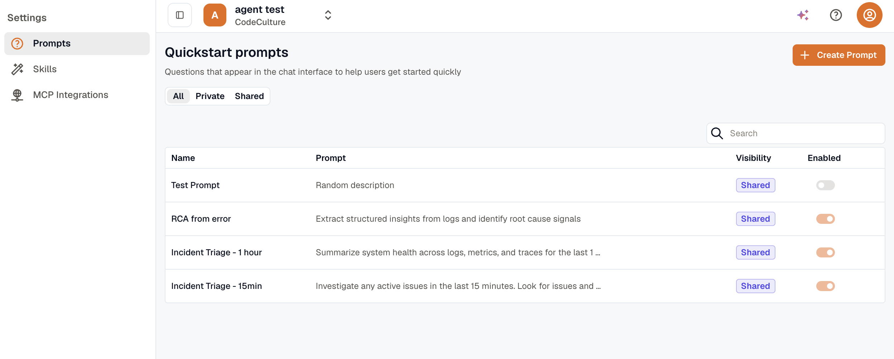
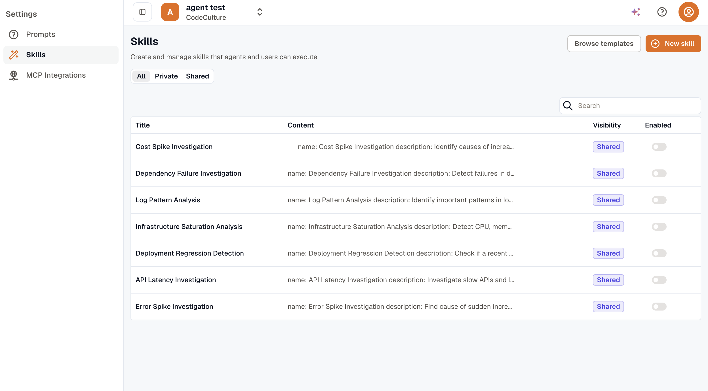
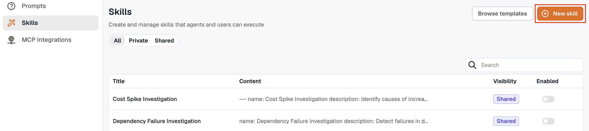
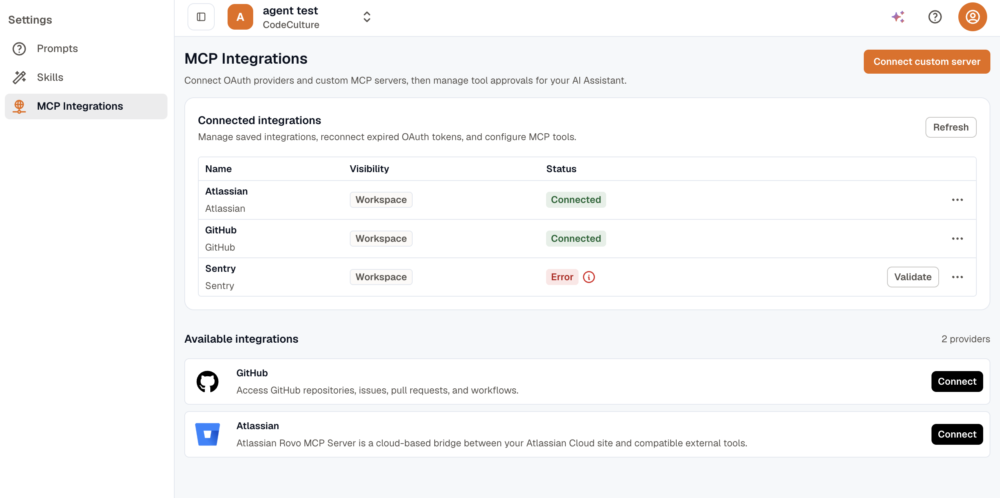

Prompts, skills, and MCP integrations control what appears in the Assistant experience and what the Assistant is allowed to do. Each one has its own tab in **Assistant**.

## Prompts

Quickstart prompts are suggested questions displayed in the chat interface to help users get immediate value. Clicking a prompt inserts its text directly into the chat input, saving users from having to type common queries from scratch. Open **Assistant → Prompts** to create and manage them.

The prompts list displays each prompt’s name, a preview of the prompt text, its visibility (Private or Shared), and whether it is currently enabled. The list can be filtered by All, Private, or Shared to quickly locate what you are looking for.

To create a new prompt, click **Create Prompt**.

A dialog will appear with the following fields:

- **Title:** A short, scannable label for the prompt
- **Prompt:** The actual text that gets inserted into the chat input when the prompt is selected. This field is required.
- **Private:** When enabled, only you can see and use the prompt. Disable it to share the prompt with everyone in the workspace.
- **Enabled:** Controls whether the prompt is active and visible in the chat interface. You can disable a prompt when it is outdated or seasonal without deleting it.

After you fill in the required fields, click **Create** to save the prompt.

## Skills

Skills are reusable instructions the Assistant can follow. They are useful for standardizing investigations, codifying runbooks, and enabling repeatable workflows across your team. Open **Assistant → Skills** to create, import, and manage skills.

Each skill is defined by the following properties:

- **Title:** The name that users and agents will recognize when referencing or activating the skill.
- **Content:** The actual skill instructions. Skills are typically written in Markdown and include a short metadata header followed by the detailed steps the Assistant should follow.
- **Visibility:** When enabled, only you can use or manage the skill. When disabled, the skill is shared with the entire workspace.
- **Enabled:** Turns the skill on or off without deleting it, useful when you want to temporarily pause a skill.

The skills list can be filtered by All, Private, or Shared to help you quickly locate skills by their visibility scope.

### Creating a New Skill

To create a skill from scratch, click **New skill**.

This opens the skill editor screen, which shows a **Title** field at the top and a **Content** editor below it. The content editor comes pre-populated with a structured template, it includes a metadata block at the top where you fill in the skill name and description, followed by a content section where you describe the steps the Assistant should follow in detail.

Fill in the title, replace the template placeholders with your actual skill instructions, configure the **Private** toggle as needed, then click **Save** to create the skill.

### Importing a Skill from a Template

To start from a pre-built template, click **Browse templates**.

This opens the Import Skill Template dialog, which lists a set of curated templates ready to import. Click **Import** next to any template to add it to your skills list. Once imported, you can open and customize the skill to suit your specific environment and workflows.

## MCP Integrations

**MCP (Model Context Protocol) integrations** connect the Assistant to external systems such as OAuth providers or your own custom MCP servers. Open **Assistant → MCP Integrations** to connect and manage them. After connecting an integration, you configure which of its tools are enabled and whether the Assistant must request approval before running any of them.

### Connected Integrations

The Connected Integrations section lists all integrations you have already configured. For each integration, you can see its display name, whether it is scoped privately to your account or shared across the workspace, and its current connection status.

:::info
  A status of **Error** indicates the integration requires attention. Use the **Validate** button to re-test the connection, or the menu to edit or remove the integration.

  If you see a **Reconnect required** status, the integration’s authorization has expired and needs to be refreshed. Click **Reconnect** to re-authenticate.
:::

### Available Integrations

The Available Integrations section lists pre-built connectors you can activate.

Click **Connect** next to any provider to begin the connection flow.

### Connecting a Custom MCP Server

To connect an MCP server that is not listed among the available providers, click **Connect custom server**.

This opens the **Connect Custom MCP Server** dialog where you configure the following:

- **Integration name:** A friendly label for the integration.
- **MCP server URL:** The publicly accessible endpoint for your MCP server. You enter it only for a custom server. Managed providers don't ask for a URL.
- **Headers:** Optional HTTP headers to be sent with every MCP request. Use this for API key or token-based authentication, tenant or workspace routing, or any other custom metadata the server requires.
- **Visibility:** Choose **Private** so only you can use the integration, or **Shared** to share it across the workspace. Keep integrations private for personal credentials, testing environments, or dev and staging connections, and share them when they are organization-managed and intended for the whole team.
- **Status:** The master on/off switch for the integration. Set it to **Disabled** during incidents, provider outages, security reviews, or when you want to deprecate the integration without permanently deleting it.

After completing the form, click **Save** to connect the integration.

### Tool-Level Settings

After connecting an integration, you can configure each of its individual tools. For every tool exposed by the integration, you can control:

- **Enabled:** Determines whether the Assistant is allowed to call the tool at all. Disable individual tools you do not need to reduce the Assistant’s scope of action.
- **Approval mode:** Determines whether the Assistant must ask for confirmation before running the tool. Setting it to **Default** uses the platform’s built-in behavior. Setting it to **Ask before run** requires the Assistant to confirm with you every time it wants to invoke the tool. Setting it to **Auto approve** allows the tool to run without any confirmation prompt.

Tools may also carry labels that hint at their behavior.

- A **Read** label indicates the tool is intended to be read-only and carries lower risk.
- A **Write** label indicates the tool may perform destructive or state-changing actions and should be used with care.

:::info
  When deciding on approval mode, it is advisable to apply stricter settings such as **Ask before run** for Write tools and for any tool with access to sensitive or production systems.
:::
