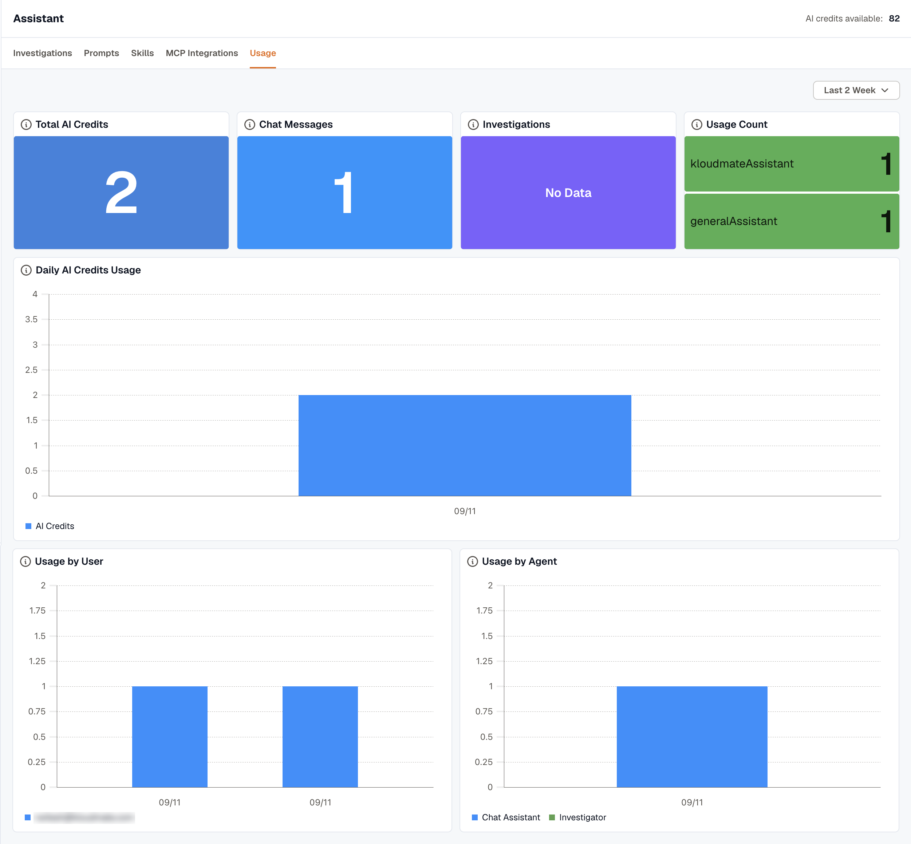

Open **Assistant → Usage** to see how many AI credits your workspace spent in the time range you pick, the last 7 days by default.

A chat message costs 1 AI credit, an investigation costs 5, and an [Ask KloudMate Assistant](/workflows/actions/#ask-kloudmate-assistant) step in a workflow costs 1 each time it answers. They all use the same AI credits.

If your organization prepays for AI credits, the page also shows the credits available, and someone with the **Owner** role can click **Buy credits**.

## Summary tiles

- **Total AI Credits:** every credit spent in the range.
- **Chat Messages:** credits spent on chat with the Assistant, not counting workflow steps.
- **Investigations:** credits spent on investigations, at 5 credits each.
- **Usage Count:** the number of **Messages Sent**, **Investigations**, and **Workflow Steps** in the range.

## Daily charts

- **Daily AI Credits Usage** shows the credits spent each day.
- **Usage by User** splits the daily credits by person, listed by email address. Credits from workflow steps aren't tied to a person.
- **Usage by Agent** splits the daily credits between the **Chat Assistant**, the **Investigator**, and **Workflows**. **Chat Assistant** counts chat only, and **Workflows** counts **Ask KloudMate Assistant** steps.
- **Usage by Type** splits the daily credits between **Chat**, **Investigations**, and **Workflows**.
