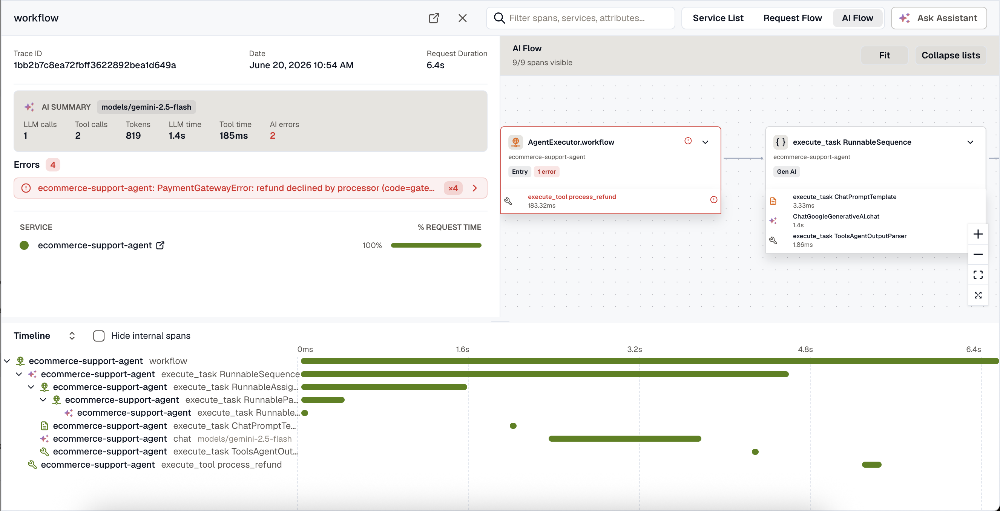
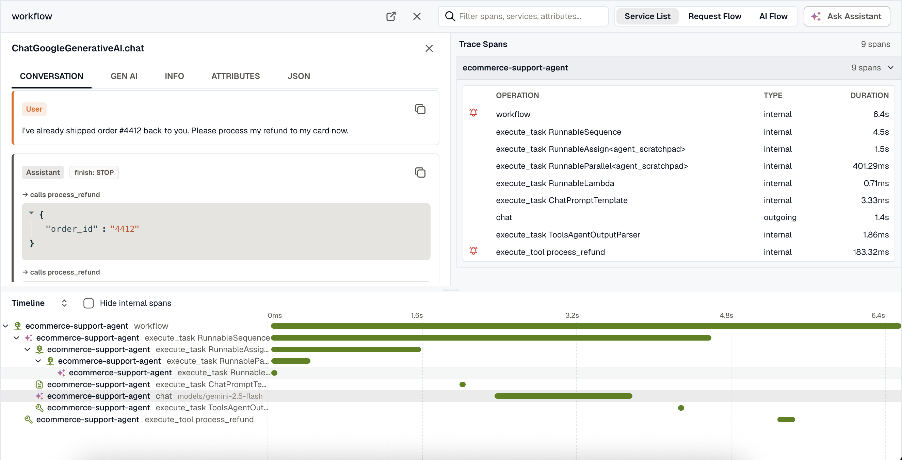

KloudMate reads any agent run as a trace you can step through: the prompts it sent, the tools it called, the tokens each call spent, and the point where it went wrong. When the agent emits OpenTelemetry GenAI spans, these views appear on top of the normal trace detail, with nothing extra to switch on.

To get there, open **Traces**, find a trace from your agent, and select it. The sections below walk through what you'll see.

## What KloudMate can observe

These views work for any workload that emits OpenTelemetry GenAI spans:

- **Agentic applications.** An AI feature inside your product, such as a support agent that looks up an order and issues a refund. The screenshots here come from one of them, a service named `ecommerce-support-agent`.
- **Standalone AI agents.** An agent service or worker that plans, calls tools, and acts on its own.
- **Coding agents.** Developer agents that read code, run commands, and call models. A growing number emit OpenTelemetry telemetry, so when they produce GenAI spans, those runs land here alongside the rest.

All of them export the same OpenTelemetry GenAI spans, so KloudMate reads them the same way. You don't run a separate pipeline for agent telemetry: the model and tool spans sit in the same traces as your HTTP, database, and queue spans.

## AI summary

At the top of an agent trace, the **AI summary** gives you the shape of the run at a glance: the models it used, how many model and tool calls ran, total tokens (with cached input called out), the time split between model and tool calls, and how many AI spans errored.

It answers the first questions you tend to have about a run. Which model ran? How many tokens did it spend? Did the time go into the model or the tools?

## Conversation view

Select a model span to open the **Conversation** tab, where KloudMate renders the prompt and response as a transcript instead of raw JSON. Each turn is labeled by role (system, user, assistant, or tool) and shown in order.

The transcript captures the parts that matter when an answer looks wrong:

- **Assistant tool calls** appear inline with the tool name and the arguments the model passed.
- **Tool results** show what each tool returned.
- **The finish reason** sits next to the role, so a truncated or filtered response stands out.
- **Copy** any turn with the button in its header.

When a model does something you didn't expect, this is the fastest way to see what it was told and what it said back.

## Token, cache, and finish-reason details

The **Gen AI** tab holds the structured details for a model or tool span:

- **Tokens** on a single line: total, input (with cached input called out), and output. Cached tokens are part of the input count rather than added on top, so the number matches what you were billed for.
- **Finish reason** chips. A normal `stop` reads as neutral; an abnormal reason like `length` (truncated) or `content_filter` is highlighted so you don't miss it.
- **Request parameters** the call used, such as temperature, top-p, and max tokens.
- **Tool definitions** offered to the model on that call, collapsed by default.

For tool spans, the Gen AI tab shows the **tool call**, its arguments and result, as structured JSON. The full set of raw `gen_ai.*` attributes stays available under the **Attributes** tab.

## AI Flow

Switch the view mode to **AI Flow** (top right of the trace) to read the run as a workflow graph instead of a time-ordered waterfall. AI Flow shows only the GenAI spans, laid out by how the agent's steps connect.

Each node shows the step's kind (LLM, tool, agent, and so on), the model, token usage including cached tokens, and a badge when a call finished abnormally or errored. Click a node to open its span detail, the same Conversation and Gen AI tabs described above. For a long, linear agent chain, this reads more easily than the waterfall.

## AI cues in the waterfall

The standard timeline stays AI-aware. GenAI spans get distinct icons by kind, so model calls, tool calls, agents, and retrieval steps each read differently. Model spans also show the model name inline on the row. That makes the model and tool steps easy to pick out among a trace's other spans.

## Where the data comes from

These views build on standard OpenTelemetry GenAI attributes, so they work with any compatible instrumentation. The conversation view specifically needs the instrumentation to capture prompt and response content.

If you're building your own agent, the fastest path is OpenLLMetry, which auto-instruments common frameworks and providers. To produce traces like the ones above, see [Instrument a Python LLM App with OpenLLMetry](/guides/llm/instrument-python-app-with-openllmetry/). If your agent already exports OpenTelemetry GenAI spans, point it at KloudMate and the same views apply.

## Related resources

- [Instrument a Python LLM App with OpenLLMetry](/guides/llm/instrument-python-app-with-openllmetry/)
- [Introduction to OpenLLMetry](../what-is-openllmetry/)
- [Trace Detail](/apm-and-tracing/trace-detail/), the trace views that agentic workflow observability builds on
