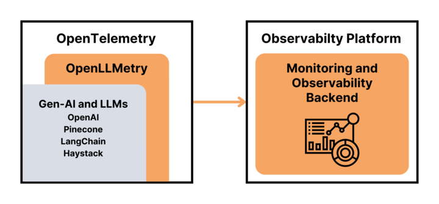

LLM-based applications leverage the deep learning capabilities of GenAI and LLMs (Large language models) to understand, interpret, and generate human-like text and reasoning, enabling tasks such as language translation, text summarization, sentiment analysis, question answering, chatbot interactions, content generation, and more.

Since LLMs typically involve intricate architectures with numerous layers of neural networks, gaining insight into their internal processes and performance metrics is highly challenging. Additionally, because of the massive scale of data processing involved in LLM applications (coupled with their distributed nature and real-time interactions), the monitoring of LLM applications requires sophisticated monitoring systems capable of accessing high volumes of data, performing high-end tracing, and providing timely insights.

The inherent complexity, scale, and diversity of LLMs, mandate the use of solutions that can provide a unified, tailored, and vendor-neutral approach to observability. And at the forefront, is the CNCF-based project, the [OpenTelemetry](https://opentelemetry.io/) framework.

## What Is OpenLLMetry?

[OpenLLMetry](https://www.traceloop.com/docs/openllmetry/introduction) is an open-source framework developed by Traceloop, that simplifies the process of monitoring and debugging Large Language Models. It is built on top of OpenTelemetry, ensuring non-intrusive tracing and seamless integration with leading observability platforms and backends like **KloudMate.**

**OpenLLMetry** aims to standardize the collection of mission-critical LLM metrics, spans, traces, and logs through OpenTelmetry.

## How Does OpenLLMetry Work?

OpenLLMetry is an extension of OpenTelemetry, for AI-related instrumentations. It is written and developed in Python, along with Typescript, and is licensed with Apache 2.0. Since it’s based on OpenTelemetry, it uses the same protocols for instrumentation, data collection, and integration.

Traceloop, the developer, has created multiple instrumentations for LLMs such as OpenAI, Anthropic, and Cohere; vector databases like Pinecone; and LLM frameworks like LangChain and Haystack. These instrumentations help in tracing LLM responses & prompts, and monitoring model performance, token usage, and other essential metrics.

Through the instrumentations for Gen-AI models and LLMs, OpenLLMetry captures and sends AI model KPIs and telemetry data to a target system (an observability backend like [KloudMate](https://www.kloudmate.com)).




The developer, Traceloop, also provides a ready SDK that makes it easy to use OpenLLMetry instrumentations for users who may not be familiar with OpenTelemetry.

***

Related Resources
-----------------

- [LLM Observability with KloudMate and Traceloop | OpenLLMetry](../llm-observability-with-kloudmate-and-openllmetry/)
- [What Is OpenTelemetry?](../../opentelemetry/what-is-opentelemetry/)
