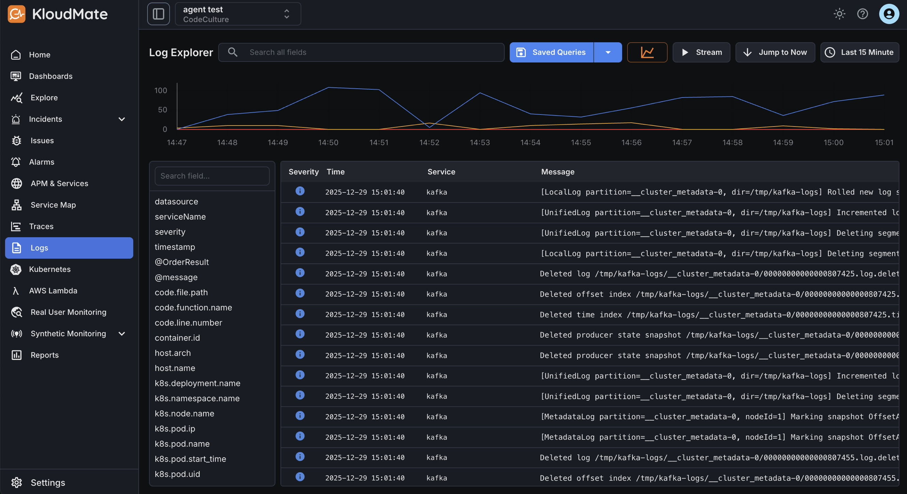

Users can navigate to the Log Explorer by clicking on the Logs tab on the left menu bar of the main dashboard. 

The Log Explorer indexes and stores logs for all the synced services and applications. It is equipped with features such as **Full-Text Logs Search**an **Saved Queries**that allow developers to find relevant logs within seconds. It also displays JSON logs in a readable format to help developers debug their logs quickly and effectively.

## Log Explorer Walkthrough

The Log Explorer displays a graph and a list of all the retrieved logs for all your synced services. Each row in the list represents an individual logline and displays some basic information about it.

The graph represents the log volume where the X-axis denotes the timeframe and the Y-axis denotes the log count.

Click on any log to analyze it in more detail. 

## Searching and Filtering Logs

### Searching

You can use the search bar located at the top of the logs explorer to contextually search and find your logs. 

Narrow down the results further by date and time range, using the **time scale menu** ocated at the top left corner. 

### Filtering

You can use the filters available within the sidebar menu to filter the list of logs. For further refined filtering, there are multiple filters for use in a combination at once.

To save a query, click the **dropdown arrow**next to the “Saved Queries” button in the top-right area of the Log Explorer. This opens a dialog where you can provide a**query name**,**description**, and**folder**, and then click**Save** to store the query for future use.

They will be saved as queries and can be accessed by clicking on the **Saved Queries** section, as shown below:

**Pro tip**: Add folders to keep your queries organized.

Click on any log entry to view detailed information and analysis.

For error logs, use **Investigate with k-AI** to automatically generate a summary of the log, identify the probable root cause, and suggest an appropriate response.

Refer to the KloudMate-AI for more details. 

### Stream Logs

Use the **Stream** button to view logs in real time as they are ingested into KloudMate.

***

**Related Resources**

- [Server Logs to KloudMate](<./Server Logs to KloudMate.mdx>)

