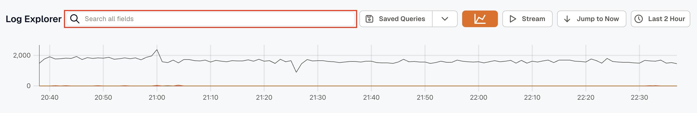
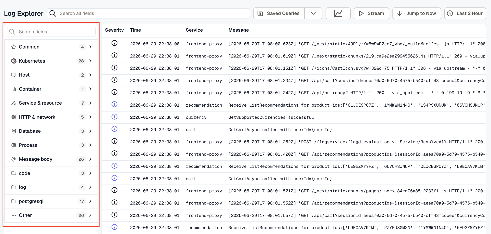
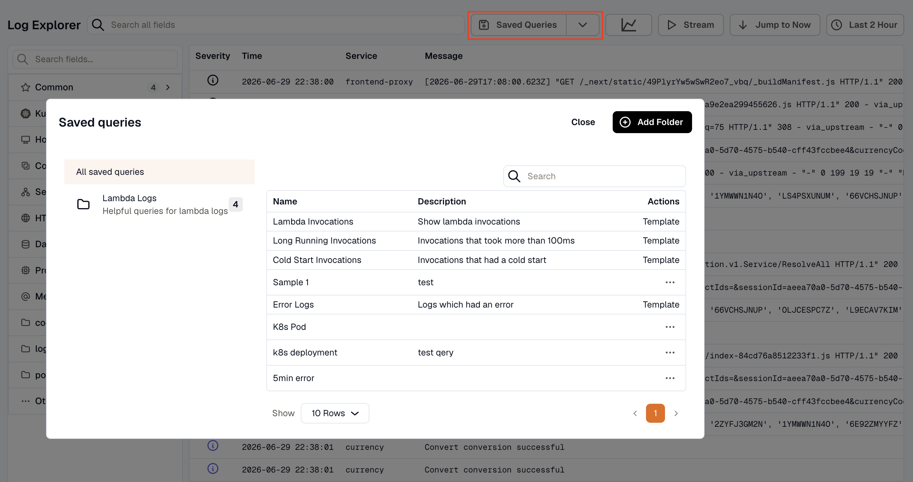
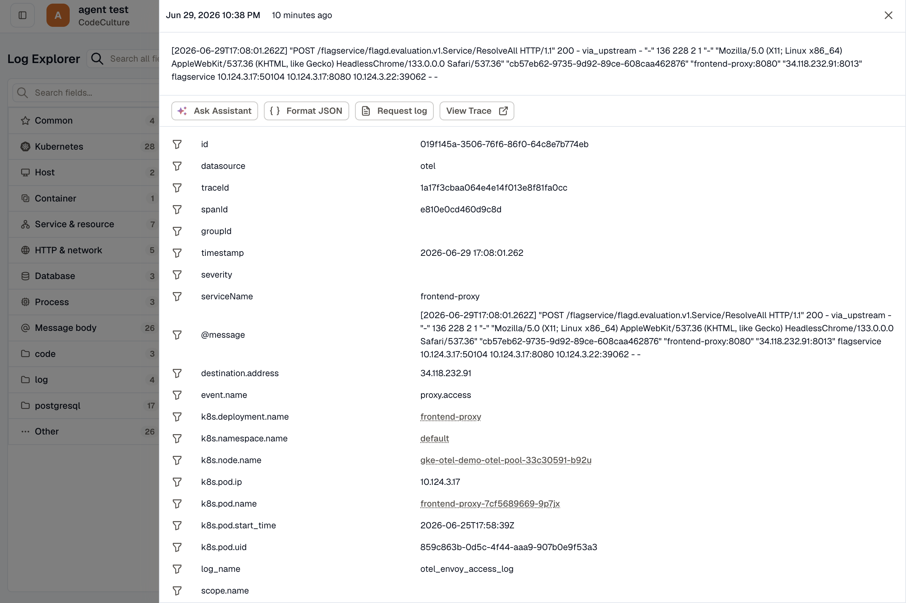
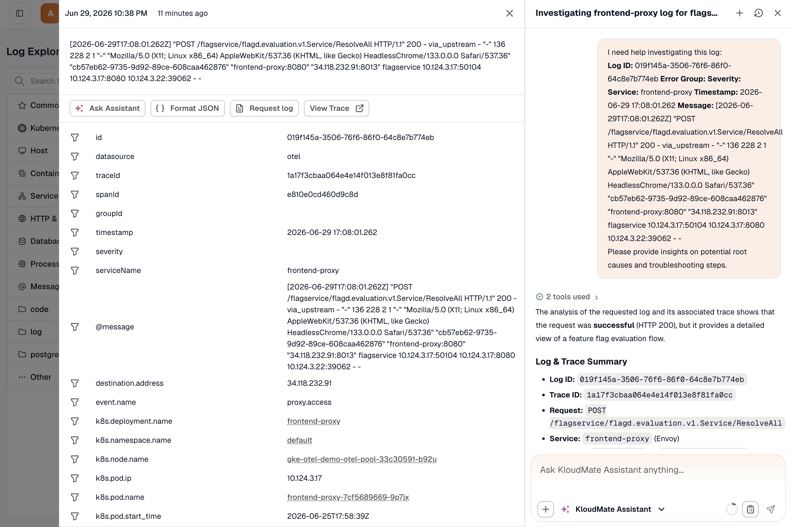
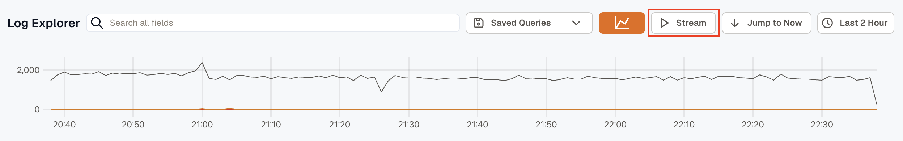

Open **Logs** from the left navigation menu to access Log Explorer.

Log Explorer indexes logs from all connected services and applications. Use it to search large log volumes, inspect structured payloads, save frequently used queries, and investigate issues without leaving the platform.

## Log Explorer Walkthrough

The main view combines a log volume graph with a result list. Each row in the list represents a single log entry and shows the most useful attributes for quick triage.

The graph shows log volume over time. The x-axis represents time and the y-axis represents the number of ingested log entries.

Select any log entry to inspect its full payload, labels, and metadata.

## Search and Filter Logs

### Search

Use the search bar at the top of Log Explorer to find matching log entries across your environment.

Refine results further by adjusting the selected time range from the time scale menu.

### Filter

Use the sidebar filters to narrow the result set by relevant dimensions. Multiple filters can be combined to isolate a very specific set of logs.

## Saved Queries

To save a query, click the dropdown arrow next to **Saved Queries** in the top-right area of Log Explorer. Enter a query name, description, and folder, then click **Save**.

Saved queries remain available from the **Saved Queries** section for quick reuse.

Use folders to keep saved queries organized by service, team, or use case.

## Inspect Log Entries

Select any log entry to view detailed information and analysis.

**Ask Assistant** opens KloudMate Assistant directly from the issue. It reviews the error log and its associated trace, generates a Log & Trace Summary, identifies the probable root cause, and suggests next steps for faster resolution.

Refer to the [KloudMate Assistant](../../kloudmate-assistant/) documentation for more details.

## Stream Logs

Use **Stream** to watch logs as they are ingested into KloudMate.

## Related Resources

- [Log Query Syntax](./syntax-for-log-querying/)
- [Collect File Logs with KloudMate Agent](../collect-file-logs/)
