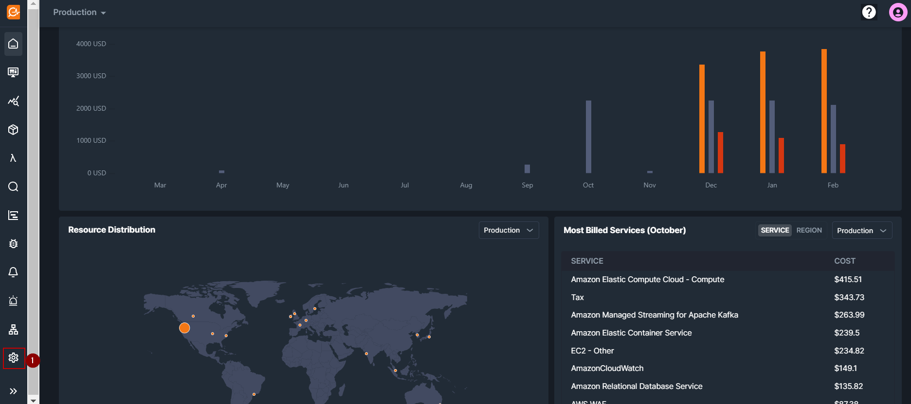
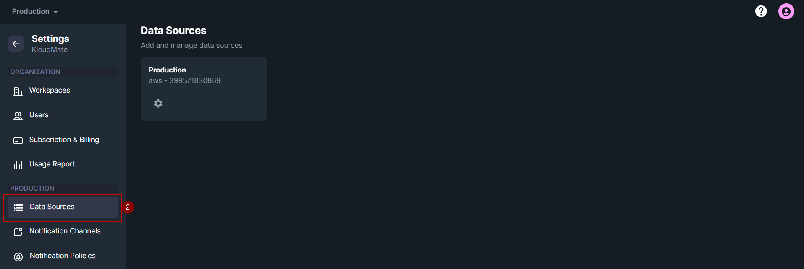
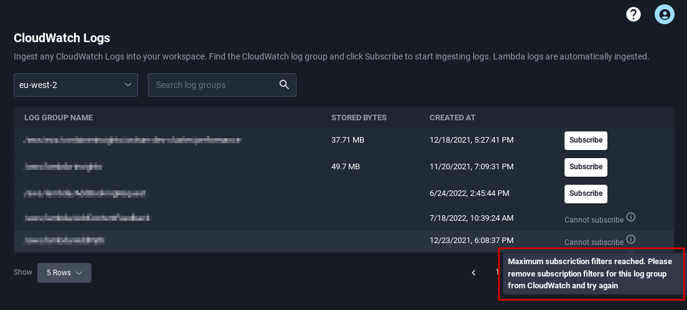

KloudMate lets you ingest any CloudWatch Logs into your workspace. You can search all your AWS service logs by log groups and start ingesting with just a click of a button. Further, you can use various [CloudWatch logs attributes](https://docs.kloudmate.com/cloudwatch-logs-attributes) to get the relevant data from your ingested logs.

<hint type="info">
  Note that Lambda logs of the connected AWS account are automatically ingested.
</hint>

Use the following steps to start ingesting CloudWatch logs for your AWS services.

Step 1: From the **Home** screen, click on **Settings >** **Data Sources.**

Step 2: The Data Sources screen will display all of your connected AWS accounts. Click on the **Settings icon **of the AWS account from which you want to ingest CloudWatch logs.

Step 3: Click on the **CloudWatch Logs **option.

Step 4: Select the respective region from the drop-down menu or search for log groups using the search field.

Step 5: Once you find the relevant logs, click on the **Subscribe **button to start ingesting logs.

### CloudWatch Limitation

<hint type="info">
  AWS has a limit on the maximum number of CloudWatch log subscription filters. AWS allows only two subscription filters per log group. 
</hint>

If you already have two subscription filters in your log group and you try to subscribe one more, you will see the following message on the screen.

### Using CloudWatch Logs Subscription Filters

In order to add another subscription filter, you will need to remove a subscription filter from the log group that you don't need using the AWS console.

Use the following steps to delete a CloudWatch logs subscription filter using the AWS console.

Step 1: Go to the AWS console

Step 2: Navigate to the CloudWatch Console and go to the Log groups

Step 3: Select the log group using the radio buttons

Step 4: Click on **Action**, then click on **Remove Subscription Filter**

<hint type="info">
  You can access, search, filter, and analyze all the ingested logs in the [KloudMate Logs](https://app.kloudmate.com/logs) section. Refer to the [Log Explorer Documentation](https://docs.kloudmate.com/log-explorer) to learn more.
</hint>

***

## **Related Resources**

[CloudWatch Logs Attributes](https://docs.kloudmate.com/cloudwatch-logs-attributes)

