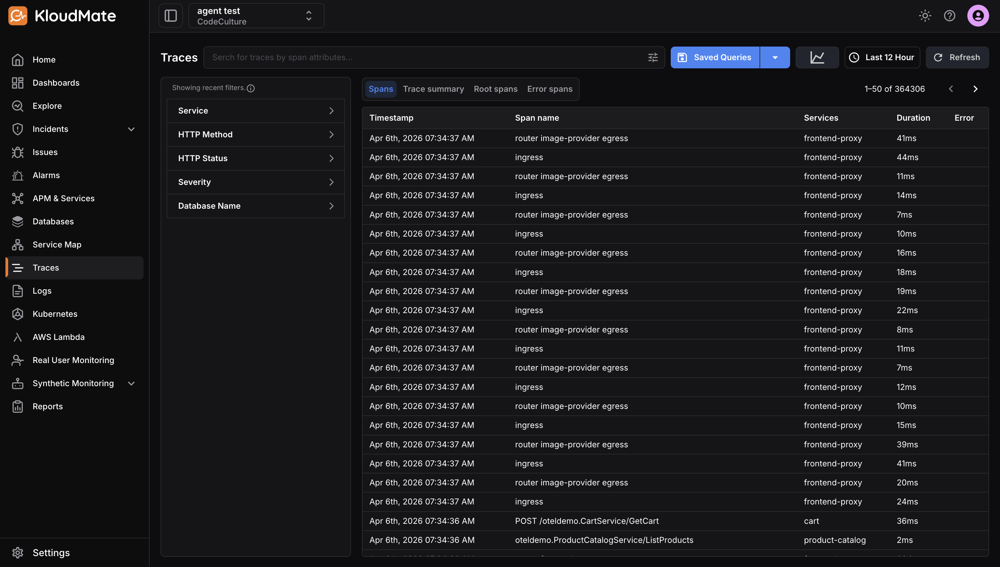

The [Traces](https://app.kloudmate.com/traces) section in KloudMate gives you end-to-end visibility into how requests travel across your services. You can explore trace data, including spans, events, and attributes, to detect errors, identify bottlenecks, and pinpoint issues at any point in a request’s lifecycle.

**Here’s what you can do in the Traces section:**

- Get a complete overview of all captured traces across your services
- Search and filter traces using span attributes, HTTP method, status, severity, and more
- Save and reuse frequently used search queries
- Analyze individual spans across four focused result views
- Drill into trace details including events, attributes, timeline, and raw data
- Correlate logs and examine service-level interactions

## Traces Section Walkthrough

Click on **Traces** in the left navigation menu to open the Traces section.

At the top of the page, you’ll see a **span volume graph** that visualizes trace activity over the selected time range. The x-axis represents time and the y-axis shows the number of spans captured. This graph gives you a quick pulse-check on traffic patterns and helps spot anomalies before you dive into individual traces.

<hint type="info">
  [Click here](https://docs.kloudmate.com/sending-data-to-kloudmate) to learn more about how to send data to KloudMate.
</hint>

## Searching and Filtering

### **Search bar**

Search across traces using span attributes. Click the **search bar** to see a list of available attributes. 

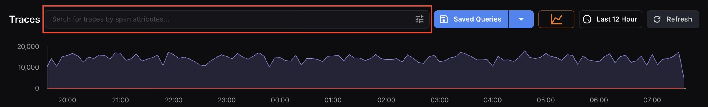

Click the **filter ** con on the right to open the full attribute picker. Active filters appear as tags in the search bar and can be removed individually.

### Sidebar filters

Use the left sidebar to filter results by:

- **Service **
- **HTTP Method **
- **HTTP Status **
- **Severity **
- **Database Name**

Each filter section includes a search box for quick lookup. When filters are active, a “Showing recent filters” notice appears at the top of the sidebar.

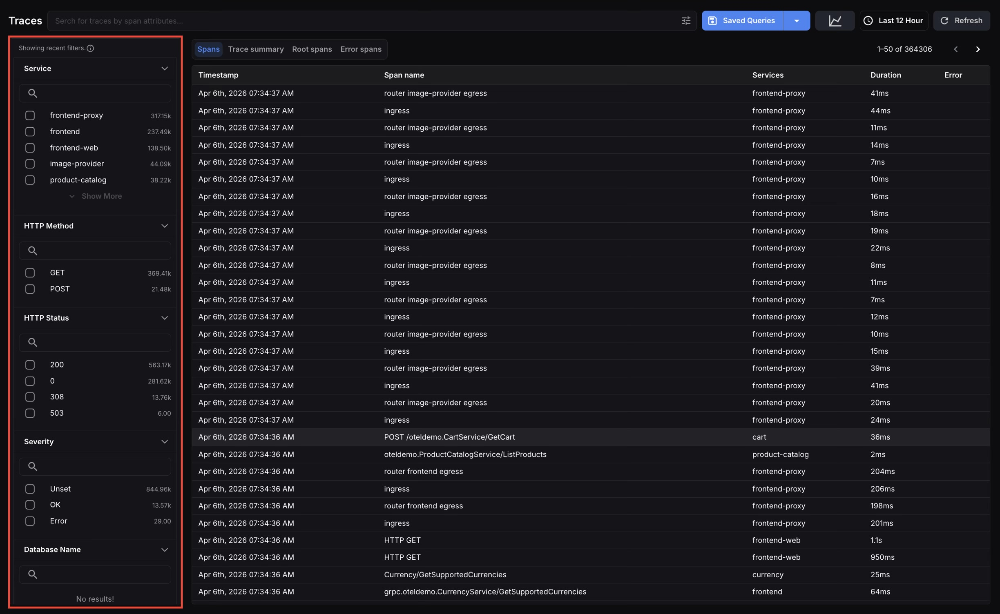

## Saved Queries

Click **Saved Queries** to view and apply any previously saved searches. To save a new query, click the dropdown arrow next to the Saved Queries button and select **Add New**, this saves your current search and filter configuration so you can reuse it anytime.

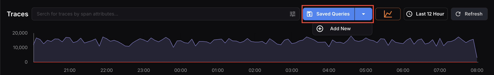

## Traces Result Views

### Spans

The **Spans** tab is the default view. It lists every individual span captured within the selected time range and active filters. Each row displays the **Timestamp**, **Span name**, **Services**, **Duration**, and **Error** columns, giving you the most granular level of detail across your trace data.

This view is best for finding a specific operation, debugging a particular service, or scanning for anomalies across high-volume traffic.

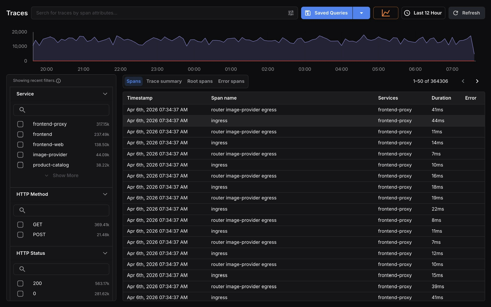

### Trace Summary

The **Trace summary** tab groups spans into complete traces, giving you a higher-level view of end-to-end request journeys rather than individual operations. Each row represents a single trace, showing its **entry point**, **the** **number of services** and **spans involved**, **total duration**, and **any errors**.

Use this view to compare traces side by side, identify which requests are slowest, and understand overall request complexity across your services.

### Root Spans

The **Root spans** tab filters the results to show only the **first span in each trace**, representing the entry point of a request into your system.

Root spans are useful for understanding incoming request patterns and monitoring service entry-point health without the noise of downstream child spans.

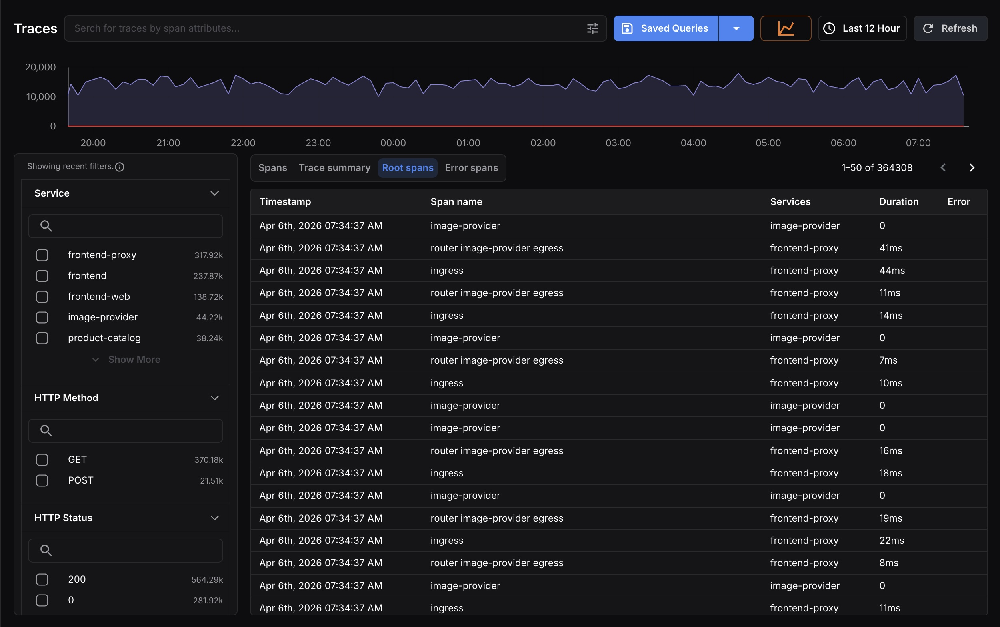

### Error Spans

The **Error spans** tab filters the results to show only spans that contain errors, making it immediately clear where failures are occurring across your services.

When this tab is active, the span volume graph renders in **red**, making it easy to spot recurring error patterns or sudden error spikes before looking at individual rows.

The sidebar filter counts also scope down to only the services and attributes present in the error set. Any active search filters appear as removable tags in the search bar.

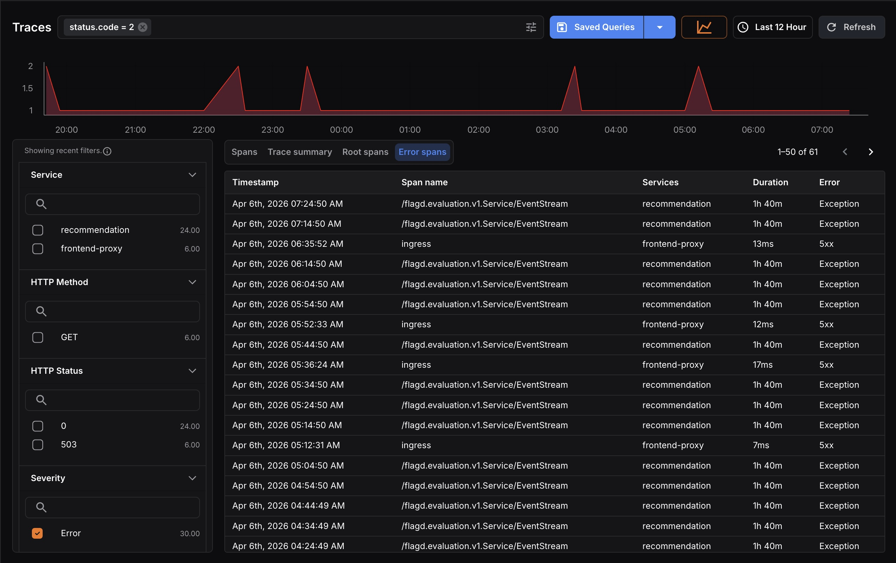

## Analyzing a Trace in Detail

Click on any row in the results table to open the full trace detail view:

- **Trace Summary**
- **Timeline**
- **Service Graph**

### Trace Summary Panel 
Breaks down all spans grouped by service, with a span count per service. Click the arrow next to any service to expand and browse individual spans within it.

The left panel of the trace detail view shows a **service breakdown table** listing every service involved in the trace alongside its % Exec time — the percentage of the total trace duration attributed to that service. A horizontal bar graph makes it easy to visually compare relative contribution at a glance.

Services are color-coded (matching the timeline at the bottom) so you can quickly cross-reference which service is responsible for which spans.

### Timeline

The **Timeline** at the bottom of the trace detail view shows the full span hierarchy. The left side displays the nested span tree with parent-child relationships across services, and the right side shows each span as a **horizontal bar** scaled to the total execution time.

This makes it easy to identify sequential bottlenecks, parallel operations, and exactly where time is being spent within a request.

Clicking on any span bar highlights the corresponding operation in the Service Graph and displays its details in the Trace Summary panel.
Use the **Hide internal** **spans** toggle to reduce noise and focus on cross-service interactions.

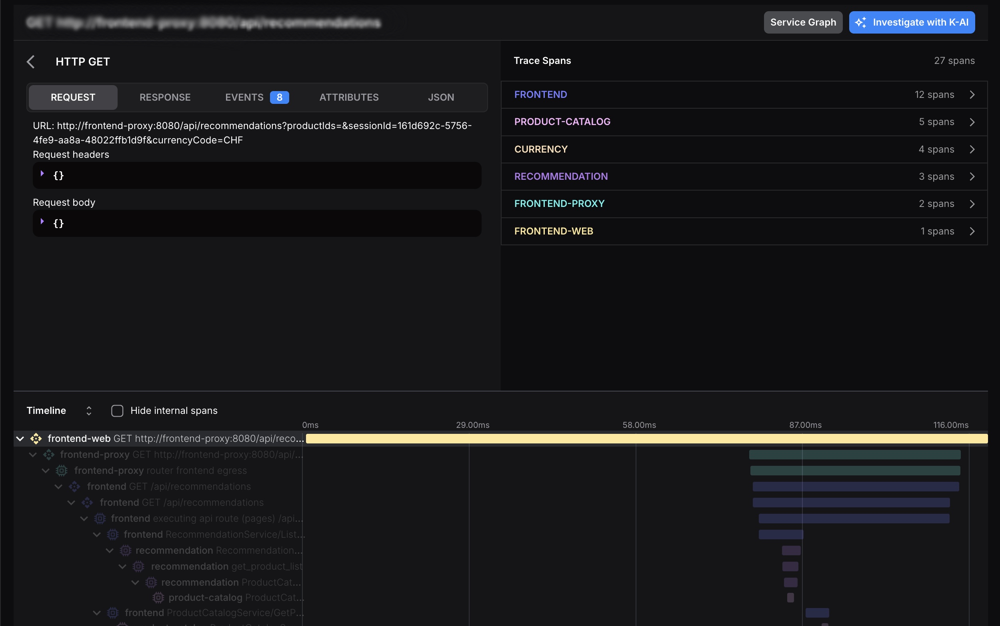

### Service Graph

Click **Service Graph** in the top-right corner of any trace detail to switch the right panel to a visual topology of that trace. Each service is represented as a node, with directed edges showing the call path and edge labels indicating the number of calls between services. Use the zoom controls to navigate, or expand to full screen.

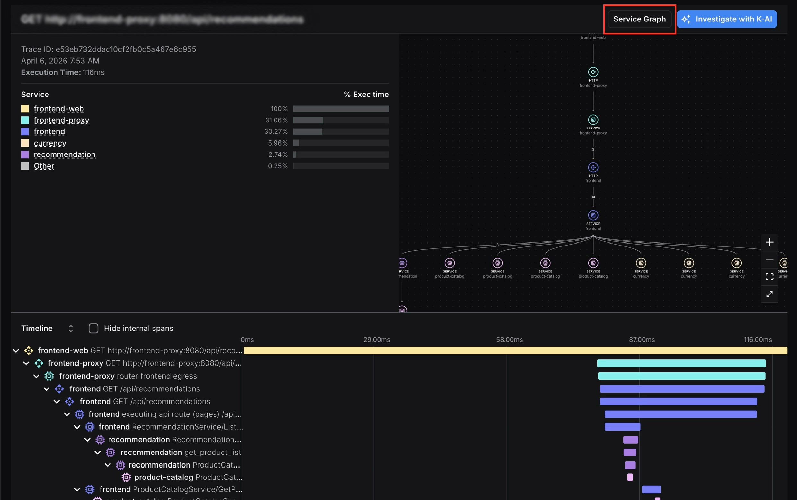

This view helps you quickly understand the full topology of a request, how many services were involved, in what order they were called, and which services branched into parallel calls.

### Investigate with K-AI

Click **Investigate with K-AI** on any trace to get an instant AI-powered analysis. 

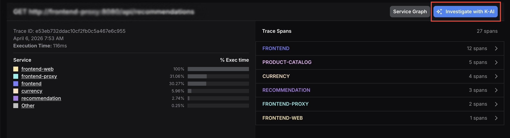

K-AI reads the trace and returns a **Summary**, **Key Observations**, and a **Verdict**, telling you whether the trace needs attention and why. This is the fastest way to triage a trace without manually reading through every span.

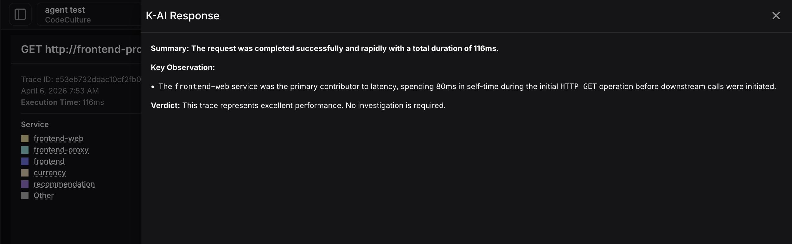

***

## **Related Resources**

- [Sending data to KloudMate](https://docs.kloudmate.com/sending-data-to-kloudmate)
- [Service map](https://docs.kloudmate.com/service-map)

