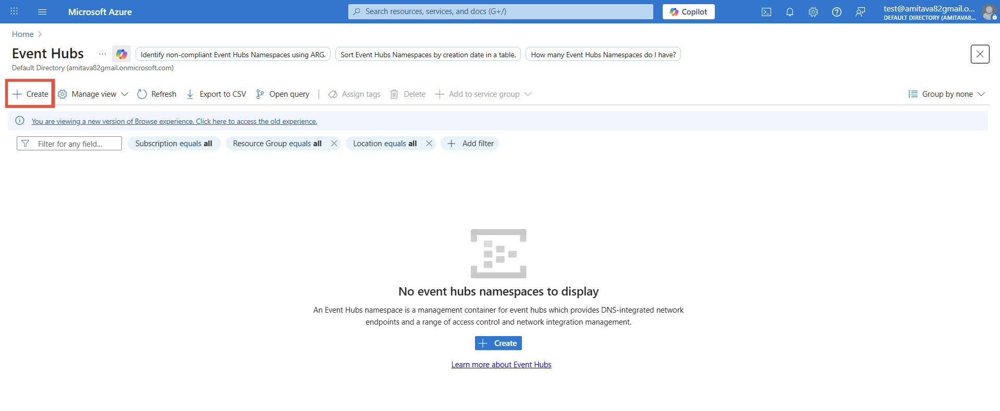
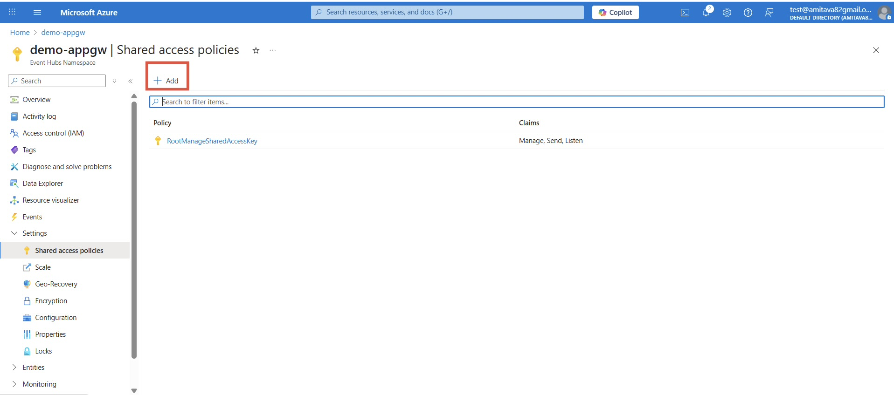
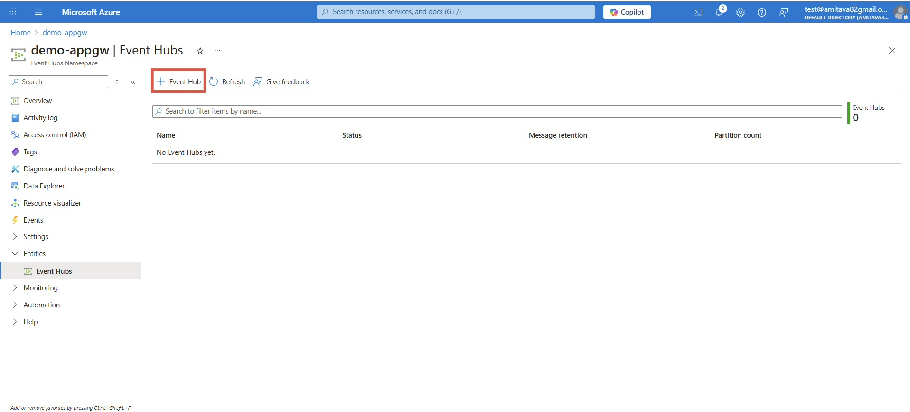
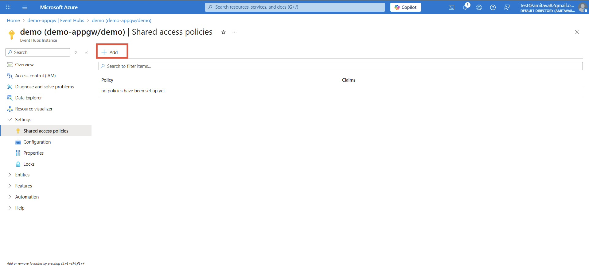
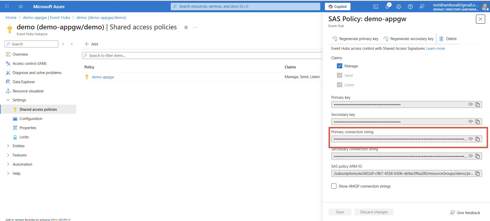

This guide explains how to stream **Azure Application Gateway logs to KloudMate** using **Azure Event Hub**. Forward diagnostic logs from your gateway (or other Azure resources) to Event Hub, then ingest them using the KloudMate agent for centralized monitoring, analysis, and troubleshooting on the KloudMate platform.

### Use Case

This setup enables pushing Azure logs (Application Gateway, databases, APIs, etc.) through Event Hub so all events can be monitored from a single platform.

### Architecture Overview

**Azure Resource → Diagnostic Settings → Event Hub → KloudMate Agent → KloudMate Platform**

### Prerequisites

- Azure subscription with Application Gateway configured.
- KloudMate Agent installed on Linux VM.
  [Linux Agent](../../../km-agent/installation/linux-agent.mdx)
- Permissions to create Event Hub resources.
- KloudMate API key.

### Step 1: Set Up Event Hub Namespace and Policies

1. In Azure Portal, search for **Event Hubs** > **Create**:





Select subscription, resource group, unique namespace name, and region.


Click **Review + Create**.


2. In the namespace:
   - Go to **Settings > Shared access policies** > **+ Add**.





Set policy name and enable **Manage** (includes Send & Listen).


Create and copy the **Primary Connection String** (namespace-level, for diagnostic settings).


3. Under **Entities > Event Hubs** > **+ Event Hub**:





Enter Event Hub name and partition count (default is fine).


Create.


4. In the new Event Hub:
   - Go to **Settings > Shared access policies** > **+ Add**.





Set policy name and enable **Manage**.


Create and copy the **Primary Connection String** (Event Hub-level, for KloudMate agent).





The namespace hosts Event Hub entities; use these connection strings in later steps.

### Step 2: Configure Diagnostic Settings on Application Gateway

1. Open your **Application Gateway** > **Monitoring > Diagnostic settings** > **+ Add diagnostic setting**.
2. Select logs: **Access logs**, **Performance logs**, and **Firewall logs** (if WAF enabled).
3. Choose **Send to Event Hub**:
   - Select namespace from Step 1.
   - Choose namespace-level shared access policy from Step 1.
4. Click **Save**.

Gateway logs now stream to the Event Hub in real time.

### Step 3: Install and Configure KloudMate Agent

- SSH to your Linux VM and install:

```text
curl -s https://install.kloudmate.com | bash
```

Verify: `kloudmate-agent status`.

- Edit `/etc/kloudmate/config.yaml` (use `sudo nano`)

Sample Configuration:

```yaml
extensions:
  health_check:
  pprof:
    endpoint: 0.0.0.0:1777
  zpages:
    endpoint: 0.0.0.0:55679

receivers:
  azureeventhub:
    connection: Endpoint=<PRIMARY-CONNECTION-STRING>  # Event Hub-level string from Step 1
    format: "azure"

processors:
  resource:
    attributes:
      - action: upsert
        from_attribute: azure.resource.id
        key: service.name
  transform/appgw:
    log_statements:
      - context: log
        statements:
          - set(resource.attributes["azure.appgw.name"], Split(resource.attributes["azure.resource.id"], "/")) where resource.attributes["azure.resource.id"] != nil
          - set(resource.attributes["service.name"], resource.attributes["azure.appgw.name"]) where resource.attributes["azure.appgw.name"] != nil
          - set(body, attributes["azure.properties"]) where attributes["azure.properties"] != nil
  batch:
    send_batch_size: 5000
    timeout: 60s

exporters:
  debug:
    verbosity: detailed
  otlphttp:
    endpoint: 'https://otel.kloudmate.dev:4318'
    headers:
      Authorization: <API-KEY>  # Your KloudMate API key

service:
  pipelines:
    logs:
      receivers: [azureeventhub]
      processors: [batch, resource, transform/appgw]
      exporters: [debug, otlphttp]
  extensions: [health_check, pprof, zpages]
```

Restart: `sudo systemctl restart kloudmate-agent`.

***

### Benefits

- Real-time, searchable Application Gateway logs.
- Centralized monitoring for Azure resources (e.g., SQL, storage, VMs, APIs).
- Enhanced troubleshooting and visibility.

### Extending to Other Azure Services

This Event Hub + KloudMate pipeline monitors any Azure service beyond Application Gateway, no agent reconfiguration needed.

**Purpose**
Apply the same setup across multiple resources to centralize all Azure logs in KloudMate.

**How It Works**

- Event Hub accepts diagnostic logs from any Azure service.
- Identical `config.yaml` pipeline processes all logs automatically.
- Repeat only Step 2 (Diagnostic Settings) per service, targeting your existing Event Hub.

**Applicable Services**

- Azure SQL Databases → Query/performance/error logs
- Storage Accounts → Blob/container access logs
- App Services/APIs → HTTP request/response metrics
- Virtual Machines → Platform/OS logs
- Any diagnostic-enabled Azure service

**Result:** Single agent monitors your entire Azure estate.

***
