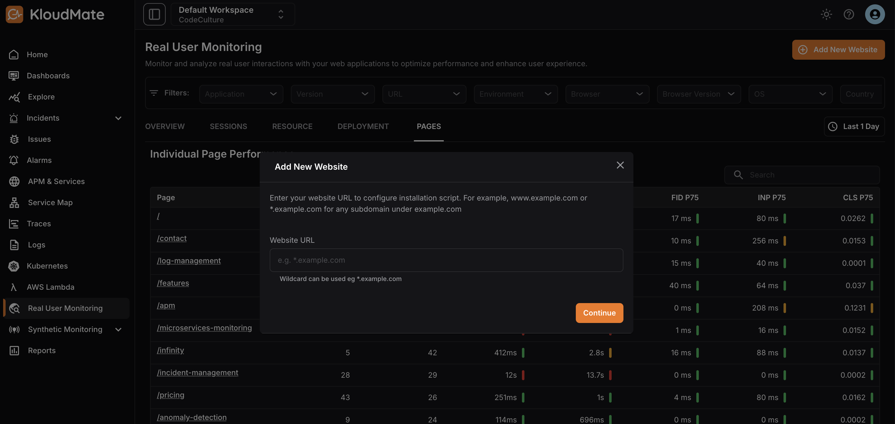
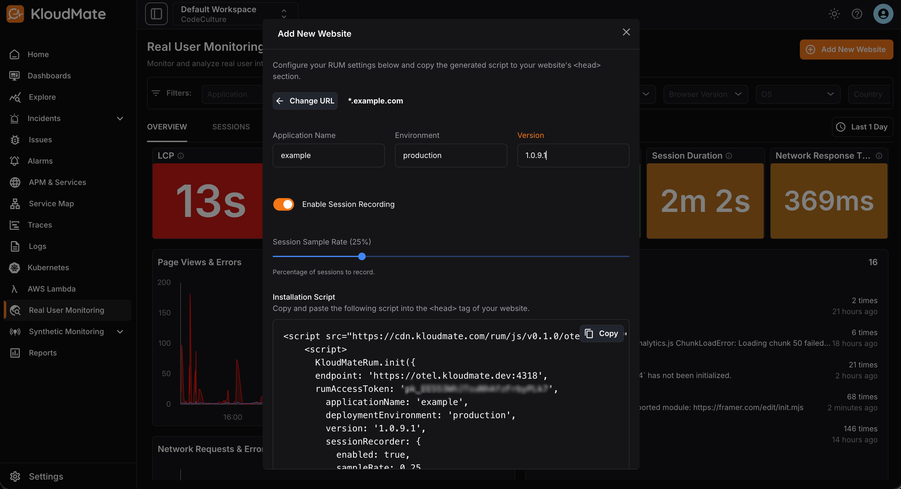
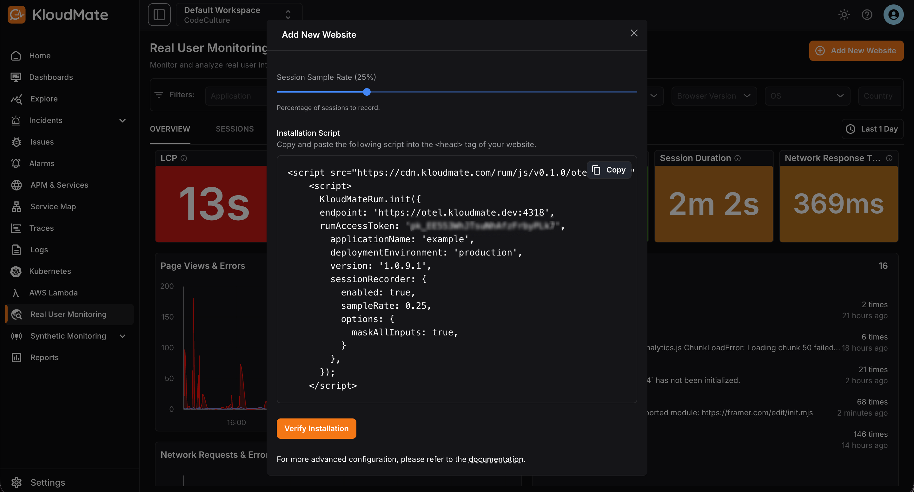

This guide helps you set up Real User Monitoring (RUM) with KloudMate for your websites.
Setting Up Real User Monitoring with KloudMate

<hint type="info">
  The RUM agent is compatible with all the supported versions of the following browsers:

  - Google Chrome
  - Microsoft Edge
  - Mozilla Firefox
  - Apple Safari
  - Chromium-based browsers
</hint>

## Setting Up Real User Monitoring with KloudMate

### Step 1: Navigate to RUM Module

- Log in to your KloudMate account.
- Navigate to the Real User Monitoring page.

### Step 2: Add the Host Website

- Click Add New Website in the top-right corner of the RUM module.
- Enter the URL of the website you want to integrate.
- Click Continue.



### Step 3: Configure the Settings

- Add an Application Name, Environment, and Version to identify the integration.
- Enable or disable Session Recording using the toggle, enabling it records user sessions.
- Set the Session Sample Rate to decide what percentage of total sessions get recorded.



### Step 4: Install the Script

- Copy the generated script.
- Paste it into the `<head>` section of your website.



- To verify installation, click the Verify Installation button , which shows the integration status.

## Managing User Details 
- To capture the current user's ID and email, if available, add the following code: 

```javascript
KloudMateRum.setGlobalAttributes({ userId: 'u_123', userEmail: 'john@example.com'})
```

- To clear out the user details, for example on user logout, use the following code: 

```javascript
KloudMateRum.setGlobalAttributes({ userId: null, userEmail: null })
```

## SDK Methods

### 1. init(options)

Initializes the RUM SDK. 

`options` is an object that accepts the following properties: 

| Property              | Type                                                                                                                            | Description                                                                                                           |
| --------------------- | ------------------------------------------------------------------------------------------------------------------------------- | --------------------------------------------------------------------------------------------------------------------- |
| applicationName       | string                                                                                                                          | The application's name.                                                                                               |
| endpoint              | string (required)                                                                                                               | KLoudMate's collector endpoint.https\://otel.kloudmate.com:4318                                                       |
| rumAccessToken        | string (required)                                                                                                               | KloudMate workspace's Public API key                                                                                  |
| deploymentEnvironment | string                                                                                                                          | The application's environment. Example: dev, prod, staging                                                            |
| version               | string                                                                                                                          | The applications' version. Example: 0.0.1, 1                                                                          |
| globalAttributes      | object                                                                                                                          | Key value pairs. These attributes will be added to every span                                                         |
| sessionRecorder       | object<br />\{ enabled: boolean, options: [RRWebRecordConfig](https://github.com/rrweb-io/rrweb/blob/master/guide.md#options) } | Configure session recording. Set `enabled` to `true` to record the session. By default session recording is disabled. |
| ignoreUrls            | `(string \| RegExp)[]`                                                                                                          | URLs to ignore                                                                                                        |

### 2. setGlobalAttributes(attributes)

| Parameter  | Type   | Description      |
| ---------- | ------ | ---------------- |
| attributes | object | Key value pairs. |

### 3. getGlobalAttributes()

Returns the global attributes. 

***

Related Resources

- [What Is Real User Monitoring (RUM)?](https://docs.kloudmate.com/what-is-real-user-monitoring-rum)
- [RUM Interface](https://docs.kloudmate.com/rum-interface)

