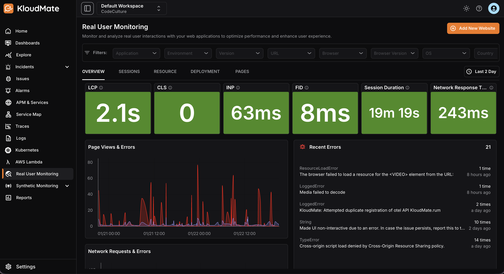
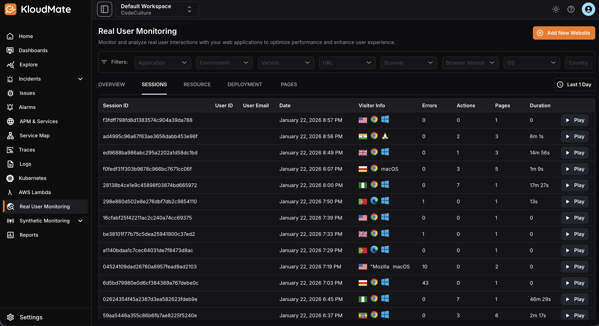
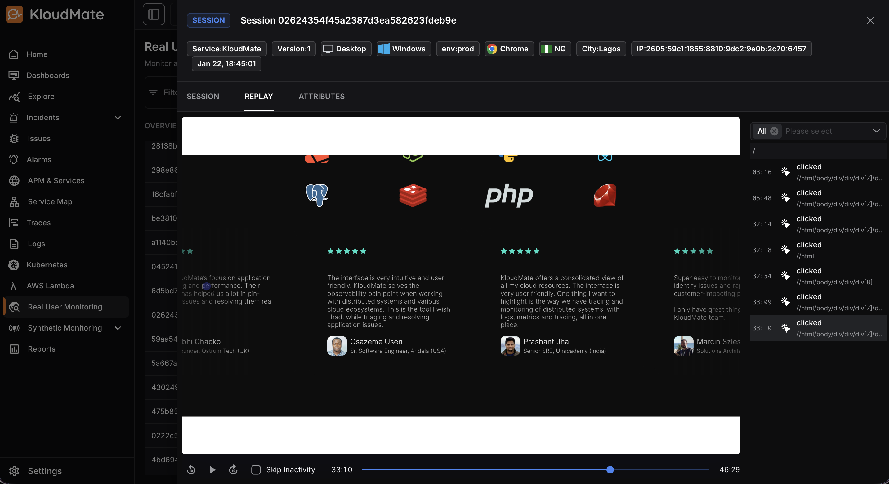
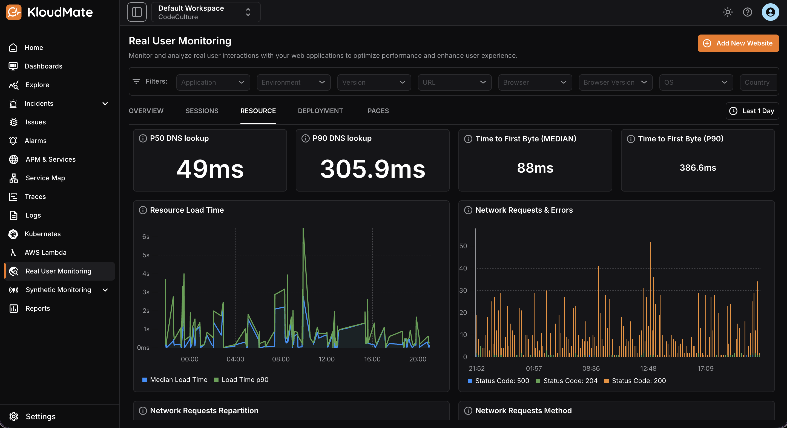
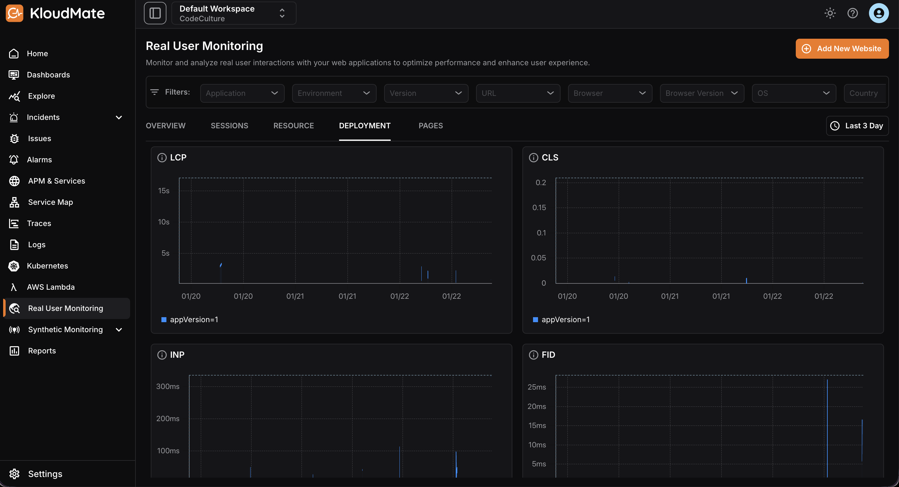
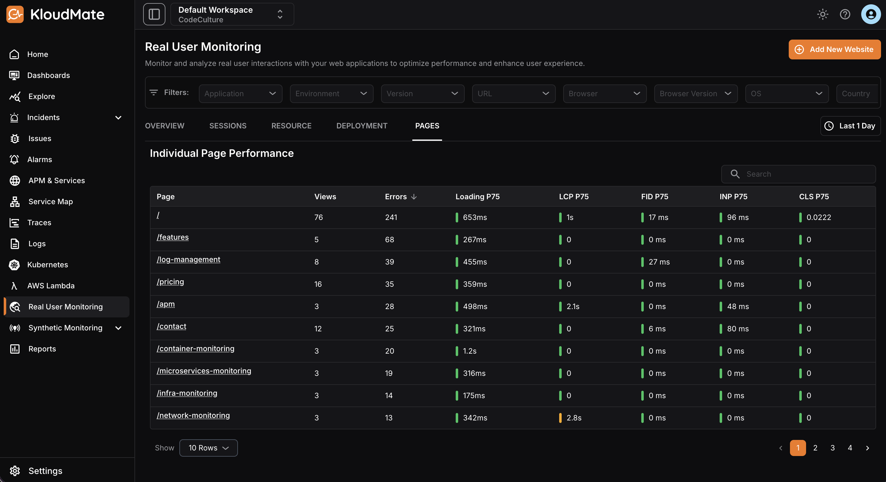
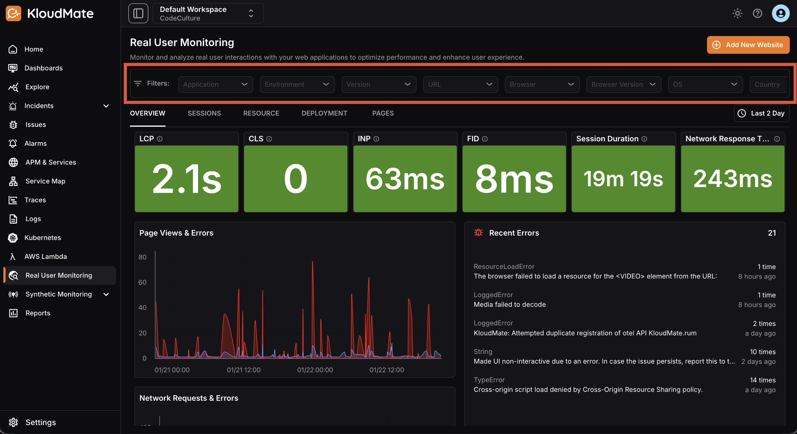

The RUM Interface within KloudMate provides a dedicated workspace to process, analyze, and visualize collected Real User Monitoring data. Access comprehensive statistics, interactive graphs, and detailed insights into user interactions with your application or website.

To integrate Real User Monitoring, visit [Get Started With RUM](<./Get Started With RUM.mdx>).

## Overview

The overview screen is pre-populated with your RUM data and displays the following:

- Various RUM metric data, such as Avg. LCP, CLS, and more
- Error list and graphs wrt page views and network requests
- A list of top browsers and related session details
- A map view of all the sessions by country

### Core Web Vitals Best Practice

WebVitals panels have color codes based on industry best practices, so users can identify if the website needs improvement.

| **Metrics**                     | **Green **(Good) | **Orange **(Need improvement) | **Red**(Poor) |
| ------------------------------- | --------------------- | ---------------------------------- | ------------- |
| LCP (Largest Contentful Paint)  | ≤ **2.5s**            | 2.5s – 4.0s                        | > **4.0s**    |
| CLS (Cumulative Layout Shift)   | ≤ **0.1**             | 0.1 – 0.25                         | > **0.1**     |
| INP (Interaction to Next Paint) | ≤ **200ms**           | 200ms – 500ms                      | > **500ms**   |
| FID (First Input Delay)         | ≤ **100ms**           | 100ms – 300ms                      | > **30**      |

## Sessions

Click on the **Sessions **tab located right next to the **Overview **tab to navigate to the Sessions screen. This screen displays a list of sessions along with some additional details about each session such as visitor info, errors, actions, and duration of the respective session.

## Session Replay

**Session Replay in Real User Monitoring (RUM)** captures and replays real users’ interactions with a website or application.

**What it records:**

- User actions such as **mouse movements**, **clicks**, **scrolls**, **keystrokes (masked)**, **page navigation**, and **UI changes**
- Sessions are replayed as **videos** or **step-by-step timelines**, showing exactly how users experienced the application

**How it works with other data:**

- Works alongside RUM metrics like page load time, errors, and performance timings
- Adds behavioral context to quantitative metrics

## Resource Page

The **Resource Page** in Real User Monitoring provides detailed insights into how individual resources are loaded and executed during a user session.

**What it displays:**

- Key performance metrics such as **DNS lookup time**, **Time to First Byte (TTFB)**, and **network request details**
- Helps teams understand **backend and network latency impacts** on user experience

**Additional insights:**

- Highlights **resource-level errors**, along with **request and response information**
- Shows the **duration of each resource load**
- Enables quick identification of **slow, failing, or inefficient resources** that may affect application performance

## Deployment Page

The **Deployment** **Page** in Real User Monitoring provides visibility into the impact of each application deployment on real user experience.

**What it tracks:**

- Key web vitals such as **Largest Contentful Paint (LCP)**, **Cumulative Layout Shift (CLS)**, **Interaction to Next Paint (INP)**, and **First Input Delay (FID)**
- **Error rates** and **overall performance metrics**, segmented by **deployment version**

**Primary benefits:**

- Helps teams quickly assess whether a **new release has improved** or **degraded** user experience
- Enables **faster detection of regressions **and **confident, data-driven release validation**

## Pages

The **Individual Page Performance** view in Real User Monitoring provides detailed insights into how a specific page performs for real users.

**What it tracks:**

- Core web vitals, including **LCP**, **CLS**, **INP**, and **FID**
- **Error occurrences**

**What it enables:**

- Helps teams evaluate **page-level user experience**
- Identify **performance bottlenecks** and **detect errors impacting usability**
- Enables **targeted optimizations** for critical user journeys

## Filtering RUM Data

You can use the filters available within the sidebar menu of the RUM interface to narrow down the RUM data that you want to monitor or visualize. For further refined filtering, use multiple filters in combination at once.

You can also set a time range for the data to be displayed using the time scale menu located on the top right corner of the screen.

<hint type="info">
  Note that the Filters are designed to last 24 hours based on the selected time range. And a longer time range may slow down your query.
</hint>

***

### Related Resources

- [What Is Real User Monitoring (RUM)?](https://docs.kloudmate.com/what-is-real-user-monitoring-rum)
- [Get Started With RUM](https://docs.kloudmate.com/get-started-with-rum)

