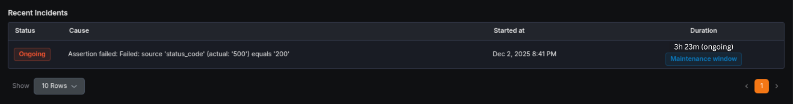
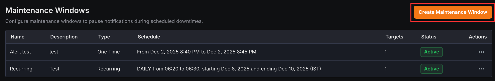
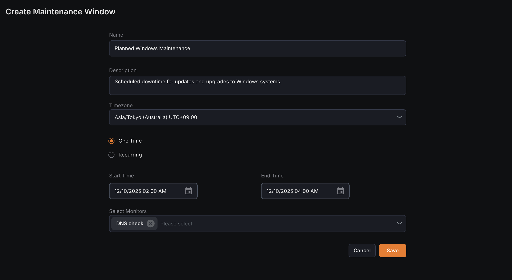

A maintenance window is a scheduled period of time during which monitors continue to run normally, but their incidents are handled differently to avoid unnecessary noise.

During a maintenance window, the monitor:

- Does not send any notifications for incidents that are triggered.
- Does not count downtime that occurs during the window toward the monitor’s success rate percentage.
- Marks incidents that happen during the maintenance window so they can be distinguished from regular production incidents.

**Maintenance Windows Overview List**
The overview page displays all created maintenance windows with key details for quick management:

- **Name**  
  The user-defined name of the maintenance window.
- **Description**  
  Brief description explaining the purpose of the maintenance window.
- **Type**  
  Indicates whether the window is recurring or one-time.
- **Schedule**  
  Shows the configured start and end time period.
- **Targets**  
  Number of monitors assigned to this maintenance window.
- **Status**  
  Current status indicating if the window is active or paused.

## Creating a Maintenance Window

1\. Navigate to the **Maintenance Window Overview** page in the Synthetic monitoring module.

2\. Click on **Create Maintenance Window**.

3\. Configure the following settings:

- **Name**  
  Enter a name for the maintenance window.
- **Description**  
  Provide a short description of the maintenance purpose.
- **Timezone**  
  Select the timezone for the scheduled maintenance period.
- **One-time  **&#xA;Schedule a single maintenance period for a specific date and time.
- **Recurring**  
  Set up automatically repeating maintenance on a regular cycle.
- **Start Time  **&#xA;Define the date and time when the maintenance window begins.
- **End Time**  
  Specify the date and time when the maintenance window ends.
- **Frequency (Recurring only)  **&#xA;Choose daily, weekly, or monthly recurrence schedule.
- **Select Monitors  **&#xA;Assign one or more monitors to apply the maintenance window to.

4\. Click Save to create the new maintenance window.

