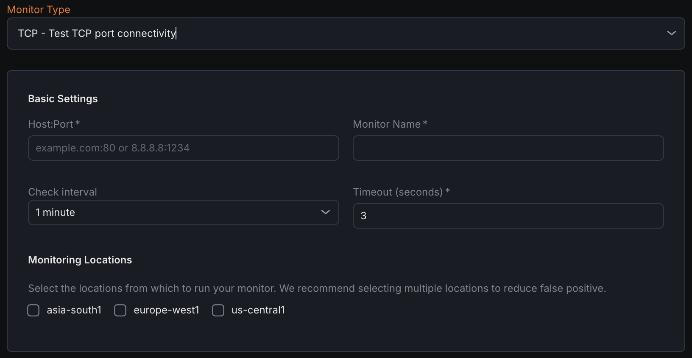

The TCP Monitor tests the availability and responsiveness of a specific TCP host and port by establishing a connection and optionally exchanging data. 

## Creating a New TCP Monitor

1. Navigate to **Synthetic monitoring > Monitors**.
2. Click on **Add new**.
3. From the monitor type dropdown, select **TCP - Test TCP port connectivity**.

## Basic Settings

- **Host\:Port**
  Enter the target TCP host and port in the format `hostname:port` that you want to monitor.
- **Monitor Name**
  Provide a clear and descriptive name for the monitor.
- **Check Interval**
  Define how often the monitor should attempt to connect to the TCP port.
- **Timeout**
  Set the maximum time the monitor will wait for a response before considering the check unsuccessful.
- **Monitoring Locations**
  Select one or more geographic monitoring locations from which the TCP checks will be performed. 

## Notification Settings

Choose the notification channels where alerts will be sent if the TCP monitor detects failure or downtime.

## **TCP Configuration**

- **Send Payload (optional)**
  Specify any data (in text or bytes) to send to the TCP port immediately after a successful connection is established.
- **Read Size (Bytes)**
  Define how many bytes the monitor should read from the server in response after sending the payload or after connection if no payload is sent.
- **Read Timeout (ms)**
  Set the maximum time (in milliseconds) the monitor waits for a response from the server after sending the payload or establishing the connection.

## Assertions

Assertions specify what connectivity and response metrics the monitor evaluates:

- **Connect Time (ms)**
  Measures the time taken to complete the TCP handshake with the target host.
- **Time to First Byte (ms)**
  The duration between establishing the connection and receiving the first byte of data from the server.
- **Total Time (ms)**
  The total elapsed time for the entire connection and data exchange process.
- **Response Data**
  Validates the actual data returned by the server after sending the payload or upon connection if no payload is sent.

## Metrics

Metrics available to be monitored in Dashboard section

| **Metric Name**                                     | **Type**   | **Description**                                            | **Labels**                                                       |
| ------------------------------------------------------------- | -------------------- | -------------------------------------------------------------------- | -------------------------------------------------------------------------- |
| kloudmate\_synthetic\_check\_network\_write\_time   | Gauge      | Time taken to write to the connection (for TCP and UDP)    | check\_id, check\_name, check\_type, target, workspace\_id, location  |
| kloudmate\_synthetic\_check\_network\_read\_time    | Gauge      | Time taken to read from the connection (for TCP and UDP)   | check\_id, check\_name, check\_type, target, workspace\_id, location  |

| kloudmate\_synthetic\_check\_connect\_time           | Gauge   | Time taken to establish a connection. Applicable to HTTP, TCP, UDP, WebSocket, and SSL checks.   | check\_id, check\_name, check\_type, target, workspace\_id, location       |
| -------------------------------------------------------------- | ----------------- | ---------------------------------------------------------------------------------------------------------- | -------------------------------------------------------------------------- |
| kloudmate\_synthetic\_check\_tls\_handshake\_time    | Gauge   | Time taken for the TLS handshake. Applicable to HTTP and TCP checks.                             | check\_id, check\_name, check\_type, target, workspace\_id, location  |
| kloudmate\_synthetic\_check\_time\_to\_first\_byte   | Gauge   | Time to the first byte. Applicable to HTTP, TCP, and UDP checks.                                 | check\_id, check\_name, check\_type, target, workspace\_id, location       |
| kloudmate\_synthetic\_check\_response\_size\_bytes   | Gauge   | The size of the response in bytes. Applicable to HTTP, TCP, and UDP checks.                      | check\_id, check\_name, check\_type, target, workspace\_id, location       |

***

## Related Resources

[UDP Monitor - Monitor UDP Port Availability](<./UDP Monitor - Monitor UDP Port Availability.mdx>)

