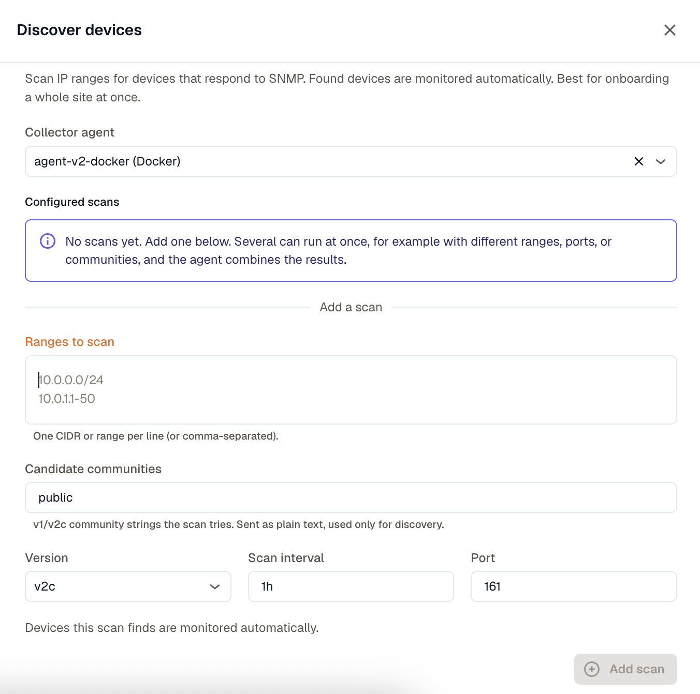
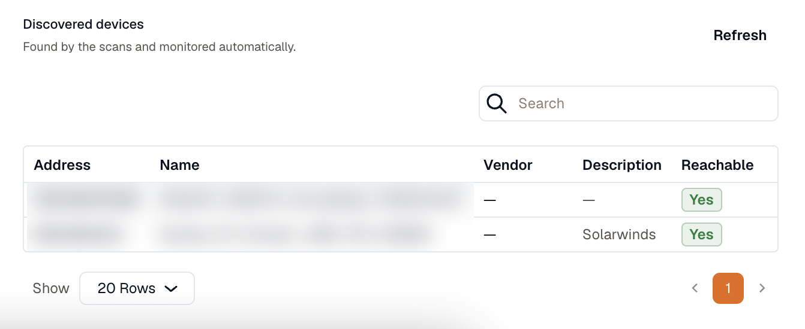

Discovery is the quickest way to onboard a site. You give the agent a few IP ranges and the community strings to try, and it scans them, finds the devices that answer SNMP, and starts monitoring them automatically. For a handful of known addresses, [Add SNMP devices](/network-monitoring/monitoring-snmp/) is the more direct route.

## Before you start

- A Linux or Docker KloudMate Agent with network access to the ranges you want to scan. Kubernetes agents can't run discovery.
- The v1/v2c community strings the devices use. Discovery tries these against every address in range.

:::caution
Discovery credentials are v1/v2c only. To monitor a device that requires SNMPv3, add it directly with the [SNMP wizard](/network-monitoring/monitoring-snmp/).
:::

## Add a scan

On the **Network** page, open the **Add** menu and choose **Discover devices**. Fill in the scan:

- **Ranges to scan**: one CIDR or range per line (or comma-separated), for example `10.0.0.0/24` or `10.0.1.1-50`.
- **Candidate communities**: the v1/v2c community strings to try, such as `public, private`. These are sent as plain text and used only for discovery.
- **Version**: v2c or v1.
- **Scan interval**: how often to re-scan, for example `1h`.
- **Port**: the SNMP port to probe, `161` by default.

You can add several scans on one agent, each with different ranges, ports, or communities, and the agent runs each on its own interval and combines the results.

## What happens next

Every device a scan finds is monitored automatically, using the community that answered it. The agent applies its updated configuration to start polling, which briefly restarts data collection on that agent. It only restarts when the set of monitored devices actually changes, so a steady scan that keeps finding the same devices does nothing.

:::caution
A single scan monitors up to 256 devices. Point scans at focused ranges rather than an entire `/16`, or a large range will leave some devices unmonitored.
:::

The **Discovered devices** panel lists what the scans found: address, name, vendor, description, and whether each is reachable. Results appear after the next scan interval, and **Refresh** reloads them. Monitored devices also show up on the **All devices** tab like any other SNMP device.

## Adjust what's monitored

Discovery is sticky. A device stays monitored even if a later scan misses it once, so a brief blip doesn't make it vanish. Instead it reports **Down**, which is the accurate state. To stop monitoring devices, narrow or remove the range that covers them (or delete the scan) from **Configure**. The agent then re-accumulates from the ranges that remain. See [Manage and troubleshoot](/network-monitoring/manage-troubleshoot/).
