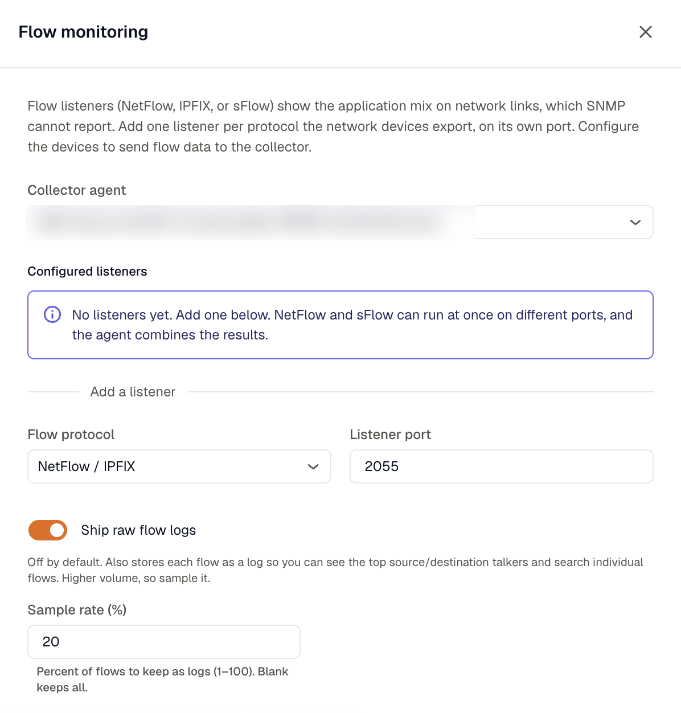
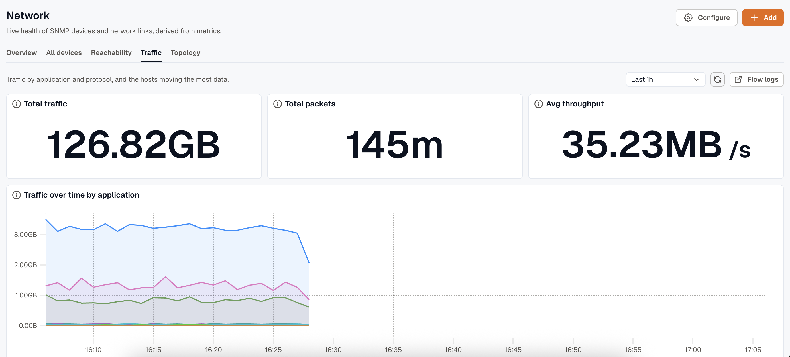

SNMP shows how much traffic crosses an interface, but not what that traffic is. Flow monitoring fills that gap. It breaks the load down by application, across HTTPS, streaming, DNS, database, and the rest. You add a listener on the agent, point your devices' flow export at it, and the mix shows up on the **Traffic** tab.

The agent listens for NetFlow, IPFIX, and sFlow. It classifies each flow by its well-known port and rolls the flows into per-application byte and packet counts.

## Add a listener

On the **Network** page, open the **Add** menu and choose **Flow monitoring**:

- **Flow protocol**: **NetFlow / IPFIX** or **sFlow**.
- **Listener port**: the UDP port the agent listens on. It defaults to `2055` for NetFlow and `6343` for sFlow.

Add one listener per protocol your devices export. NetFlow and sFlow can run at the same time on different ports, and the agent combines their results. Then configure each device to send flow records to `agent-ip:port`.

:::caution
Flow volume can be high, so turn on sampling at the sending device rather than exporting every flow. Applications are identified by well-known port, not by deep packet inspection. All traffic on port 443 is labeled `https`, so an app on a non-standard port shows up as `other`.
:::

## What you get

Both metrics are byte and packet totals per application, per interval:

- `netflow_app_bytes`
- `netflow_app_packets`

Each carries three attributes: `app` (`https`, `dns`, `voip_sip`, `database`, and so on, plus `other`), `transport` (`tcp` or `udp`), and `exporter`, the management IP of the device that sent the flow. Because `exporter` matches a device's address, KloudMate ties the traffic mix back to the SNMP device that carries it, so a saturated interface and its application breakdown sit in one place.

## Where results show up

Open the **Traffic** tab for the workspace-wide view: top applications, top transports, and totals over the selected window. Each device drawer also has a **Traffic** tab, scoped to the flow that device exports.

## Find the top talkers

The per-application metric answers "what apps are on this link," but it drops the source and destination addresses, so it can't tell you which host is the bandwidth hog. To answer that, turn on raw flow logs when you add or edit a listener:

- **Ship raw flow logs**: off by default. When on, the agent also stores each flow as a log with its source and destination address and port, so you can rank the top talkers and search individual flows.
- **Sample rate (%)**: the percentage of flows to keep as logs, from 1 to 100. Leave it blank to keep all of them.

Raw flow logs carry more volume than the per-app metrics, so sample them on a busy link. With them enabled, a **Top talkers** view appears on the Traffic tab, ranking sources, destinations, and conversations.
