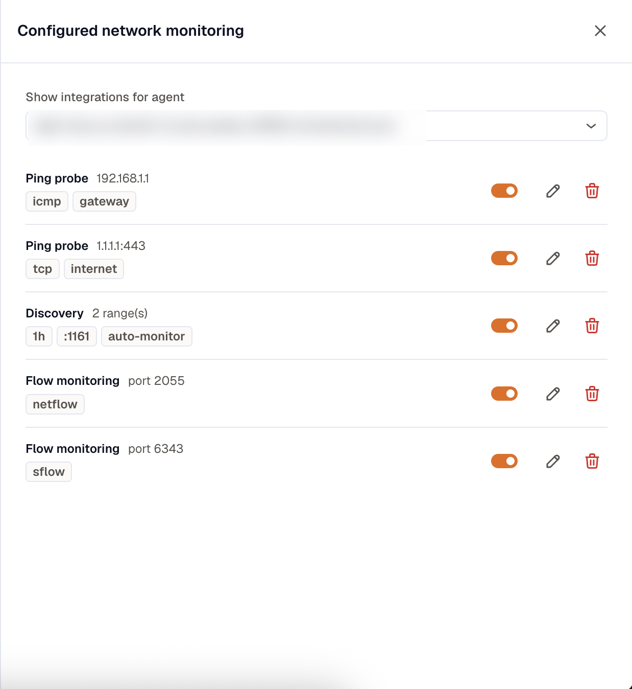

SNMP devices, ping probes, flow listeners, and discovery scans are all managed from one place. This page covers changing what you've configured and fixing the common reasons a device isn't reporting.

## Manage what's configured

On the **Network** page, select **Configure**. Pick a collector agent to see everything it's set to monitor, grouped by kind: **SNMP device**, **Ping probe**, **Flow monitoring**, and **Discovery**. For any entry you can:

- **Enable or disable** it. Disabling stops the polling without deleting the configuration, so you can turn it back on later.
- **Edit** it to change credentials, targets, capabilities, ports, or scan ranges.
- **Remove** it.

Enabling and disabling take effect on their own. Any edit that changes what the agent polls, and any add or remove, briefly restarts data collection on that agent, so expect a short gap in that poller's telemetry.

## An SNMP device won't report

If a device stays **Down** or never appears on the **All devices** tab, work down this list:

1. **Reachability**: the agent host must have a network path to the device on UDP port 161. Check firewalls and routing between them.
2. **Credentials**: confirm the community string (v1/v2c) or v3 user, and that the version matches what the device expects. A v2c community won't authenticate against a v3-only device.
3. **SNMP access list**: many devices restrict SNMP by source IP. Add the agent host's address to the device's allowed list, or no metrics come back even when everything else is correct.
4. **Agent placement**: network monitoring runs on Linux and Docker agents only. A Kubernetes agent is rejected for SNMP, ping, flow, and discovery.
5. **SNMP enabled**: confirm the SNMP service is actually running on the device.

## A device shows "Not reporting"

**Not reporting** means data stopped arriving, which isn't the same as the device being down. Two things cause it:

- The **poller** is offline. Check the Overview for a poller-not-reporting banner. If the agent stopped sending its heartbeat, every device it watches goes stale until it comes back.
- The device genuinely stopped responding and its last data aged out. Confirm reachability and credentials as above.

Discovery is sticky, so a device found by a scan stays listed even after it stops answering. That's deliberate, so you don't lose sight of it.

## A reachability check won't run

The gateway probe uses ICMP, which needs `CAP_NET_RAW` or root on the agent host. Running the agent in Docker without `--cap-add=NET_RAW` is the usual cause of a gateway probe that never reports. The internet probe uses TCP and doesn't need that permission, so if only the gateway probe is failing, check ICMP privilege first. See [Monitor sites without SNMP](/network-monitoring/reachability-checks/).

## Flow monitoring shows no traffic

- Confirm each device's flow export points at the agent's IP and the **listener port** you configured (`2055` for NetFlow, `6343` for sFlow by default).
- Check that the device is actually exporting flows and that sampling isn't set so aggressively that little arrives.
- NetFlow and sFlow need separate listeners on separate ports. A device exporting sFlow to a NetFlow listener won't be understood.

If a device is reachable but a specific metric is missing, check that the matching capability is on. BGP, MPLS L3VPN, LLDP, and IP SLA metrics only appear when you enable those capabilities on the device in the [SNMP wizard](/network-monitoring/monitoring-snmp/).
