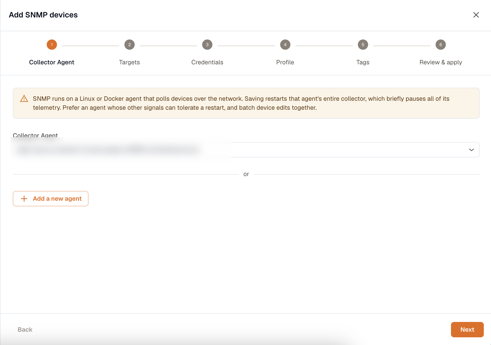
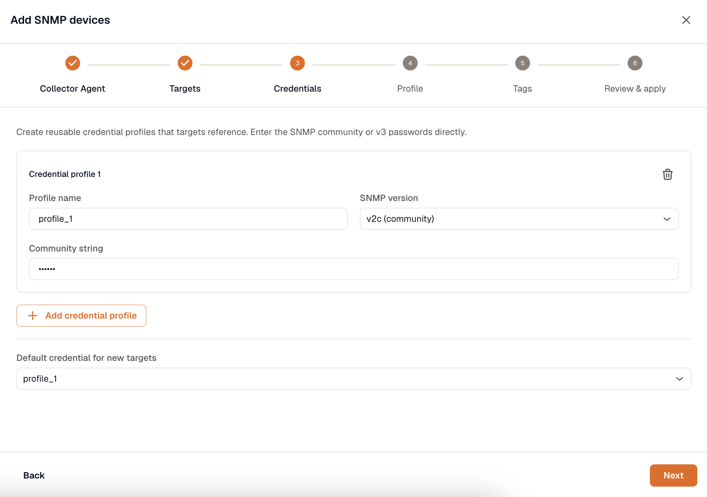
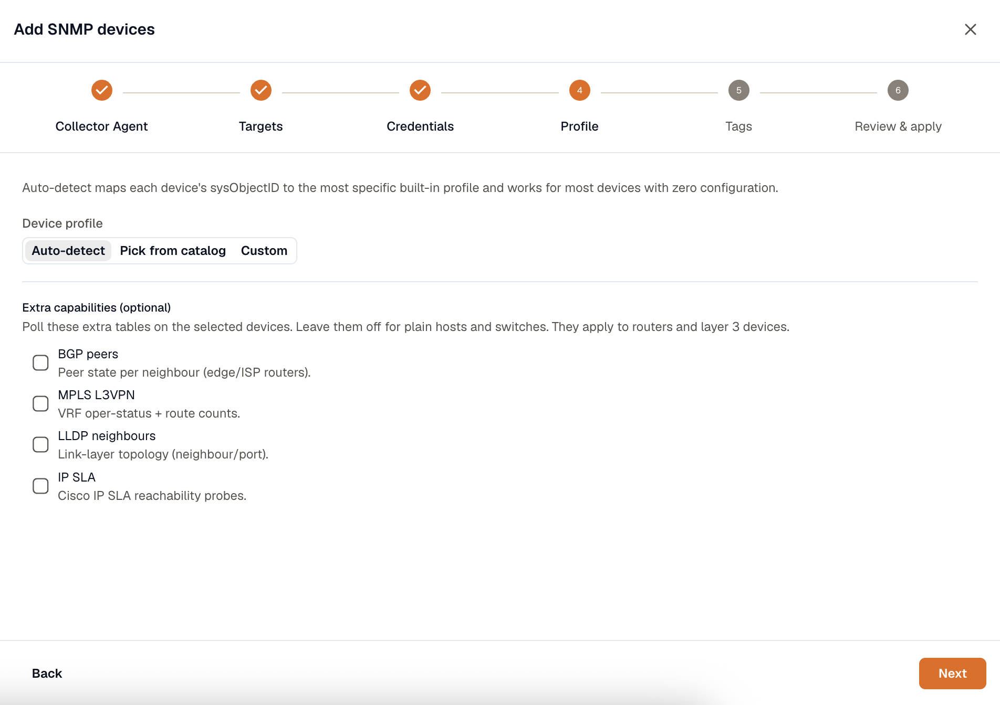

Add SNMP devices when you already know the addresses you want to poll, such as a core switch, an edge router, a firewall, or a rack PDU. The **Add SNMP devices** wizard walks you through picking an agent, listing targets, entering credentials, and choosing a device profile. From there the agent polls each device on a schedule and reports its metrics to KloudMate.

To sweep a subnet and monitor whatever answers instead, use [Discover devices](/network-monitoring/discover-devices/).

## Before you start

- A KloudMate Agent running on a **Linux host or in Docker**, with network access to the devices. Kubernetes agents can't poll SNMP. Install the [Linux agent](/kloudmate-agent/installation/linux-agent/) or [Docker agent](/kloudmate-agent/installation/docker-agent/) if you don't have one.
- SNMP enabled on each device, with a community string (v1/v2c) or a v3 USM user.
- The agent host's IP address allowed in the device's SNMP access list. If the device restricts SNMP by source IP and the agent isn't on the list, no metrics come back.
- UDP port 161 reachable from the agent to each device (the SNMP default).

## Open the wizard

On the **Network** page, open the **Add** menu and choose **SNMP device**. The wizard has six steps.



### 1. Collector Agent

Pick the Linux or Docker agent that will poll the devices. It needs a network path to every target in this batch. The list shows only eligible agents. If it's empty, install one first from the link in the step.

### 2. Targets

List the devices to poll. Paste one target per line into the box, using an IP, a CIDR block, a last-octet range, or a hostname. Then select **Expand & add** to turn them into rows:

```text
10.0.0.1
10.0.10.0/24
10.0.1.1-50
core-sw-01.example.com
```

Each row takes an endpoint and a credential. Leave the credential set to **Default** to use the profile you mark as default in the next step, or pick a specific one per device.

### 3. Credentials

Create one or more **credential profiles** that your targets reference, so devices that share a community or v3 user reuse the same entry.

- **v1 or v2c**: enter the **community string**.
- **v3 (USM)**: enter a **username** and **security level** (`noAuthNoPriv`, `authNoPriv`, or `authPriv`). For `authNoPriv` and `authPriv`, choose an **auth protocol** (MD5, SHA, SHA224, SHA256, SHA384, or SHA512) and password. For `authPriv`, also choose a **priv protocol** (DES, AES, AES192, or AES256) and password.

You enter these values directly. Mark one profile as the default for new targets.



### 4. Profile

A device profile decides which tables the agent walks and what metrics it emits. Choose how to match one:

- **Auto-detect** (recommended): the agent reads the device's `sysObjectID` and picks the matching vendor profile. This covers most Cisco, Juniper, Arista, HPE, Aruba, Dell, Fortinet, MikroTik, F5, and APC gear out of the box.
- **Pick from catalog**: choose a specific profile by name.
- **Custom**: name a profile you've defined.



#### Extra capabilities

Under **Extra capabilities (optional)**, turn on tables that only matter for routers and layer-3 devices. Leave them off for plain hosts and switches, where they add polling work with no benefit.

| Capability | What it collects |
|---|---|
| **BGP peers** | Peer state per neighbour, for edge and ISP routers. |
| **MPLS L3VPN** | VRF operational status and route counts. |
| **LLDP neighbours** | Link-layer neighbour and port data, which feeds the [Topology](/network-monitoring/network-page/) map. |
| **IP SLA** | Cisco IP SLA reachability probes, for per-WAN ISP verdicts. |

### 5. Tags

Add key-value tags such as `site`, `group`, or `role`, or anything you use to organize devices. They apply to every device in this batch and drive the filtering and grouping on the Network page. Grouping the Overview status board by `site` or `role`, for example, only works if your devices carry that tag.

### 6. Review & apply

Check the staged devices, then select **Apply configuration**. Saving briefly restarts data collection on that agent, so the wizard batches every device in the run and applies them together to keep the interruption short.

## What you get

Within a few minutes the devices appear on the **All devices** tab with an **Up** status, and their metrics are queryable. The agent emits, per interface:

- `snmp_interface_in_octets`, `snmp_interface_out_octets`: throughput in bytes
- `snmp_interface_in_errors`, `snmp_interface_out_errors`
- `snmp_interface_in_discards`, `snmp_interface_out_discards`
- `snmp_interface_oper_status`, `snmp_interface_admin_status` (`2` means down)
- `snmp_interface_speed`

Per device, you get `snmp_device_uptime`, `snmp_cpu_usage`, and `snmp_memory_usage` (plus `snmp_memory_used`, `_free`, and `_total`). The agent's own reachability check is `km_snmp_up`, which reads `1` when the device answers and `0` when it doesn't. Turn on capabilities and you also get `snmp_bgp_peer_state`, `snmp_mpls_l3vpn_vrf_oper_status`, `snmp_isp_reachability`, and related metrics.

If a device stays **Down** or never appears, work through the checklist in [Manage and troubleshoot](/network-monitoring/manage-troubleshoot/).
