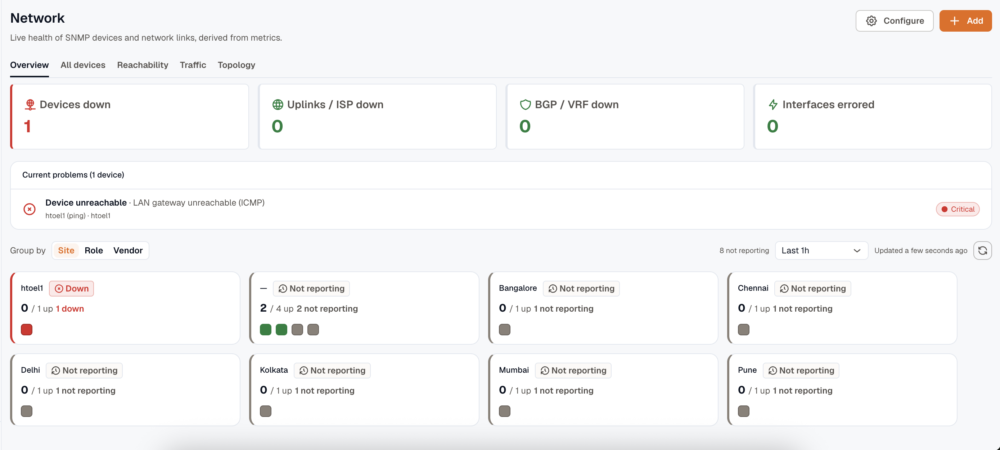
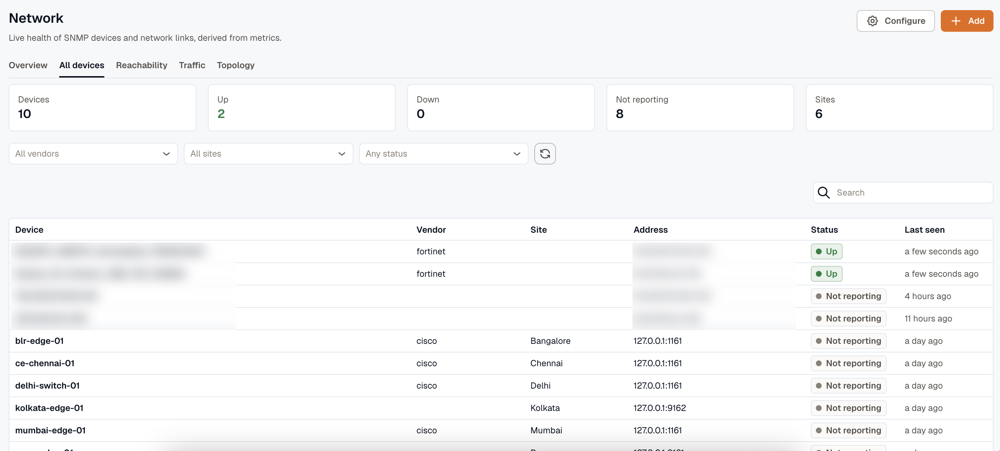
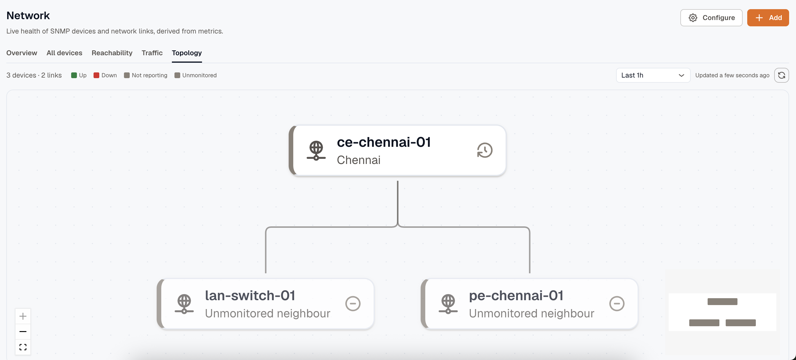
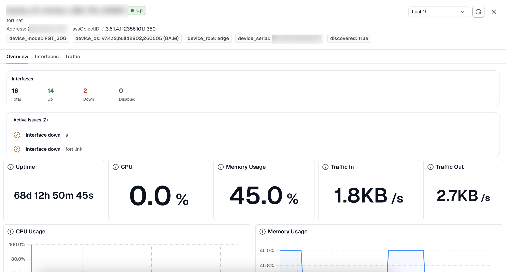
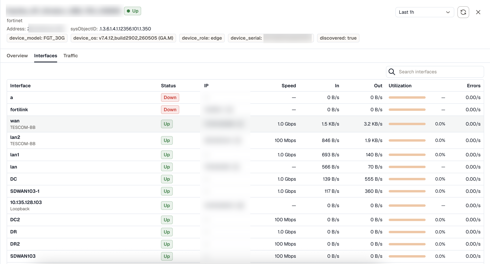

Once devices are reporting, the **Network** page is where you watch them. It opens on an Overview built to answer one question fast: is anything wrong, and where? From there you can drill into any device. This page explains how to read each surface.

## Overview tab

The Overview leads with problems, not a wall of devices.

**Health tiles** across the top count the current problems by kind:

- **Devices down**
- **Uplinks / ISP down**
- **BGP / VRF down**
- **Interfaces errored**

Selecting a tile filters the feed below to that category.

The **Current problems** feed lists active issues, worst first, one row per affected device. A device with several faults collapses into a single row with its most severe problem as the headline. Each row links to the device drawer.

[Reachability-check sites](/network-monitoring/reachability-checks/) appear here too. A failed gateway probe shows as the gateway being unreachable; a failed internet probe as an uplink problem. A site that stops reporting entirely shows as **Site not reporting** — for a site with one internet link, that's how an outage surfaces, because the agent can't send a failure over the link that's down.

The **status board** groups your devices into cards. Switch the grouping between **Site**, **Role**, and **Vendor**. Each card takes the worst status among its devices and shows a `healthy / total` count, so you see both the state and how much is affected at a glance. Problem groups float to the top, and healthy groups collapse.

## Device statuses

Status appears as a color, a label, and an icon throughout the page:

| Status | Meaning |
|---|---|
| **Up** | The device is reachable and reporting. |
| **Down** | A reachability check failed; the device didn't answer. |
| **Not reporting** | The device stopped sending data. It's still listed, with "last seen X ago." |
| **Warning** | The device is up but has an active issue, such as an errored interface. |
| **Unknown** | Status can't be determined. |

**Not reporting** and **Down** are different on purpose. Down means the agent polled the device and got no answer. Not reporting means the data itself stopped arriving, often because the agent that polls it is offline rather than because the device is.

That distinction drives the **poller-not-reporting banner**. If a collector agent stops sending its heartbeat, the Overview shows a banner naming the affected poller instead of marking every device it watched as down. Device status under that agent may be stale until it reports again.

## All devices tab

**All devices** is the flat, searchable table, the drill view for power users. Filter by vendor, site, or status, sort by any column, and read each device's current status and **Last seen** time. A device that stopped reporting stays in the table as **Not reporting** rather than disappearing.

## Reachability and Traffic tabs

- **Reachability** shows the ping results for sites monitored without SNMP. See [Monitor sites without SNMP](/network-monitoring/reachability-checks/).
- **Traffic** shows the application traffic mix from your flow listeners. See [Flow monitoring](/network-monitoring/flow-monitoring/).

## Topology tab

The **Topology** tab draws a link map from LLDP and CDP neighbour data. Devices are nodes, neighbour links are edges, and both use the same status colors as the Overview. A down endpoint reddens its links so the fault path stands out.

Topology needs the **LLDP neighbours** capability turned on for a device, either in the [SNMP wizard](/network-monitoring/monitoring-snmp/) or by editing the device under **Configure**. Until then the map is empty. It's a secondary view for locating a fault, not the place you start.

## Device drawer

Selecting a device opens its drawer, with tabs that depend on what the device reports:

- **Overview**: status, uptime, CPU and memory, and the device's active issues.
- **Interfaces**: every interface with its operational state, sorted so down ports surface first. Admin-disabled ports are marked as disabled, not counted as faults.
- **Routing**: BGP peers, MPLS L3VPN VRFs, and IP SLA results. This tab appears only when the device has those capabilities enabled.
- **Traffic**: the application mix this device exports, when flow monitoring is set up.
- **Tags**: the site, role, and other tags on the device.

The page auto-refreshes and stamps how long ago it updated, so you're always reading a recent picture.
