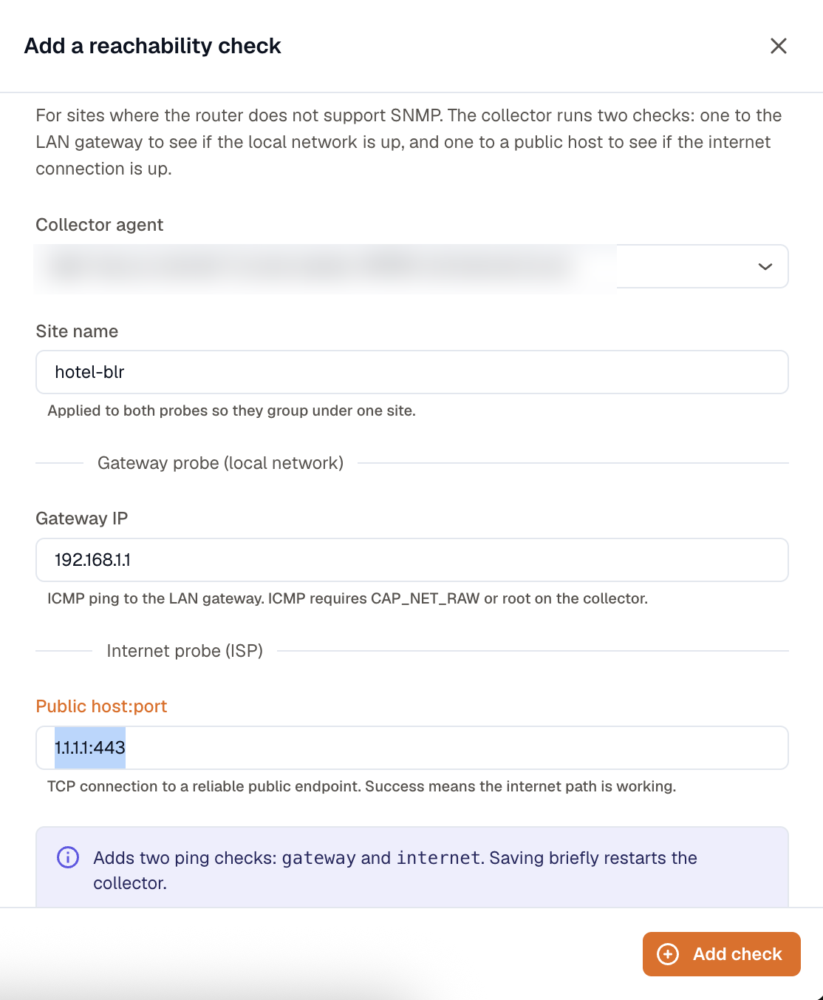
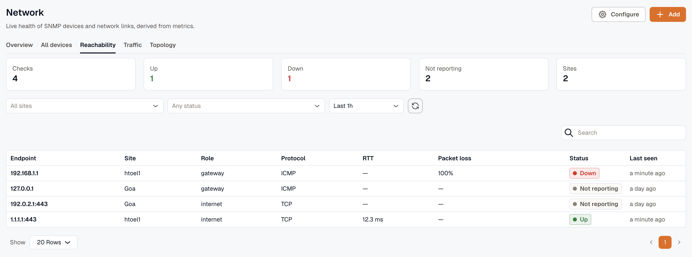

Not every site has a device you can poll. A branch office might sit behind a consumer router or a cheap gateway that doesn't support SNMP. For those sites, add a **reachability check**: a pair of ping probes that tell you whether the local network is up and whether the internet connection is working.

## How the two probes split the problem

A reachability check runs two probes from the agent:

- **Gateway probe**: an ICMP ping to the site's LAN gateway. It answers "is the local network up?"
- **Internet probe**: a TCP connection to a public host. It answers "is the ISP link working?"

Read together, the two probes tell you where a fault is. Gateway up and internet down points at the ISP or the WAN link, not the local network. Both down points at the site itself: power, the gateway, or the agent's own connectivity.

## Before you start

- A Linux or Docker KloudMate Agent that can reach the site's gateway and the public internet.
- For the gateway probe, ICMP permission on the agent host. ICMP needs `CAP_NET_RAW` or root, so add `--cap-add=NET_RAW` when running the agent in Docker. The internet probe uses TCP and works without extra privileges.

## Add a reachability check

On the **Network** page, open the **Add** menu and choose **Reachability check**:

- **Site name**: a label such as `hotel-blr-01`. It applies to both probes so they group under one site.
- **Gateway IP**: the LAN gateway address to ping, for example `192.168.1.1`.
- **Public host:port**: a reliable public endpoint to connect to, for example `1.1.1.1:443`. A successful connection means the internet path is working.

Saving adds both probes and briefly restarts data collection on the agent.

## Where results show up

Open the **Reachability** tab on the Network page. Each probe is a row with its endpoint, site, role (gateway or internet), protocol, round-trip time, packet loss, status, and when it was last seen. Summary tiles at the top count how many checks are up, down, and not reporting.

The agent emits three metrics per probe:

- `km_ping_up`: `1` when the target is reachable, `0` when it isn't
- `km_ping_rtt`: round-trip time in milliseconds
- `km_ping_packet_loss`: percentage lost (ICMP probes only)

Each carries the `site` and `role` tags you set, so you can build [Dashboards](/visualize-data/dashboards/) and [Alerts](/alerts/create-alerts/) that group by site or fire only when an internet probe drops.
