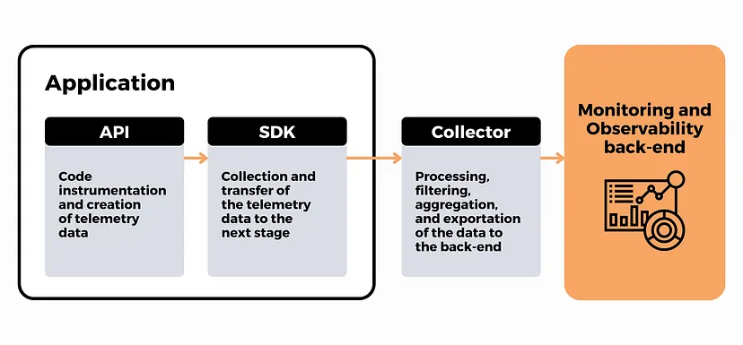

OpenTelemetry combines vendor-neutral components that generate, process, and export observability data in a consistent way.

At a high level, it helps you:

- Specify what should be measured
- Capture and structure telemetry data
- Export that data to an observability backend such as KloudMate

The core components of OpenTelemetry are loosely coupled, so you can choose the pieces that fit your environment.

## 1. Instrumentation

Instrumentation starts in your application code or runtime.

**APIs** define the operations used to generate traces, metrics, and logs and to attach useful context to that data.

## 2. Data Collection

**SDKs** implement those APIs for specific languages and runtimes. They gather telemetry from the instrumented application and prepare it for export.

## 3. Data Export

The **OpenTelemetry Collector** is an optional but commonly recommended component. It can receive, process, and export telemetry data before that data reaches the final backend.

Use the Collector when you want to:

- Export telemetry to multiple backends
- Add batching, retries, or encryption
- Filter or redact sensitive data
- Collect host-level metrics such as CPU and memory usage

You can also export directly from SDKs to a backend when your setup is simple and you do not need Collector-side processing.

## 4. Visualization and Analysis

OpenTelemetry generates and transports telemetry data, but it does not provide long-term storage, querying, or visualization by itself.

That final step happens in an observability backend such as KloudMate, where you can search, analyze, and correlate the data.

## Related Resources

- [What Is OpenTelemetry?](../what-is-opentelemetry/)
- [Install the OpenTelemetry Collector](../installing-the-opentelemetry-collector/)
