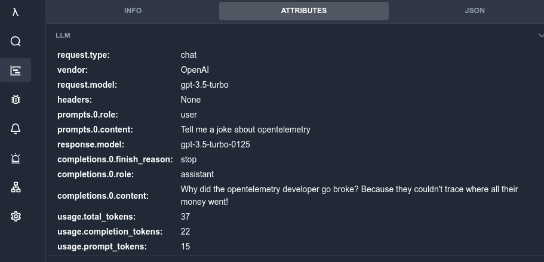
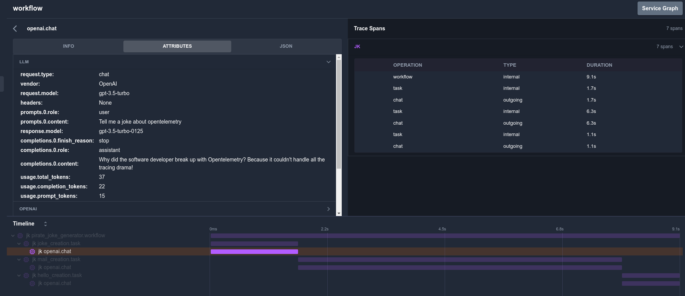

In this guide, we will walk you through the process of setting up and using OpenLLMetry in Python. You can use the following steps to instrument a Python program with OpenLLMetry and then emit and visualize its traces within [KloudMate](https://app.kloudmate.com).

The instrumentation demonstrated in this guide lets OpenLLMetry capture and send OpenAI model KPIs to KloudMate, where there is a dedicated '**Traces**' section to visualize the captured data. In addition to this OpenLLMetry also has instrumentations for vector databases such as**Pinecone**, and LLM frameworks such as**LangChain**. Feel free to adapt the instructions to your preferred framework.**Step 1: Prerequisites**

- Ensure that you have Python 3 installed on your local machine
- Create an OpenAI account and get your OpenAI API key ([here's how](https://help.openai.com/en/articles/4936850-where-do-i-find-my-openai-api-key))
- Create a [KloudMate account](https://app.kloudmate.com/signup) and generate your KloudMate API Key 

<hint type="info">
  The KloudMate API-Key can be obtained by logging into your KloudMate account and navigating to **Settings >>**[Workspaces ](https://app.kloudmate.com/settings)**>> Edit Workspace**.
</hint>

**Step 2: Example Application**For this setup, we will be using a basic Python program that uses OpenAI API. Adhere to the steps outlined below to set up the environment for the program.**Step 3: Installation**

1\. Create a new directory and activate a virtual environment:

```linux
mkdir openLLMetry-getting-started
cd openLLMetry-getting-started
python3 -m venv venv
source ./venv/bin/activate
```

2\. Next, install the `traceloop-sdk` and `openai`. 

```none
pip install traceloop-sdk openai
```

**Step 4: Instrumentation**

 1\. Create a file named `app.py` and add the following code to it:

```python
from traceloop.sdk import Traceloop
from openai import OpenAI
from traceloop.sdk.decorators import workflow, task
import time

client = OpenAI(api_key=<api-key>)

Traceloop.init(app_name="your app name", api_endpoint=https://otel.kloudmate.com:4318, headers={"Authorization":<kloudmate api key>})

@task(name="joke_creation")
def create_joke():
    completion = client.chat.completions.create(
        model="gpt-3.5-turbo",
        messages=[{"role": "user", "content": "Tell me a joke about OpenTelemetry"}],
    )

    return completion.choices[0].message.content
@workflow(name="pirate_joke_generator")
def joke_workflow():
    eng_joke = create_joke()
    print(eng_joke + "\n\n")

joke_workflow()

time.sleep(10)
```

<hint type="info">
  The KloudMate API-Key can be obtained by logging into your KloudMate account and navigating to **Settings >>**[Workspaces ](https://app.kloudmate.com/settings)**>> Edit Workspace**.
</hint>

**Step 5: Run the Instrumented Program**

1\. Use the following command to run the program

```python
python3 app.py
```

Step 6: Visualize the traces emitted to KloudMate

1\. Login to [KloudMate](https://app.kloudmate.com) and navigate to the '**Traces**' section. 

- You will be able to view the LLM attributes as shown below:



- You will also be able to visualize the traces and spans:



***

### Related Resources

-
  [What Is OpenTelemetry?](https://docs.kloudmate.com/what-is-opentelemetry)
- [OpenLLMetry: OpenTelemetry-Based Observability for LLMs](https://docs.kloudmate.com/openllmetry-opentelemetry-based-observability-for-llms)


